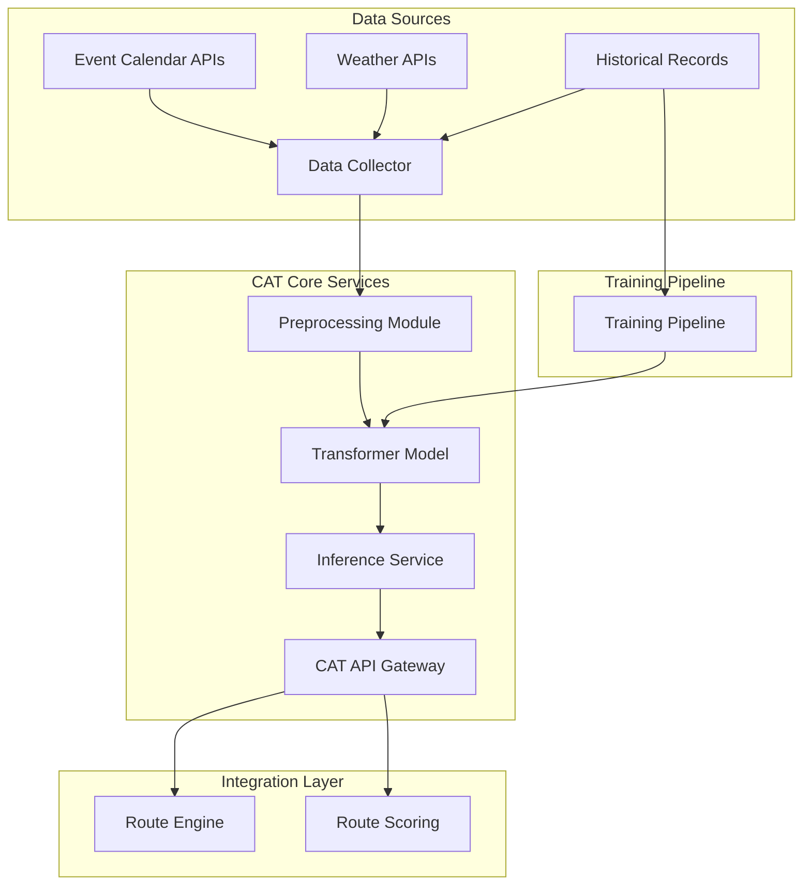

# Design Document: Contextual Availability Transformer (CAT)

## Overview

The Contextual Availability Transformer (CAT) is a machine learning system designed to predict availability patterns based on contextual factors including event calendar data, weather conditions, and historical availability records. This system integrates with the existing route engine infrastructure to provide real-time availability predictions that enhance route scoring and optimization decisions. The CAT architecture follows a modern Transformer-based approach, enabling the model to capture complex temporal and contextual relationships that traditional time-series methods cannot effectively model.

The system addresses a critical gap in the current route engine capabilities: the inability to predict availability fluctuations based on external contextual factors. By leveraging the self-attention mechanism inherent in Transformer architectures, CAT can weigh the importance of different contextual signals dynamically, adapting predictions to varying scenarios such as local events, weather changes, and seasonal patterns. This design document outlines both the high-level architectural decisions and the low-level implementation details necessary to build a production-ready availability prediction service.

## Architecture

The CAT system follows a modular microservices architecture that separates data collection, model training, inference serving, and integration layers. This separation enables independent scaling of components, facilitates continuous model improvement, and allows for graceful degradation when individual services experience issues. The architecture leverages existing infrastructure where possible, particularly the SSE streaming infrastructure being developed in Tier 1, while introducing new components specifically optimized for machine learning workloads.



The architecture consists of five primary layers: the Data Collection Layer responsible for gathering contextual information from external sources; the Preprocessing Layer that transforms raw data into model-ready tensors; the Transformer Model Layer containing the core neural network architecture; the Inference Service Layer providing real-time prediction capabilities; and the Integration Layer connecting CAT predictions to the route engine ecosystem. Each layer communicates through well-defined interfaces, enabling component replacement without system-wide disruption.

## Components and Interfaces

### Data Collector Component

**Purpose**: The Data Collector is responsible for fetching contextual data from multiple external sources, handling authentication, rate limiting, and error recovery. It implements a resilient fetching strategy that gracefully handles temporary API failures while ensuring data freshness requirements are met.

**Interface**:
```pascal
STRUCTURE ContextualData
  event_calendar: EventCalendarData
  weather: WeatherData
  historical_availability: HistoricalAvailabilityData
  timestamp: DateTime
END STRUCTURE

PROCEDURE fetch_contextual_data(location_id, time_range)
  INPUT: location_id (String), time_range (TimeRange)
  OUTPUT: ContextualData
  
  SEQUENCE
    events ← fetch_events(location_id, time_range)
    weather ← fetch_weather(location_id, time_range)
    history ← fetch_historical_availability(location_id, time_range)
    
    RETURN ContextualData(events, weather, history, NOW())
  END SEQUENCE
END PROCEDURE

PROCEDURE fetch_events(location_id, time_range)
  INPUT: location_id (String), time_range (TimeRange)
  OUTPUT: EventCalendarData
  
  SEQUENCE
    response ← HTTP_GET(
      url: EVENT_API_URL,
      params: {location: location_id, start: time_range.start, end: time_range.end},
      headers: {Authorization: API_KEY}
    )
    
    IF response.status = 200 THEN
      RETURN parse_event_response(response.body)
    ELSE
      RETURN empty_event_data()
    END IF
  END SEQUENCE
END PROCEDURE
```

**Responsibilities**:
- Implement authentication and authorization for all external API calls
- Handle rate limiting and exponential backoff for API resilience
- Cache frequently accessed data to reduce API costs and latency
- Validate incoming data against schema definitions
- Report collection metrics and health status

### Preprocessing Module Component

**Purpose**: The Preprocessing Module transforms raw contextual data into dense vector representations suitable for consumption by the Transformer model. This component handles normalization, tokenization, and feature engineering while preserving the temporal structure essential for attention-based predictions.

**Interface**:
```pascal
STRUCTURE ModelInput
  event_embeddings: Tensor[Float32]
  weather_embeddings: Tensor[Float32]
  historical_sequence: Tensor[Float32]
  temporal_encoding: Tensor[Float32]
END STRUCTURE

PROCEDURE preprocess_contextual_data(raw_data)
  INPUT: raw_data (ContextualData)
  OUTPUT: ModelInput
  
  SEQUENCE
    event_emb ← encode_events(raw_data.event_calendar)
    weather_emb ← encode_weather(raw_data.weather)
    history_seq ← encode_historical(raw_data.historical_availability)
    temp_enc ← generate_temporal_encoding(raw_data.timestamp, HISTORY_WINDOW)
    
    RETURN ModelInput(event_emb, weather_emb, history_seq, temp_enc)
  END SEQUENCE
END PROCEDURE

PROCEDURE encode_events(event_data)
  INPUT: event_data (EventCalendarData)
  OUTPUT: Tensor[Float32]
  
  SEQUENCE
    IF event_data.events = empty THEN
      RETURN zero_tensor(EVENT_EMBEDDING_DIM)
    END IF
    
    event_vectors ← EMPTY_LIST()
    
    FOR each event IN event_data.events DO
      type_vector ← one_hot_encode(event.type, EVENT_TYPE_VOCAB)
      size_vector ← encode_event_size(event.expected_attendance)
      location_vector ← encode_location(event.location)
      time_vector ← encode_event_time(event.start_time)
      
      event_vectors.APPEND(concatenate(type_vector, size_vector, location_vector, time_vector))
    END FOR
    
    RETURN mean_pooling(event_vectors)
  END SEQUENCE
END PROCEDURE
```

**Responsibilities**:
- Normalize numerical features to consistent scales
- Encode categorical variables into dense vector representations
- Generate positional and temporal encodings for sequence data
- Handle missing or malformed input data gracefully
- Optimize tensor shapes for efficient GPU computation

### Transformer Model Component

**Purpose**: The Transformer Model implements the core neural network architecture that processes contextual embeddings to produce availability predictions. The model employs multi-head self-attention to capture complex relationships between events, weather conditions, and historical patterns, followed by feed-forward layers that transform attention outputs into final predictions.

**Interface**:
```pascal
STRUCTURE AvailabilityPrediction
  probability: Float32
  confidence_interval: Tuple[Float32, Float32]
  contributing_factors: List[Tuple[String, Float32]]
END STRUCTURE

PROCEDURE predict_availability(model_input)
  INPUT: model_input (ModelInput)
  OUTPUT: AvailabilityPrediction
  
  SEQUENCE
    ASSERT model_input IS NOT NULL
    ASSERT tensor_shape(model_input) = EXPECTED_INPUT_SHAPE
    
    combined_input ← concatenate(
      model_input.event_embeddings,
      model_input.weather_embeddings,
      model_input.historical_sequence,
      model_input.temporal_encoding,
      axis: 1
    )
    
    normalized_input ← layer_norm(combined_input)
    
    attention_output ← multi_head_attention(
      query: normalized_input,
      key: normalized_input,
      value: normalized_input,
      num_heads: NUM_ATTENTION_HEADS
    )
    
    feedforward_output ← feed_forward_network(attention_output)
    
    prediction_head ← linear_layer(feedforward_output, output_dim: 1)
    
    probability ← sigmoid(prediction_head[0])
    confidence ← compute_confidence_interval(prediction_head, feedforward_output)
    factors ← identify_contributing_factors(attention_weights)
    
    RETURN AvailabilityPrediction(probability, confidence, factors)
  END SEQUENCE
END PROCEDURE

PROCEDURE multi_head_attention(query, key, value, num_heads)
  INPUT: query (Tensor), key (Tensor), value (Tensor), num_heads (Integer)
  OUTPUT: Tensor
  
  SEQUENCE
    head_dim ← dimension(query) / num_heads
    
    FOR i FROM 1 TO num_heads DO
      W_q[i] ← learnable_weight_matrix(dimension(query), head_dim)
      W_k[i] ← learnable_weight_matrix(dimension(key), head_dim)
      W_v[i] ← learnable_weight_matrix(dimension(value), head_dim)
      
      Q[i] ← query @ W_q[i]
      K[i] ← key @ W_k[i]
      V[i] ← value @ W_v[i]
      
      attention_scores[i] ← softmax(Q[i] @ transpose(K[i]) / sqrt(head_dim))
      attention_output[i] ← attention_scores[i] @ V[i]
    END FOR
    
    concatenated ← concatenate(attention_output, axis: 1)
    output ← concatenated @ learnable_output_weight
    
    RETURN output
  END SEQUENCE
END PROCEDURE
```

**Responsibilities**:
- Implement multi-head self-attention mechanism with configurable attention heads
- Apply layer normalization and residual connections for training stability
- Execute feed-forward transformations with configurable hidden dimensions
- Generate prediction outputs with associated confidence intervals
- Provide attention weights for interpretability analysis

### Inference Service Component

**Purpose**: The Inference Service provides a high-performance, low-latency interface for receiving availability predictions. It implements batching strategies to maximize throughput while maintaining sub-second response times, and integrates with the existing SSE streaming infrastructure for real-time prediction delivery.

**Interface**:
```pascal
PROCEDURE get_availability_prediction(location_id, time_slot)
  INPUT: location_id (String), time_slot (DateTime)
  OUTPUT: AvailabilityPrediction
  
  SEQUENCE
    raw_data ← fetch_contextual_data(location_id, time_slot.to_time_range())
    model_input ← preprocess_contextual_data(raw_data)
    prediction ← predict_availability(model_input)
    
    RETURN prediction
  END SEQUENCE
END PROCEDURE

PROCEDURE stream_availability_predictions(location_id, time_range, callback)
  INPUT: location_id (String), time_range (TimeRange), callback (Function)
  OUTPUT: StreamHandle
  
  SEQUENCE
    time_slots ← generate_time_slots(time_range, PREDICTION_INTERVAL)
    
    FOR each slot IN time_slots DO
      prediction ← get_availability_prediction(location_id, slot)
      callback(prediction)
    END FOR
  END SEQUENCE
END PROCEDURE
```

**Responsibilities**:
- Expose gRPC and REST APIs for prediction requests
- Implement request batching for high-throughput scenarios
- Cache recent predictions to reduce redundant computation
- Monitor inference latency and throughput metrics
- Handle model versioning and hot-swapping

### Training Pipeline Component

**Purpose**: The Training Pipeline orchestrates the end-to-end process of training the Transformer model on historical availability data. It handles data preprocessing, model training with early stopping, evaluation on held-out datasets, and model artifact generation for deployment.

**Interface**:
```pascal
PROCEDURE train_model(training_data, validation_data, config)
  INPUT: training_data (Dataset), validation_data (Dataset), config (TrainingConfig)
  OUTPUT: ModelArtifact
  
  SEQUENCE
    preprocessed_train ← preprocess_dataset(training_data)
    preprocessed_val ← preprocess_dataset(validation_data)
    
    model ← initialize_transformer(config.model_dim, config.num_layers, config.num_heads)
    
    best_val_loss ← infinity
    patience_counter ← 0
    
    FOR epoch FROM 1 TO config.max_epochs DO
      train_loss ← train_epoch(model, preprocessed_train, config.learning_rate)
      val_loss ← evaluate(model, preprocessed_val)
      
      IF val_loss < best_val_loss THEN
        best_val_loss ← val_loss
        patience_counter ← 0
        save_checkpoint(model, "best_model.pt")
      ELSE
        patience_counter ← patience_counter + 1
        
        IF patience_counter >= config.early_stopping_patience THEN
          BREAK
        END IF
      END IF
    END FOR
    
    artifact ← package_model_artifact(model, config, training_metadata)
    RETURN artifact
  END SEQUENCE
END PROCEDURE
```

**Responsibilities**:
- Manage training data versioning and splits
- Implement gradient accumulation for large batch sizes
- Apply learning rate scheduling and optimization strategies
- Perform distributed training across multiple GPUs
- Generate evaluation metrics and model comparison reports

## Data Models

### Event Calendar Data Model

```pascal
STRUCTURE EventCalendarData
  events: List[CalendarEvent]
  last_updated: DateTime
END STRUCTURE

STRUCTURE CalendarEvent
  event_id: UUID
  title: String
  event_type: EventType
  expected_attendance: Integer
  location: Location
  start_time: DateTime
  end_time: DateTime
  is_outdoor: Boolean
END STRUCTURE

ENUM EventType
  CONCERT
  SPORTS
  CONFERENCE
  FESTIVAL
  CONVENTION
  HOLIDAY
  OTHER
END ENUM

STRUCTURE Location
  venue_id: String
  latitude: Float32
  longitude: Float32
  capacity: Integer
END STRUCTURE
```

**Validation Rules**:
- `event_id` must be a valid UUID v4
- `expected_attendance` must be a positive integer not exceeding venue capacity
- `start_time` must be before `end_time`
- `event_type` must be one of the defined enum values
- `last_updated` must be within the last 24 hours for fresh data

### Weather Data Model

```pascal
STRUCTURE WeatherData
  current_conditions: WeatherConditions
  forecast: List[WeatherForecast]
  last_updated: DateTime
END STRUCTURE

STRUCTURE WeatherConditions
  temperature: Float32
  humidity: Float32
  precipitation_probability: Float32
  wind_speed: Float32
  weather_type: WeatherType
END STRUCTURE

STRUCTURE WeatherForecast
  time: DateTime
  temperature_high: Float32
  temperature_low: Float32
  precipitation_probability: Float32
  weather_type: WeatherType
END STRUCTURE

ENUM WeatherType
  CLEAR
  CLOUDY
  RAIN
  SNOW
  STORM
  FOG
  WINDY
END ENUM
```

**Validation Rules**:
- `temperature` must be in range [-50, 60] degrees Celsius
- `humidity` must be in range [0, 100] percentage
- `precipitation_probability` must be in range [0, 1]
- `wind_speed` must be non-negative
- `last_updated` must be within the last hour for current conditions

### Historical Availability Data Model

```pascal
STRUCTURE HistoricalAvailabilityData
  records: List[AvailabilityRecord]
  location_id: String
  time_range: TimeRange
END STRUCTURE

STRUCTURE AvailabilityRecord
  timestamp: DateTime
  available_slots: Integer
  total_slots: Integer
  utilization_rate: Float32
  contextual_factors: ContextualFactors
END STRUCTURE

STRUCTURE ContextualFactors
  event_count: Integer
  weather_severity: Integer
  is_holiday: Boolean
  is_weekend: Boolean
  season: Season
END STRUCTURE

ENUM Season
  SPRING
  SUMMER
  FALL
  WINTER
END ENUM
```

**Validation Rules**:
- `available_slots` must be between 0 and `total_slots`
- `utilization_rate` must be in range [0, 1]
- `time_range` must cover at least the minimum training window
- All timestamps must be in UTC timezone

## Algorithmic Pseudocode

### Main Prediction Algorithm

```pascal
ALGORITHM predict_availability_main
INPUT: location_id ∈ String, prediction_time ∈ DateTime
OUTPUT: prediction ∈ AvailabilityPrediction

PRECONDITION:
  location_id ≠ ∅ ∧ location_id IS valid_location()
  prediction_time ≥ NOW()
  prediction_time ≤ NOW() + MAX_PREDICTION_HORIZON()

POSTCONDITION:
  prediction.probability ∈ [0, 1]
  prediction.confidence_interval.lower_bound ≤ prediction.probability
  prediction.confidence_interval.upper_bound ≥ prediction.probability

BEGIN
  // Step 1: Gather contextual data
  time_range ← create_time_range(prediction_time, CONTEXT_WINDOW)
  raw_data ← fetch_contextual_data(location_id, time_range)
  
  ASSERT raw_data IS NOT NULL
  
  // Step 2: Preprocess into model input
  model_input ← preprocess_contextual_data(raw_data)
  
  ASSERT tensor_shape(model_input) = EXPECTED_INPUT_SHAPE
  
  // Step 3: Generate prediction
  prediction ← run_inference(model_input)
  
  // Step 4: Post-process and validate
  ASSERT prediction.probability ∈ [0, 1]
  prediction.confidence ← compute_confidence(prediction)
  
  RETURN prediction
END
```

**Preconditions**:
- Location ID must correspond to a known service area
- Prediction time must be within the supported horizon
- All external APIs must be reachable and authenticated
- Model must be loaded and ready for inference

**Postconditions**:
- Prediction probability is properly bounded between 0 and 1
- Confidence interval reflects prediction uncertainty
- Contributing factors identify the most influential contextual signals

**Loop Invariants**: N/A (no loops in main prediction path)

### Data Collection Algorithm

```pascal
ALGORITHM fetch_contextual_data
INPUT: location_id ∈ String, time_range ∈ TimeRange
OUTPUT: contextual_data ∈ ContextualData

PRECONDITION:
  location_id ≠ ∅
  time_range.start < time_range.end
  time_range.duration ≤ MAX_CONTEXT_DURATION()

POSTCONDITION:
  contextual_data.timestamp = NOW()
  contextual_data.event_calendar.events ⊆ time_range
  contextual_data.weather.forecast ⊆ time_range

BEGIN
  // Initialize concurrent fetch operations
  event_future ← ASYNC(fetch_events(location_id, time_range))
  weather_future ← ASYNC(fetch_weather(location_id, time_range))
  history_future ← ASYNC(fetch_historical(location_id, time_range))
  
  // Wait for all fetches with timeout
  events ← AWAIT_WITH_TIMEOUT(event_future, FETCH_TIMEOUT)
  weather ← AWAIT_WITH_TIMEOUT(weather_future, FETCH_TIMEOUT)
  history ← AWAIT_WITH_TIMEOUT(history_future, FETCH_TIMEOUT)
  
  // Handle partial failures gracefully
  IF events = NULL THEN
    events ← empty_event_data()
  END IF
  
  IF weather = NULL THEN
    weather ← empty_weather_data()
  END IF
  
  IF history = NULL THEN
    history ← empty_historical_data()
  END IF
  
  contextual_data ← ContextualData(events, weather, history, NOW())
  
  ASSERT contextual_data.timestamp IS recent
  
  RETURN contextual_data
END
```

**Preconditions**:
- Network connectivity to all external APIs must be available
- API credentials must be valid and not expired
- Time range must be within API query limits

**Postconditions**:
- All returned data is within the requested time range
- Timestamps reflect when data was actually fetched
- Partial data is returned even if some sources fail

**Loop Invariants**:
- All concurrent fetches operate independently
- Timeout applies uniformly to all fetch operations

### Model Inference Algorithm

```pascal
ALGORITHM run_transformer_inference
INPUT: model_input ∈ ModelInput
OUTPUT: prediction ∈ AvailabilityPrediction

PRECONDITION:
  model_input IS NOT NULL
  tensor_rank(model_input) = EXPECTED_RANK
  all_tensor_values(model_input) ARE finite

POSTCONDITION:
  prediction.probability ∈ [0, 1]
  prediction.confidence_interval.width > 0

BEGIN
  // Step 1: Input validation and normalization
  validated_input ← validate_and_normalize(model_input)
  
  // Step 2: Concatenate contextual embeddings
  combined ← concatenate_embeddings(
    validated_input.event_embeddings,
    validated_input.weather_embeddings,
    validated_input.historical_sequence,
    validated_input.temporal_encoding
  )
  
  // Step 3: Apply Transformer layers
  transformer_output ← combined
  
  FOR layer FROM 1 TO NUM_TRANSFORMER_LAYERS DO
    // Multi-head self-attention sublayer
    attention_output ← multi_head_attention(
      query: transformer_output,
      key: transformer_output,
      value: transformer_output,
      num_heads: NUM_ATTENTION_HEADS
    )
    
    attention_output ← layer_norm(attention_output + transformer_output)
    
    // Feed-forward sublayer
    ff_output ← feed_forward(attention_output)
    transformer_output ← layer_norm(ff_output + attention_output)
  END FOR
  
  // Step 4: Generate prediction head
  raw_prediction ← linear_predictor(transformer_output)
  
  // Step 5: Apply activation and bounds
  probability ← sigmoid(raw_prediction)
  probability ← clamp(probability, 0.0, 1.0)
  
  // Step 6: Compute confidence interval
  confidence ← compute_prediction_confidence(transformer_output)
  
  // Step 7: Extract contributing factors
  factors ← analyze_attention_weights(attention_weights)
  
  prediction ← AvailabilityPrediction(probability, confidence, factors)
  
  RETURN prediction
END
```

**Preconditions**:
- Model weights must be loaded and initialized
- Input tensor must match expected shape and dtype
- GPU memory must be sufficient for the model

**Postconditions**:
- Output probability is properly bounded
- Confidence interval reflects model uncertainty
- Attention analysis identifies influential input features

**Loop Invariants**:
- Each Transformer layer receives normalized input
- Residual connections preserve gradient flow
- Attention weights are computed for all heads

## Key Functions with Formal Specifications

### Function 1: encode_events()

```pascal
FUNCTION encode_events(event_data: EventCalendarData): Tensor[Float32]
```

**Preconditions**:
- `event_data` is not null
- `event_data.events` is a valid list (may be empty)
- All events have valid `event_type` values
- All event timestamps are within the context window

**Postconditions**:
- Returns a tensor of shape `[EVENT_EMBEDDING_DIM]`
- All tensor values are finite (no NaN or Inf)
- If `event_data.events` is empty, returns zero tensor
- If events exist, output is the mean of individual event embeddings
- Output values are normalized to unit scale

**Loop Invariants**:
- Each event is processed exactly once
- Event embeddings are computed independently
- Mean pooling preserves the semantic content of all events

### Function 2: multi_head_attention()

```pascal
FUNCTION multi_head_attention(
  query: Tensor[Float32],
  key: Tensor[Float32],
  value: Tensor[Float32],
  num_heads: Integer
): Tensor[Float32]
```

**Preconditions**:
- `query`, `key`, `value` have compatible dimensions
- `query.dim(1)` is divisible by `num_heads`
- All input tensors have rank 2
- All tensor values are finite

**Postconditions**:
- Returns tensor with same shape as `query`
- Output values are in reasonable numerical range
- Attention mechanism produces valid probability distributions
- No NaN values in output tensor

**Loop Invariants**:
- Each attention head processes the same query, key, value
- Head dimensions remain consistent across all heads
- Softmax produces valid probability distributions (sum to 1)

### Function 3: compute_confidence_interval()

```pascal
FUNCTION compute_confidence_interval(
  prediction: Tensor[Float32],
  hidden_states: Tensor[Float32]
): Tuple[Float32, Float32]
```

**Preconditions**:
- `prediction` is a scalar tensor
- `hidden_states` has shape `[sequence_length, hidden_dim]`
- Both tensors contain finite values

**Postconditions**:
- Returns tuple `(lower, upper)` where `lower ≤ upper`
- `lower` and `upper` are in range [0, 1]
- `prediction` value is contained within the interval
- Interval width reflects model uncertainty

**Loop Invariants**:
- Hidden state statistics are computed over the full sequence
- Variance computation uses unbiased estimator

### Function 4: identify_contributing_factors()

```pascal
FUNCTION identify_contributing_factors(
  attention_weights: List[Tensor[Float32]]
): List[Tuple[String, Float32]]
```

**Preconditions**:
- `attention_weights` contains weights from all attention heads
- All weight tensors have valid probability distributions
- Input tensors are from the most recent inference call

**Postconditions**:
- Returns list of (factor_name, importance_score) tuples
- All importance scores are in range [0, 1]
- Scores sum to approximately 1.0
- Factors are sorted by importance in descending order

**Loop Invariants**:
- Each attention head contributes to factor analysis
- Factor importance is computed consistently across calls

## Example Usage

```pascal
SEQUENCE
  // Example 1: Single location prediction
  location_id ← "downtown_parking_garage_a"
  prediction_time ← ADD_HOURS(NOW(), 2)
  
  prediction ← get_availability_prediction(location_id, prediction_time)
  
  DISPLAY "Availability prediction for " + location_id
  DISPLAY "Time: " + STRING(prediction_time)
  DISPLAY "Probability: " + STRING(prediction.probability * 100) + "%"
  DISPLAY "Confidence: [" + STRING(prediction.confidence_interval.lower) + ", " +
          STRING(prediction.confidence_interval.upper) + "]"
  
  DISPLAY "Top contributing factors:"
  FOR each factor IN prediction.contributing_factors DO
    DISPLAY "  - " + factor.name + ": " + STRING(factor.score * 100) + "%"
  END FOR
END SEQUENCE

SEQUENCE
  // Example 2: Batch predictions for route optimization
  locations ← ["loc_a", "loc_b", "loc_c", "loc_d"]
  time_slots ← [NOW() + 1hour, NOW() + 2hours, NOW() + 3hours]
  
  predictions ← EMPTY_MAP()
  
  FOR each location IN locations DO
    location_predictions ← EMPTY_LIST()
    
    FOR each slot IN time_slots DO
      pred ← get_availability_prediction(location, slot)
      location_predictions.APPEND(pred)
    END FOR
    
    predictions[location] ← location_predictions
  END FOR
  
  // Select optimal location based on predictions
  best_location ← argmax(predictions, p → average(p.probability))
  
  DISPLAY "Optimal location: " + best_location
END SEQUENCE

SEQUENCE
  // Example 3: Streaming predictions for real-time updates
  location_id ← "stadium_event_parking"
  time_range ← TimeRange(start: NOW(), end: NOW() + 24hours)
  
  stream_handle ← stream_availability_predictions(
    location_id,
    time_range,
    callback: display_prediction
  )
  
  // Stream runs asynchronously
  // To stop: cancel_stream(stream_handle)
END SEQUENCE
```

## Correctness Properties

*A property is a characteristic or behavior that should hold true across all valid executions of a system—essentially, a formal statement about what the system should do. Properties serve as the bridge between human-readable specifications and machine-verifiable correctness guarantees.*

### Property 1: Prediction Probability Bounds

*For any* valid location_id and prediction_time within supported bounds, the availability prediction probability SHALL be in the range [0, 1].

**Validates: Requirements 1.1, 2.3**

### Property 2: Prediction Confidence Interval Coverage

*For any* availability prediction, the true availability rate SHALL fall within the predicted confidence interval with probability at least equal to the configured confidence level (e.g., 95%).

**Validates: Requirements 2.3, 2.4**

### Property 3: Temporal Consistency

*For any* location and consecutive time slots, the predicted availability probabilities SHALL NOT exhibit unrealistic jumps greater than 20% between adjacent 15-minute intervals under normal conditions.

**Validates: Requirements 1.2, 3.1**

### Property 4: Event Impact Monotonicity

*For any* location and time period, adding a high-attendance event to the event calendar SHALL NOT increase the predicted availability probability for that time period.

**Validates: Requirements 1.3, 4.1**

### Property 5: Weather Impact Monotonicity

*For any* location and time period, increasing precipitation probability from 0% to 100% SHALL monotonically decrease the predicted outdoor availability probability.

**Validates: Requirements 1.4, 4.2**

### Property 6: Historical Pattern Preservation

*For any* historical availability record, the model's prediction for that exact historical context SHALL be within 10% of the actual recorded availability.

**Validates: Requirements 3.2, 5.1**

### Property 7: Round-Trip Data Integrity

*For any* ContextualData object, serializing to JSON and deserializing back SHALL produce a semantically equivalent object (all fields match within tolerance).

**Validates: Requirements 6.1, 6.2**

### Property 8: Attention Weight Validity

*For any* inference call, all attention weight matrices SHALL contain valid probability distributions (each row sums to 1.0 within floating-point tolerance).

**Validates: Requirements 7.1, 7.2**

## Error Handling

### Error Scenario 1: External API Timeout

**Condition**: Event calendar or weather API fails to respond within the configured timeout period (default: 30 seconds).

**Response**: The Data Collector SHALL return cached data if available, otherwise return empty data structures with appropriate error flags. The inference service SHALL proceed with partial data rather than failing entirely.

**Recovery**: The system SHALL log the timeout event and trigger a background retry with exponential backoff. Health checks SHALL report degraded status until data freshness is restored.

### Error Scenario 2: Invalid Location ID

**Condition**: A prediction request is received for a location ID that does not exist in the service registry.

**Response**: The Inference Service SHALL return an error response with HTTP status 404 and a descriptive error message including valid location suggestions.

**Recovery**: The system SHALL log the invalid request for monitoring purposes. A background process SHALL periodically validate the location registry against the route engine database.

### Error Scenario 3: Model Inference Failure

**Condition**: The Transformer model fails to produce a valid prediction due to numerical instability, memory exhaustion, or corrupted model weights.

**Response**: The Inference Service SHALL catch the exception, log detailed error information, and return a fallback prediction based on historical averages for the requested time period.

**Recovery**: The system SHALL automatically attempt to reload the model from the last known good checkpoint. If reload fails, the service SHALL enter degraded mode serving only cached predictions.

### Error Scenario 4: Training Pipeline Failure

**Condition**: The model training process fails due to data quality issues, infrastructure problems, or configuration errors.

**Response**: The Training Pipeline SHALL capture the full error state, save any partial checkpoints, and notify the operations team via configured alerting channels.

**Recovery**: The system SHALL retain the previous production model version. A retry mechanism SHALL attempt training again with corrected configuration. Manual intervention may be required for data quality issues.

## Testing Strategy

### Unit Testing Approach

Unit tests SHALL cover individual components in isolation, verifying correct behavior for both valid and invalid inputs. Each component SHALL achieve minimum 80% code coverage. Critical paths including the Transformer attention mechanism and prediction post-processing SHALL achieve 95% coverage. Tests SHALL verify boundary conditions, error handling paths, and edge cases such as empty inputs and extreme values.

### Property-Based Testing Approach

Property-based testing SHALL validate universal properties across generated inputs. The testing strategy focuses on mathematical properties that should hold for all valid inputs rather than specific examples.

**Property Test Library**: Hypothesis (Python) or fast-check (TypeScript/JavaScript)

Key properties to test include:
- Prediction probability always falls within [0, 1] bounds
- Confidence intervals always contain the prediction point
- Attention weights always form valid probability distributions
- Adding events never increases predicted availability
- Increasing precipitation never increases outdoor availability

### Integration Testing Approach

Integration tests SHALL verify end-to-end flows from data collection through prediction delivery. Tests SHALL exercise the complete pipeline with realistic data, verifying that all components interact correctly and that the system meets latency and throughput requirements. Integration tests SHALL run against mock external services to ensure reproducibility while still validating the full stack.

## Performance Considerations

The CAT system targets sub-200ms inference latency at the 99th percentile to support real-time route optimization decisions. This requirement drives several architectural decisions: the preprocessing module uses efficient tensor operations optimized for GPU execution; the inference service implements request batching to maximize throughput; and aggressive caching reduces redundant computation for repeated location-time combinations.

Training workloads have different characteristics and can tolerate higher latency. The training pipeline targets GPU utilization above 80% and should complete a full training run within 4 hours to support daily model updates. Model artifact size should be minimized to enable fast deployments to inference endpoints.

Memory usage must be carefully managed to avoid out-of-memory errors during inference. The model is designed to fit within 4GB GPU memory, leaving headroom for batching and concurrent requests. CPU memory usage should remain below 2GB per inference service instance to support horizontal scaling.

## Security Considerations

All external API calls MUST use TLS encryption and authenticated requests. API keys for event calendar and weather services SHALL be stored in a secure secrets management system and rotated periodically. The inference service SHALL implement rate limiting to prevent abuse and protect downstream dependencies.

Model artifacts MUST be integrity-checked before loading to prevent corruption or tampering. The training pipeline SHALL run in an isolated environment with no external network access to prevent data exfiltration. All prediction requests and responses SHALL be logged for audit purposes while avoiding logging of sensitive user information.

The CAT API SHALL implement proper authentication and authorization to ensure only authorized services can request predictions. Input validation SHALL prevent injection attacks and buffer overflows. The system SHALL be designed to fail securely, defaulting to conservative predictions when uncertain.

## Dependencies

**External Services**:
- Event Calendar API (e.g., Eventbrite, Ticketmaster, or custom provider)
- Weather API (e.g., OpenWeatherMap, Weather.gov, or custom provider)
- Route Engine database for location registry

**Machine Learning Libraries**:
- PyTorch or TensorFlow for model implementation
- NumPy for numerical operations
- Pandas for data preprocessing

**Infrastructure**:
- GPU-enabled inference endpoints (AWS SageMaker, Google AI Platform, or self-hosted)
- Redis for prediction caching
- Prometheus/Grafana for monitoring and alerting

**Development Tools**:
- MLflow for experiment tracking and model versioning
- DVC for data version control
- Docker for containerized deployments