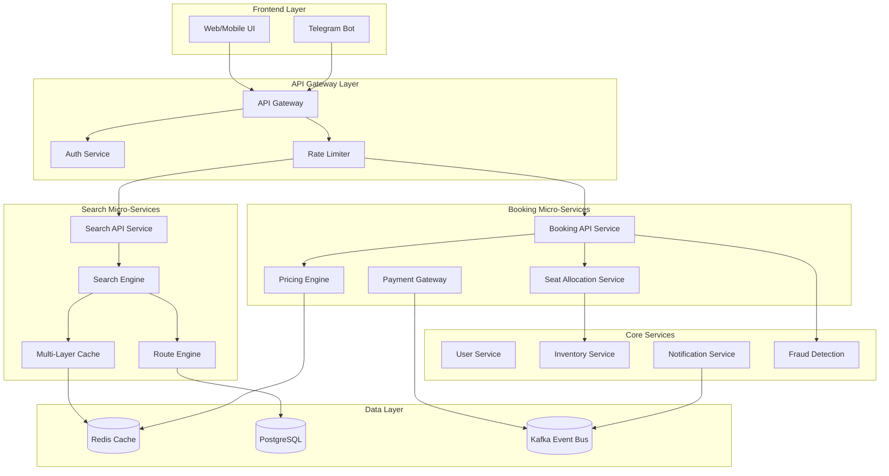
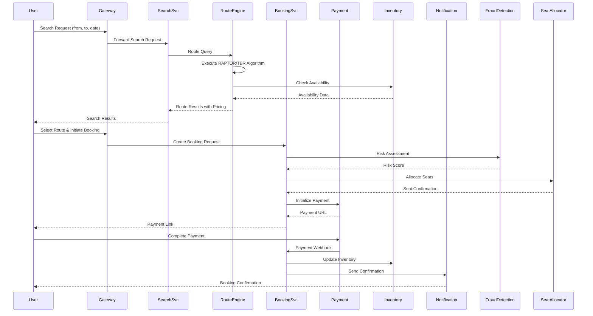
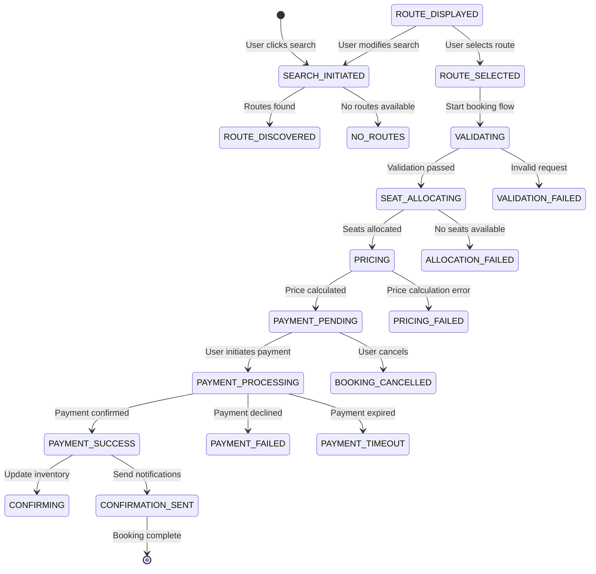
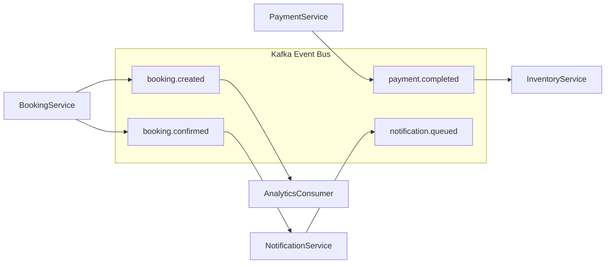

# Technical Design Document: Route Search to Booking Workflow

## 1. Executive Summary

This document defines the complete technical architecture for a route search to ticket booking workflow in a micro-services based travel platform. The design addresses the complete user journey from initiating a search to completing a booking and receiving confirmation, with comprehensive coverage of backend services, data models, API contracts, and integration patterns.

The architecture follows a micro-services approach with clear service boundaries, event-driven communication for asynchronous operations, and resilience patterns for handling failures gracefully. The design builds upon existing infrastructure documented in `backend/ALGORITHM_ARCHITECTURE.md` and extends the current implementation to provide a cohesive, production-ready workflow.

## 2. System Architecture

### 2.1 High-Level Architecture Diagram



### 2.2 Service Interaction Flow



## 3. Micro-Services Definition

### 3.1 Search Service

**Purpose**: Handle all route search operations and return optimized results based on user preferences and real-time availability.

**Key Responsibilities**:
- Accept and validate search requests from multiple clients (web, mobile, telegram)
- Execute multi-criteria route search using RAPTOR and TBR algorithms
- Apply persona-based filtering and ranking
- Integrate with cache layer for performance optimization
- Handle fallback mechanisms for degraded service

**API Contract**:
```python
# Request Schema
class SearchRequest(BaseModel):
    source: str = Field(..., min_length=2, max_length=10, description="Origin station code")
    destination: str = Field(..., min_length=2, max_length=10, description="Destination station code")
    travel_date: date = Field(..., description="Travel date")
    quota: str = Field(default="GN", description="Booking quota (GN, CK, etc.)")
    persona: PersonaType = Field(default=PersonaType.COMFORT)
    passengers: int = Field(default=1, ge=1, le=6)
    class_type: Optional[str] = None
    budget_category: Optional[str] = None
    page: int = Field(default=1, ge=1)
    limit: int = Field(default=15, ge=1, le=50)

# Response Schema
class SearchResponse(BaseModel):
    status: str
    journeys: List[JourneyResult]
    pagination: PaginationMetadata
    search_id: str
    expires_at: datetime
    alternatives: Optional[List[JourneyResult]] = None

class JourneyResult(BaseModel):
    journey_id: str
    train_number: str
    train_name: str
    from_station: str
    to_station: str
    departure_time: time
    arrival_time: time
    duration_minutes: int
    classes: List[ClassAvailability]
    total_fare: float
    availability_status: str
    metadata: Dict[str, Any] = {}
```

### 3.2 Booking Service

**Purpose**: Manage the complete booking lifecycle from seat allocation to payment confirmation.

**Key Responsibilities**:
- Create and manage booking records with idempotency guarantees
- Coordinate seat allocation across inventory services
- Integrate with payment gateway for transaction processing
- Maintain audit trail for all booking operations
- Handle fraud detection and risk assessment

**API Contract**:
```python
# Booking Request
class BookingRequest(BaseModel):
    journey_id: str
    travel_date: date
    passengers: List[PassengerDetails]
    class_type: str
    berth_preference: Optional[str] = None
    meal_preference: Optional[str] = None
    payment_method: str
    webhook_url: Optional[str] = None

# Booking Response
class BookingResponse(BaseModel):
    booking_id: str
    pnr_number: str
    status: BookingStatus
    train_details: TrainInfo
    passengers: List[PassengerInfo]
    total_amount: float
    payment_url: Optional[str] = None
    created_at: datetime
    expires_at: Optional[datetime] = None
```

### 3.3 Payment Service

**Purpose**: Handle payment processing, reconciliation, and refund management.

**Key Responsibilities**:
- Process payments through multiple payment methods
- Handle payment webhooks and callbacks
- Maintain transaction records for reconciliation
- Process refunds and cancellations
- Manage payment gateway integrations

### 3.4 Notification Service

**Purpose**: Deliver notifications through multiple channels.

**Key Responsibilities**:
- Send booking confirmations via SMS, email, and push
- Deliver status updates (PNR status, delay alerts)
- Handle notification templates and localization
- Manage delivery retry logic

## 4. Data Models

### 4.1 Core Entities

```python
# Database Models (from existing implementation)

class Booking(UserBase):
    """Core booking entity with comprehensive state tracking."""
    __tablename__ = "bookings"
    
    id: Mapped[str] = mapped_column(String(36), primary_key=True)
    pnr_number: Mapped[str] = mapped_column(String(10), unique=True, index=True)
    user_id: Mapped[str] = mapped_column(String(36), ForeignKey("users.id"))
    travel_date: Mapped[date] = mapped_column(Date, index=True)
    booking_status: Mapped[str] = mapped_column(String(50), default="pending")
    escrow_status: Mapped[EscrowStatus] = mapped_column(SQLEnum(EscrowStatus))
    
    # Financial
    amount_paid: Mapped[float] = mapped_column(Float, default=0.0)
    upi_tx_id: Mapped[Optional[str]] = mapped_column(String(100), unique=True)
    utr_number: Mapped[Optional[str]] = mapped_column(String(12), unique=True)
    
    # Train Details
    train_number: Mapped[Optional[str]] = mapped_column(String(20))
    route_id: Mapped[Optional[str]] = mapped_column(String(36))
    berth_preference: Mapped[Optional[str]] = mapped_column(String(20))
    
    # Timestamps
    created_at: Mapped[datetime] = mapped_column(DateTime, default=datetime.utcnow)
    payment_completed_at: Mapped[Optional[datetime]] = mapped_column(DateTime)

class PassengerDetails(UserBase):
    """Passenger information for a booking."""
    __tablename__ = "passenger_details"
    
    id: Mapped[str] = mapped_column(String(36), primary_key=True)
    booking_id: Mapped[str] = mapped_column(String(36), ForeignKey("bookings.id"))
    full_name: Mapped[str] = mapped_column(String(255))
    age: Mapped[int] = mapped_column(Integer)
    gender: Mapped[str] = mapped_column(String(10))
    phone_number: Mapped[Optional[str]] = mapped_column(String(20))
    email: Mapped[Optional[str]] = mapped_column(String(100))
    berth_preference: Mapped[Optional[str]] = mapped_column(String(20))
    concession_type: Mapped[Optional[str]] = mapped_column(String(50))

class SeatInventory(UserBase):
    """High-performance seat availability tracking."""
    __tablename__ = "seat_inventory"
    
    id: Mapped[str] = mapped_column(String(36), primary_key=True)
    train_number: Mapped[str] = mapped_column(String(20), index=True)
    from_station_code: Mapped[str] = mapped_column(String(10), index=True)
    to_station_code: Mapped[str] = mapped_column(String(10), index=True)
    journey_date: Mapped[date] = mapped_column(Date, index=True)
    class_type: Mapped[str] = mapped_column(String(10), index=True)
    quota: Mapped[str] = mapped_column(String(10), index=True)
    available_seats: Mapped[int] = mapped_column(Integer, default=0)
    status_text: Mapped[str] = mapped_column(String(100))
    locked_until: Mapped[Optional[datetime]] = mapped_column(DateTime)
    locked_by_booking_id: Mapped[Optional[str]] = mapped_column(String(36))
```

### 4.2 Workflow State Machine



## 5. Low-Level Design

### 5.1 Search Workflow Algorithm

```python
class SearchWorkflow:
    """
    Implements the complete search workflow with resilience patterns.
    """
    
    async def execute_search(self, request: SearchRequest) -> SearchResponse:
        """
        Execute the complete search workflow.
        
        Preconditions:
            - request.source and request.destination are valid station codes
            - request.travel_date is within booking window (today + 120 days)
            - User has not exceeded rate limits
        
        Postconditions:
            - Returns list of available routes matching criteria
            - All routes have current availability information
            - Response includes pagination metadata
        """
        # Step 1: Validate request and rate limits
        await self._validate_request(request)
        
        # Step 2: Resolve station codes to stop IDs
        source_stop, dest_stop = await self._resolve_stations(
            request.source, request.destination
        )
        
        # Step 3: Build routing request with constraints
        constraints = self._build_constraints(request)
        
        # Step 4: Execute multi-tier route search
        routes = await self._search_routes(
            source_stop, dest_stop, request.travel_date, constraints
        )
        
        # Step 5: Hydrate with real-time data
        routes = await self._hydrate_routes(routes, request.travel_date)
        
        # Step 6: Apply persona-based ranking
        routes = self._rank_routes(routes, request.persona)
        
        # Step 7: Generate response with pagination
        return self._build_response(routes, request.page, request.limit)
    
    async def _search_routes(
        self,
        source: Stop,
        destination: Stop,
        travel_date: date,
        constraints: RoutingConstraints
    ) -> List[Route]:
        """
        Execute multi-tier route search using RAPTOR and TBR algorithms.
        
        Algorithm:
            1. Execute direct route search (TurboRouter)
            2. Execute 1-transfer route search (Hub Intersection)
            3. Execute multi-transfer search (RAPTOR) if needed
            4. Merge and deduplicate results
        """
        # Parallel execution of search tiers
        tasks = [
            self._search_direct_routes(source, destination, travel_date, constraints),
            self._search_one_transfer(source, destination, travel_date, constraints),
            self._search_multi_transfer(source, destination, travel_date, constraints)
        ]
        
        results = await asyncio.gather(*tasks, return_exceptions=True)
        
        # Merge results, handling exceptions
        all_routes = []
        for result in results:
            if isinstance(result, Exception):
                logger.error(f"Search tier failed: {result}")
            else:
                all_routes.extend(result)
        
        # Deduplicate by journey_id
        unique_routes = {r.journey_id: r for r in all_routes}.values()
        
        return sorted(unique_routes, key=lambda r: r.departure_time)
```

### 5.2 Booking Workflow Algorithm

```python
class BookingWorkflow:
    """
    Implements the complete booking workflow with idempotency and locking.
    """
    
    async def execute_booking(
        self,
        request: BookingRequest,
        user_id: str
    ) -> BookingResult:
        """
        Execute the complete booking workflow.
        
        Preconditions:
            - User is authenticated
            - Journey is still available
            - Passenger data is valid
            - User has not exceeded booking limits
        
        Postconditions:
            - Booking record created with PNR
            - Seats allocated (or waitlist position assigned)
            - Payment initiated
            - Audit trail logged
        """
        # Step 1: Generate idempotency key
        idempotency_key = self._generate_idempotency_key(
            user_id, request.journey_id, request.travel_date
        )
        
        # Step 2: Check for existing booking (idempotency)
        existing = await self._check_idempotency(idempotency_key)
        if existing:
            return BookingResult.from_booking(existing)
        
        # Step 3: Acquire distributed lock
        lock_id = f"booking:{user_id}:{request.travel_date}"
        async with self.lock_manager.lock(lock_id):
            # Double-check idempotency inside lock
            existing = await self._check_idempotency(idempotency_key)
            if existing:
                return BookingResult.from_booking(existing)
            
            # Step 4: Validate request
            await self._validate_booking_request(request)
            
            # Step 5: Fraud detection
            fraud_result = await self._check_fraud(user_id, request)
            if not fraud_result.allowed:
                raise FraudDetectionError(fraud_result.reason)
            
            # Step 6: Allocate seats
            allocation = await self._allocate_seats(request)
            
            # Step 7: Calculate final price
            price = await self._calculate_price(request, allocation)
            
            # Step 8: Create booking record
            booking = await self._create_booking(
                user_id, request, allocation, price, idempotency_key
            )
            
            # Step 9: Initiate payment
            payment_url = await self._initiate_payment(booking, price)
        
        # Step 10: Trigger async webhooks
        await self._trigger_webhooks("booking_created", booking)
        
        return BookingResult(booking=booking, payment_url=payment_url)
    
    async def _allocate_seats(self, request: BookingRequest) -> SeatAllocation:
        """
        Allocate seats using the advanced seat allocation engine.
        
        Algorithm:
            1. Check availability for requested class
            2. Apply preference matching (berth, position)
            3. Apply family grouping if applicable
            4. Reserve seats with timeout lock
            5. Return allocation result
        """
        # Get available seats from inventory
        available = await self.inventory.get_available_seats(
            train_number=request.train_number,
            from_station=request.from_station,
            to_station=request.to_station,
            travel_date=request.travel_date,
            class_type=request.class_type
        )
        
        if not available:
            # Check waitlist availability
            waitlist_position = await self._add_to_waitlist(request)
            return SeatAllocation(
                status=AllocationStatus.WAITLIST,
                waitlist_position=waitlist_position
            )
        
        # Apply preference matching
        allocation = self.seat_allocator.allocate(
            passengers=request.passengers,
            available_seats=available,
            preferences=[p.berth_preference for p in request.passengers]
        )
        
        # Lock allocated seats
        await self.inventory.lock_seats(
            allocation.seat_ids,
            booking_id=booking.id,
            lock_duration=30  # 30 minutes
        )
        
        return allocation
```

### 5.3 Payment Processing Algorithm

```python
class PaymentWorkflow:
    """
    Handles payment processing with retry logic and webhook handling.
    """
    
    async def process_payment(
        self,
        booking_id: str,
        payment_method: str,
        amount: float
    ) -> PaymentResult:
        """
        Process payment for a booking.
        
        Preconditions:
            - Booking exists and is in pending state
            - Amount matches booking amount
            - Payment method is valid
        
        Postconditions:
            - Payment record created
            - Payment gateway transaction initiated
            - Booking status updated on success/failure
        """
        # Create payment record
        payment = await self._create_payment_record(
            booking_id, payment_method, amount
        )
        
        # Generate payment URL based on method
        if payment_method == "UPI":
            return await self._process_upi_payment(payment)
        elif payment_method == "CARD":
            return await self._process_card_payment(payment)
        else:
            raise PaymentMethodError(f"Unsupported payment method: {payment_method}")
    
    async def handle_payment_webhook(
        self,
        payment_id: str,
        status: str,
        transaction_details: Dict
    ) -> None:
        """
        Handle payment gateway webhook callback.
        
        This method is idempotent - multiple calls with same status
        will not create duplicate state changes.
        """
        # Verify webhook signature
        if not self._verify_webhook_signature(transaction_details):
            raise WebhookVerificationError("Invalid webhook signature")
        
        # Get payment record
        payment = await self._get_payment(payment_id)
        
        # Check for idempotent update
        if payment.status == status:
            logger.info(f"Payment {payment_id} already in status {status}")
            return
        
        # Update payment status
        await self._update_payment_status(payment, status, transaction_details)
        
        # Handle booking update based on payment status
        if status == "SUCCESS":
            await self._confirm_booking(payment.booking_id, transaction_details)
        elif status in ["FAILED", "CANCELLED"]:
            await self._cancel_booking(payment.booking_id)
        
        # Trigger notification
        await self._send_payment_notification(payment)
```

## 6. Integration Points

### 6.1 Telegram Bot Integration

The existing `search_handler.py` provides the foundation for Telegram bot integration. The design extends this with:

```python
class TelegramBookingHandler:
    """
    Handles booking flow through Telegram interface.
    """
    
    async def handle_booking_flow(
        self,
        message: TelegramMessage,
        context: UserContext
    ) -> HandlerResult:
        """
        Manage the complete booking conversation flow.
        
        Flow:
            1. User selects a train from search results
            2. Request passenger details
            3. Show price summary
            4. Request payment confirmation
            5. Send booking confirmation
        """
        state = context.state.get("booking_state", "idle")
        
        if state == "idle":
            return await self._start_booking(message, context)
        elif state == "passenger_details":
            return await self._collect_passenger_details(message, context)
        elif state == "confirmation":
            return await self._confirm_booking(message, context)
        elif state == "payment":
            return await self._handle_payment(message, context)
```

### 6.2 Event-Driven Communication



## 7. Identified Gaps and Solutions

### 7.1 Gap Analysis

| Gap ID | Description | Severity | Current State | Required Action |
|--------|-------------|----------|---------------|-----------------|
| G1 | No unified booking API endpoint | High | Scattered across services | Create Booking API Service |
| G2 | Missing payment webhook handler | High | Not implemented | Implement PaymentWebhookService |
| G3 | Seat allocation not integrated | Medium | In-memory engine only | Integrate with InventoryService |
| G4 | No booking state machine | Medium | Implicit state only | Implement explicit state transitions |
| G5 | Missing frontend API contracts | High | No documented APIs | Define OpenAPI specifications |
| G6 | Telegram booking flow incomplete | Medium | Search only | Extend to full booking |
| G7 | No booking cancellation flow | Low | Not implemented | Implement cancellation workflow |
| G8 | Missing waitlist management | Medium | Basic support only | Implement queue management |

### 7.2 Implementation Solutions

**G1 - Unified Booking API**:
```python
# backend/api/booking_routes.py
from fastapi import APIRouter, Depends
from services.booking_service import BookingService

router = APIRouter(prefix="/api/v1/bookings", tags=["bookings"])

@router.post("/")
async def create_booking(
    request: BookingRequest,
    user: User = Depends(get_current_user)
) -> BookingResponse:
    """Create a new booking."""
    service = BookingService()
    return await service.execute_booking(request, user.id)

@router.get("/{booking_id}")
async def get_booking(
    booking_id: str,
    user: User = Depends(get_current_user)
) -> BookingResponse:
    """Get booking details."""
    # Implementation
```

**G2 - Payment Webhook Handler**:
```python
# backend/api/payment_webhook.py
from fastapi import APIRouter, Request, HTTPException

router = APIRouter(prefix="/api/v1/webhooks", tags=["webhooks"])

@router.post("/payment/{provider}")
async def handle_payment_webhook(
    provider: str,
    request: Request
):
    """Handle payment provider webhooks."""
    payload = await request.json()
    signature = request.headers.get("X-Signature")
    
    if not verify_signature(provider, payload, signature):
        raise HTTPException(status_code=401, detail="Invalid signature")
    
    await payment_service.handle_webhook(provider, payload)
    return {"status": "received"}
```

## 8. Implementation Roadmap

### Phase 1: Foundation (Weeks 1-2)

1. **Create Booking API Service**
   - Set up FastAPI application
   - Implement booking endpoints
   - Configure database models

2. **Implement Payment Webhook Handler**
   - Create webhook endpoints for payment providers
   - Implement signature verification
   - Handle payment status updates

### Phase 2: Core Workflow (Weeks 3-4)

1. **Integrate Seat Allocation**
   - Connect to InventoryService
   - Implement seat locking mechanism
   - Handle waitlist management

2. **Implement Booking State Machine**
   - Define explicit state transitions
   - Add state validation
   - Implement audit logging

### Phase 3: Integration (Weeks 5-6)

1. **Telegram Bot Extension**
   - Add booking conversation flow
   - Implement passenger detail collection
   - Handle payment through bot

2. **Notification Integration**
   - Connect to NotificationService
   - Implement booking confirmation templates
   - Add status update notifications

### Phase 4: Polish (Weeks 7-8)

1. **Error Handling & Resilience**
   - Implement circuit breakers
   - Add retry logic
   - Handle edge cases

2. **Testing & Documentation**
   - Unit tests (80% coverage)
   - Integration tests
   - API documentation

## 9. Security Considerations

### 9.1 Authentication & Authorization

- All booking endpoints require JWT authentication
- Users can only access their own bookings
- Admin endpoints require role-based access control

### 9.2 Fraud Prevention

- Rate limiting per user and IP
- Velocity checks for booking frequency
- Amount-based risk scoring
- Device fingerprinting

### 9.3 Data Protection

- Passenger PII encrypted at rest
- Payment data never logged
- Audit trail for all sensitive operations

## 10. Performance Considerations

### 10.1 Caching Strategy

- Search results cached with TTL (configurable per quota)
- Seat availability cached with short TTL (30 seconds)
- User preferences cached for personalization

### 10.2 Database Optimization

- Indexed queries on booking lookups (PNR, user_id, travel_date)
- Partitioned tables for large booking volumes
- Connection pooling with appropriate limits

### 10.3 Horizontal Scaling

- Stateless services can scale horizontally
- Redis for distributed locking and caching
- Kafka for event-driven communication

## 11. Appendix

### A. Error Codes

| Code | Description | Resolution |
|------|-------------|------------|
| ERR001 | Station not found | Verify station code |
| ERR002 | No routes found | Try different date/route |
| ERR003 | Seats unavailable | Try different class/date |
| ERR004 | Payment failed | Retry with different method |
| ERR005 | Booking timeout | Retry booking |
| ERR006 | Rate limit exceeded | Wait and retry |

### B. Configuration Parameters

```yaml
booking:
  max_bookings_per_user_24h: 5
  max_bookings_per_user_7d: 20
  max_amount_per_booking: 100000
  lock_timeout_seconds: 30
  payment_expiry_minutes: 30

search:
  max_results_per_page: 50
  cache_ttl_seconds: 300
  rate_limit_requests_per_minute: 10
```

### C. Database Schema Changes

```sql
-- New tables required for booking workflow
CREATE TABLE booking_idempotency (
    id SERIAL PRIMARY KEY,
    idempotency_key VARCHAR(64) UNIQUE NOT NULL,
    booking_id VARCHAR(50) NOT NULL,
    request_hash VARCHAR(64) NOT NULL,
    created_at TIMESTAMP DEFAULT NOW(),
    expires_at TIMESTAMP NOT NULL
);

CREATE TABLE booking_fraud_checks (
    id SERIAL PRIMARY KEY,
    booking_id VARCHAR(50) NOT NULL,
    user_id VARCHAR(100) NOT NULL,
    check_type VARCHAR(50) NOT NULL,
    risk_score FLOAT NOT NULL,
    flags JSONB,
    decision VARCHAR(20) NOT NULL,
    created_at TIMESTAMP DEFAULT NOW()
);

CREATE INDEX idx_booking_user_date ON bookings(user_id, travel_date);
CREATE INDEX idx_booking_pnr ON bookings(pnr_number);
CREATE INDEX idx_booking_status ON bookings(booking_status);
```