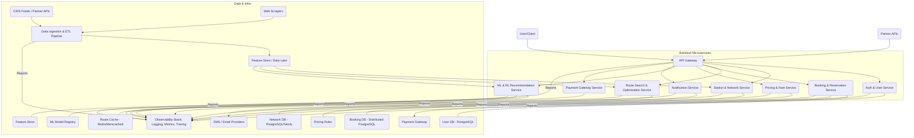
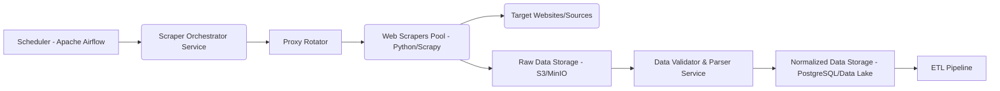
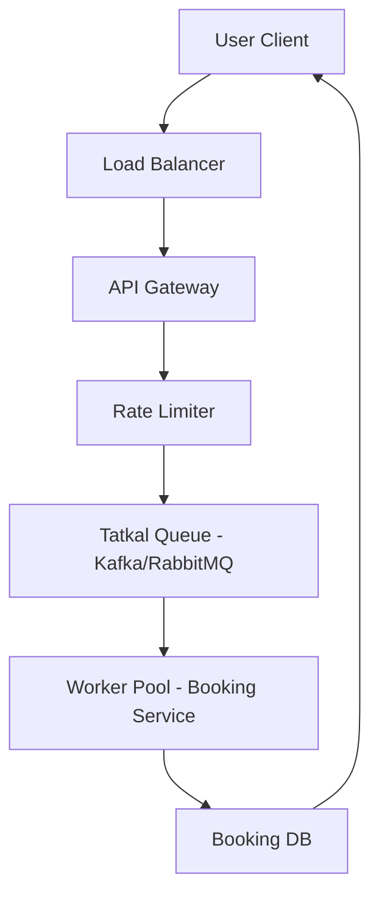

# Advanced Railway Intelligence Engine Design Document

## Foreword

This document serves as a comprehensive technical deep-dive into the design and architectural considerations for a next-generation Railway Intelligence Engine. It systematically reverse-engineers concepts from existing systems, particularly those implied by the "Optimization of Railway Reservation System using Reinforcement Learning" report, and integrates them with modern multi-modal routing principles exemplified by the `startupV2` project. The aim is to lay out a production-grade blueprint, meticulously detailing every technical idea, algorithm, optimization logic, and architectural principle required for a highly scalable, performant, and intelligent railway reservation and routing system. This design emphasizes AI-driven optimization, real-time data processing, and a superior user experience, moving beyond conventional approaches.

---

## SECTION 1 — COMPLETE SYSTEM ARCHITECTURE

### 1.1 Full Backend Architecture

**Objective:** To design a resilient, scalable, and modular backend capable of handling high transaction volumes, complex routing computations, and intelligent decision-making.

**Architectural Paradigm:** Microservices-oriented architecture (MSA) leveraging event-driven patterns for loose coupling and high availability.

**Core Components:**

1.  **API Gateway (e.g., Nginx, Envoy):**
    *   **Functionality:** Central entry point for all client requests (frontend, mobile, external partners). Handles load balancing, SSL termination, authentication/authorization enforcement (initial layer), rate limiting, and request routing to appropriate microservices.
    *   **Technologies:** Nginx (for performance and flexibility), Kong or Ocelot (for advanced API management features).
    *   **Key Design Decisions:**
        *   **Edge Caching:** Cache static content and frequently accessed API responses to reduce upstream load.
        *   **Circuit Breaker & Retry Logic:** Implement resilience patterns to prevent cascading failures.
        *   **Observability Integration:** Centralized logging, metrics, and tracing for all incoming requests.

2.  **Core Microservices (Polyglot Persistence & Services):**
    *   **User Service:** Manages user profiles, authentication, authorization, and preferences.
        *   **Database:** PostgreSQL (for relational integrity), Redis (for session management and caching user preferences).
    *   **Station & Network Service:** Manages static and dynamic railway network data (stations, tracks, schedules).
        *   **Database:** PostgreSQL with PostGIS extension (for spatial queries), Neo4j (for complex graph traversals and relationship management).
        *   **Data Model:** GTFS (General Transit Feed Specification) as a foundation, extended for railway-specific attributes.
    *   **Route Search & Optimization Service:** The core computational engine for finding and optimizing routes.
        *   **Algorithms:** RAPTOR (for multi-modal), advanced graph traversal (Dijkstra, A*, Yen's k-shortest path), custom heuristics for layover generation.
        *   **Technologies:** Python (FastAPI for speed, NumPy/SciPy for computations), Rust/Go (for performance-critical inner loops).
        *   **Scalability:** Horizontal scaling through stateless design, distributed queue for long-running searches.
    *   **Booking & Reservation Service:** Handles ticket booking, seat allocation, PNR generation, and payment integration.
        *   **Database:** Transactional RDBMS (PostgreSQL, distributed via sharding).
        *   **Concurrency:** Optimistic/Pessimistic locking strategies, distributed transactions (e.g., Saga pattern) for multi-service consistency.
    *   **Pricing & Fare Calculation Service:** Dynamically calculates fares, applies discounts, and handles complex pricing rules.
        *   **Logic:** Rule Engine (e.g., Drools, custom Python rules engine), ML models for dynamic pricing.
    *   **ML & RL Recommendation Service:** Houses the Reinforcement Learning agent, Tatkal prediction, seat availability, and personalization models.
        *   **Technologies:** Python (TensorFlow, PyTorch, Scikit-learn), Ray/Dask (for distributed training and inference).
        *   **Data Store:** Feature Store (e.g., Feast) for managing ML features, time-series database (e.g., InfluxDB) for real-time sensor data.
    *   **Notification Service:** Manages push notifications, SMS, email alerts for bookings, delays, cancellations.
        *   **Technologies:** Message Broker (Kafka/RabbitMQ), third-party notification APIs.
    *   **Payment Gateway Service:** Securely integrates with multiple payment providers.
        *   **Compliance:** PCI DSS compliance.
        *   **Security:** Tokenization, encryption, secure key management.

3.  **Data Ingestion & Processing Pipeline (ETL/ELT):**
    *   **Components:** Web crawlers, data validators, transformers, loaders.
    *   **Technologies:** Apache Airflow (orchestration), Apache Kafka (real-time streaming), Apache Spark (batch processing), Flink (stream processing).
    *   **Sources:** CRIS data feeds, partner APIs, web scraping, IoT sensors (train location, track status).

4.  **Observability Stack:**
    *   **Logging:** Centralized log aggregation (Elasticsearch, Loki).
    *   **Metrics:** Prometheus/Grafana for monitoring system health and performance.
    *   **Tracing:** Distributed tracing (Jaeger, Zipkin) for inter-service communication visibility.
    *   **Alerting:** Alertmanager for incident notification.

**System Diagram (High-Level Microservices):**



### 1.2 Full Frontend Architecture

**Objective:** To provide a highly responsive, intuitive, and feature-rich user interface that seamlessly integrates with the backend services.

**Architectural Paradigm:** Single-Page Application (SPA) with component-based development.

**Core Components:**

1.  **Client-Side Framework (e.g., React/Vite with TypeScript):**
    *   **Component-Based:** Modular UI components for reusability and maintainability (e.g., Station Search, Route Display, Booking Widget).
    *   **State Management:** Centralized state management (e.g., Redux, Zustand, React Context) for consistent data flow across the application.
    *   **Routing:** Client-side routing (e.g., React Router) for smooth navigation without full page reloads.
    *   **Styling:** Utility-first CSS framework (e.g., Tailwind CSS) combined with component-scoped styles.

2.  **API Consumption Layer:**
    *   **HTTP Client:** Axios or Fetch API for making asynchronous requests to the API Gateway.
    *   **Data Fetching Libraries:** React Query or SWR for efficient data fetching, caching, and synchronization.
    *   **Schema Validation:** Zod or Yup for validating API responses.

3.  **UI/UX Design Decisions:**
    *   **Progressive Enhancement:** Core functionality available on basic browsers, enhanced for modern ones.
    *   **Responsive Design:** Optimized for various screen sizes (desktop, tablet, mobile).
    *   **Accessibility (A11Y):** Adherence to WCAG standards for inclusive design.
    *   **Feedback Mechanisms:** Clear loading indicators, error messages, and success notifications for user actions.
    *   **Intuitive Search:** Predictive text for station names, date pickers, clear display of filters.
    *   **Route Visualization:** Interactive maps (e.g., Mapbox GL JS, Leaflet) to display route segments, layovers, and multimodal transfers.
    *   **Booking Flow:** Multi-step, guided process with clear summary and progress indicators.

4.  **Build & Deployment:**
    *   **Bundler:** Vite (for fast development and optimized production builds).
    *   **CI/CD:** Automated testing, building, and deployment to CDN/static hosting.

### 1.3 Data Flow from User Input → Route Generation → Ranking → Display

**Scenario:** User searches for a multi-modal route from Source (S) to Destination (D) on a specific Date.

```mermaid
sequenceDiagram
    participant U as User (Frontend)
    participant AG as API Gateway
    participant US as User Service
    participant RS as Route Search Service
    participant NSS as Station & Network Service
    participant MLRS as ML & RL Service
    participant DB as Databases/Caches

    U->>AG: 1. Search Request (S, D, Date, Preferences)
    AG->>+US: 2. Authenticate/Authorize User
    US->>-AG: 3. User Context
    AG->>+RS: 4. Route Search Request (S, D, Date, User Context)
    RS->>+NSS: 5. Get Network Data (Stations, Schedules, Graph)
    NSS->>DB: 6. Fetch Network Topology
    DB-->>-NSS: 7. Network Data
    NSS-->>-RS: 8. Network Data
    RS->>RS: 9. Execute RAPTOR/Graph Algorithm (Find candidate routes, layovers)
    RS->>+MLRS: 10. Request Route Ranking (Candidate Routes, User Context)
    MLRS->>DB: 11. Fetch User Preferences, Historical Interactions
    DB-->>-MLRS: 12. User Profile, Features
    MLRS->>MLRS: 13. Apply RL/ML Ranking Model
    MLRS-->>-RS: 14. Ranked Routes (Score, Features)
    RS->>+FS: 15. Calculate Fares for Ranked Routes
    FS-->>-RS: 16. Fares
    RS-->>-AG: 17. Optimized & Ranked Routes
    AG->>U: 18. Display Routes
    U->>AG: 19. User Selects Route & Proceeds to Booking
```

**Detailed Steps:**

1.  **User Input:** User enters Source, Destination, Date, and optional preferences (e.g., "fastest," "cheapest," "avoid late night layovers") into the frontend UI.
2.  **API Gateway Routing:** The frontend sends a search request to the API Gateway. The Gateway performs initial authentication/authorization, logs the request, and routes it to the `Route Search & Optimization Service`.
3.  **User Context Enrichment:** The `Route Search Service` may query the `User Service` to retrieve user-specific preferences, loyalty status, or historical booking patterns.
4.  **Network Data Retrieval:** It queries the `Station & Network Service` to get the latest railway network topology, station details, train schedules, and real-time operational data (e.g., delays, cancellations). This service can fetch from an in-memory graph database (e.g., Neo4j, or a custom graph structure loaded into Redis) for speed.
5.  **Candidate Route Generation:** The `Route Search Service` executes its core multi-modal routing algorithm (e.g., RAPTOR, modified A*, Yen's algorithm for k-shortest paths). This involves:
    *   **Graph Traversal:** Identifying all feasible direct and indirect (layover) connections within the specified constraints (time, max transfers).
    *   **Layover Logic:** Applying the "Set A & Set B" intersection logic, extended to find optimal transfer points.
    *   **Constraint Filtering:** Initially filtering out routes that violate hard constraints (e.g., impossible transfer times, closed routes).
6.  **Reinforcement Learning/Machine Learning Ranking:** The generated candidate routes are sent to the `ML & RL Recommendation Service`. This service:
    *   Fetches the user's historical interaction data, demographic information, and past preferences from a Feature Store.
    *   Applies a trained RL agent or a supervised ML model to rank the routes based on predicted user satisfaction, booking probability, and other objectives (e.g., revenue, operational efficiency).
    *   The RL agent's policy is updated asynchronously based on user booking feedback.
7.  **Pricing & Fare Calculation:** For the top-ranked routes, the `Pricing & Fare Service` calculates the exact fare, including base costs, dynamic pricing adjustments, and applicable discounts.
8.  **Display & Feedback:** The `Route Search Service` returns the final sorted and priced routes to the API Gateway, which then sends them to the frontend for display. The frontend visually presents these options, potentially highlighting recommended routes or offering explanations for the ranking.
9.  **User Interaction & Learning:** When a user selects a route and proceeds to book, this action is logged and fed back to the `ML & RL Recommendation Service` to update the RL agent's understanding of successful actions and refine its policy.

### 1.4 Database Schema Assumptions

**Objective:** To define a robust, extensible, and performant database schema supporting static network data, dynamic operational data, user information, and booking records. Given a PostgreSQL primary backend with PostGIS.

**Key Principles:**
*   **Normalization:** To reduce data redundancy and improve data integrity.
*   **Indexing:** Strategic indexing for query performance.
*   **Partitioning/Sharding:** For scalability (discussed in Section 6).
*   **Spatial Data:** Leveraging PostGIS for efficient geospatial queries.

**Core Tables (Illustrative, simplified):**

1.  **`stations` Table:**
    *   `station_id` (PK, UUID): Unique identifier for each station.
    *   `name` (VARCHAR): Official name of the station.
    *   `code` (VARCHAR, UNIQUE): Short code (e.g., "NDLS" for New Delhi).
    *   `city` (VARCHAR): City where the station is located.
    *   `state` (VARCHAR): State/Province.
    *   `country` (VARCHAR): Country.
    *   `location` (GEOGRAPHY(Point, 4326)): Geographical coordinates (latitude, longitude) using PostGIS.
    *   `facilities_json` (JSONB): JSON document for available facilities (waiting rooms, food, accessibility, Wi-Fi).
    *   `platform_count` (INTEGER).
    *   `is_major_junction` (BOOLEAN).
    *   `created_at`, `updated_at` (TIMESTAMPTZ).

2.  **`trains` Table:**
    *   `train_id` (PK, UUID): Unique identifier for each train.
    *   `number` (VARCHAR, UNIQUE): Train number (e.g., "12951").
    *   `name` (VARCHAR): Train name (e.g., "Mumbai Rajdhani").
    *   `type` (VARCHAR): E.g., "Express", "Passenger", "Freight", "Vande Bharat".
    *   `operator` (VARCHAR): Railway zone/operator.
    *   `max_speed_kmph` (INTEGER).
    *   `total_coaches` (INTEGER).
    *   `created_at`, `updated_at` (TIMESTAMPTZ).

3.  **`schedules` Table:** (Defines the fixed route and timings for a train)
    *   `schedule_id` (PK, UUID).
    *   `train_id` (FK to `trains.train_id`).
    *   `route_variant_id` (FK to `route_variants.route_variant_id`): For trains with multiple operational routes.
    *   `valid_from`, `valid_to` (DATE): Operational date range.
    *   `operating_days` (BITMASK/ARRAY of BOOLEAN): E.g., [T, F, F, F, F, F, F] for Mon only.
    *   `created_at`, `updated_at` (TIMESTAMPTZ).

4.  **`schedule_stops` Table:** (Details of each stop within a schedule)
    *   `schedule_stop_id` (PK, UUID).
    *   `schedule_id` (FK to `schedules.schedule_id`).
    *   `station_id` (FK to `stations.station_id`).
    *   `arrival_time` (TIME): Scheduled arrival time.
    *   `departure_time` (TIME): Scheduled departure time.
    *   `sequence` (INTEGER): Order of stop in the route.
    *   `distance_from_origin_km` (NUMERIC).
    *   `platform_number` (VARCHAR, NULLABLE).
    *   `created_at`, `updated_at` (TIMESTAMPTZ).
    *   **Composite Index:** `(schedule_id, sequence)` for efficient route reconstruction.

5.  **`route_segments` Table:** (Pre-computed physical segments between stations for graph building)
    *   `segment_id` (PK, UUID).
    *   `origin_station_id` (FK to `stations.station_id`).
    *   `destination_station_id` (FK to `stations.station_id`).
    *   `distance_km` (NUMERIC).
    *   `track_count` (INTEGER).
    *   `max_speed_kmph` (INTEGER).
    *   `geometry` (GEOGRAPHY(LineString, 4326)): Track path for visualization.
    *   `created_at`, `updated_at` (TIMESTAMPTZ).

6.  **`users` Table:**
    *   `user_id` (PK, UUID).
    *   `username` (VARCHAR, UNIQUE).
    *   `email` (VARCHAR, UNIQUE).
    *   `password_hash` (VARCHAR).
    *   `pnr_id` (VARCHAR, NULLABLE): For linking historical IRCTC data if available.
    *   `preferences_json` (JSONB): User preferences (e.g., "window seat", "veg meal", "fastest route").
    *   `rewards_points` (INTEGER).
    *   `is_premium` (BOOLEAN).
    *   `created_at`, `updated_at` (TIMESTAMPTZ).

7.  **`bookings` Table:**
    *   `booking_id` (PK, UUID).
    *   `user_id` (FK to `users.user_id`).
    *   `pnr_number` (VARCHAR, UNIQUE): Generated PNR.
    *   `booking_date` (DATE).
    *   `travel_date` (DATE).
    *   `status` (ENUM: 'CONFIRMED', 'WAITLIST', 'CANCELLED').
    *   `total_fare` (NUMERIC).
    *   `payment_status` (ENUM: 'PENDING', 'PAID', 'FAILED').
    *   `created_at`, `updated_at` (TIMESTAMPTZ).

8.  **`booking_segments` Table:** (Details of each train journey within a booking)
    *   `segment_id` (PK, UUID).
    *   `booking_id` (FK to `bookings.booking_id`).
    *   `train_id` (FK to `trains.train_id`).
    *   `origin_station_id` (FK to `stations.station_id`).
    *   `destination_station_id` (FK to `stations.station_id`).
    *   `departure_time_actual` (TIMESTAMPTZ).
    *   `arrival_time_actual` (TIMESTAMPTZ).
    *   `coach_details` (VARCHAR).
    *   `seat_number` (VARCHAR).
    *   `fare_paid` (NUMERIC).
    *   `sequence` (INTEGER): Order of segment in the multi-segment journey.
    *   `is_transfer_point` (BOOLEAN).
    *   `transfer_duration_minutes` (INTEGER, NULLABLE).
    *   `created_at`, `updated_at` (TIMESTAMPTZ).

9.  **`realtime_data` Table:** (For dynamic updates, potentially a time-series DB or Kafka topics)
    *   `event_id` (PK, UUID).
    *   `train_id` (FK to `trains.train_id`).
    *   `timestamp` (TIMESTAMPTZ).
    *   `location` (GEOGRAPHY(Point, 4326), NULLABLE): Current train location.
    *   `delay_minutes` (INTEGER).
    *   `status_code` (VARCHAR): E.g., "ON_TIME", "DELAYED", "CANCELLED".
    *   `next_stop_id` (FK to `stations.station_id`, NULLABLE).
    *   `created_at`.

10. **`rl_feedback_logs` Table:** (For Reinforcement Learning)
    *   `log_id` (PK, UUID).
    *   `user_id` (FK to `users.user_id`).
    *   `search_query_hash` (VARCHAR): Hashed search query for state tracking.
    *   `recommended_routes_json` (JSONB): JSON array of recommended routes (state).
    *   `selected_route_index` (INTEGER): Index of route selected by user (action).
    *   `reward_value` (NUMERIC): Calculated reward based on booking success/satisfaction.
    *   `timestamp` (TIMESTAMPTZ).
    *   `created_at`.

### 1.5 Caching Strategy Possibilities

**Objective:** Minimize latency and reduce database/compute load for frequently accessed data and expensive computations.

**Layers of Caching:**

1.  **Client-Side Cache (Browser/CDN):**
    *   **Mechanism:** HTTP caching headers (`Cache-Control`, `ETag`, `Last-Modified`), Service Workers for offline capabilities and aggressive caching of static assets and API responses.
    *   **Content:** Static frontend assets (JS, CSS, images), frequently accessed static data (e.g., list of all stations, train types).
    *   **Tools:** Cloudflare, Akamai (CDN), Service Worker API.

2.  **API Gateway Cache:**
    *   **Mechanism:** In-memory caching, distributed cache (e.g., Redis).
    *   **Content:** Responses to idempotent API calls that are relatively stable (e.g., `GET /stations`, `GET /trains/{id}/details`).
    *   **Tools:** Nginx caching module, Envoy proxy cache filters.

3.  **Application-Level Caches (Microservices):**
    *   **Mechanism:** In-memory caches (e.g., Guava Cache in Java, `functools.lru_cache` in Python), dedicated distributed caches.
    *   **Content:**
        *   **Station & Network Service:** GTFS graph data, pre-computed station reachability matrices, schedule lookups.
        *   **Route Search Service:** Recently computed routes for popular source-destination pairs (Time-to-Live, TTL, based on data freshness).
        *   **User Service:** User profiles, authentication tokens, session data.
        *   **Pricing Service:** Fare rules, dynamic pricing parameters.
        *   **ML & RL Service:** ML model weights, pre-computed feature vectors, user preference profiles.
    *   **Tools:** Redis (primary choice for distributed caching due to versatility), Memcached (for simpler key-value stores).

4.  **Database Caching:**
    *   **Mechanism:** Database-specific caching (e.g., PostgreSQL's shared buffers), query result caching (less common for highly dynamic data).
    *   **Content:** Frequently accessed rows, index data.
    *   **Tools:** PGBouncer (connection pooling, can have some caching effects).

**Invalidation Strategies:**

*   **TTL (Time-To-Live):** Data expires after a set period. Suitable for data that can tolerate some staleness.
*   **Event-Driven Invalidation:** When underlying data changes (e.g., a train schedule update, a station facility change), an event is published to a message broker (Kafka), and relevant microservices listen and invalidate their caches.
*   **Cache-Aside Pattern:** Application explicitly loads data from the database on a cache miss and then stores it in the cache.
*   **Write-Through/Write-Back:** Data is written to the cache and then synchronously/asynchronously to the database. (Less common for complex, distributed systems).

### 1.6 API Integration Strategy

**Objective:** To enable seamless and secure communication between internal microservices and with external partners (e.g., CRIS, payment gateways, other transport providers).

**Internal API (Microservices Communication):**

1.  **RESTful APIs (Synchronous):**
    *   **Protocol:** HTTP/1.1 or HTTP/2.
    *   **Serialization:** JSON (primary), Protocol Buffers (for performance-critical paths).
    *   **Design:** HATEOAS principles where applicable, clear resource-oriented endpoints.
    *   **Error Handling:** Standardized HTTP status codes (2xx, 4xx, 5xx) with detailed error payloads.
    *   **Example:** `GET /users/{user_id}`, `POST /bookings`, `GET /stations?name=Delhi`.

2.  **Event-Driven Communication (Asynchronous):**
    *   **Mechanism:** Message Broker (Apache Kafka, RabbitMQ).
    *   **Pattern:** Publish-Subscribe. Services publish events (e.g., `BookingCreated`, `ScheduleUpdated`, `TrainDelayed`), and other interested services consume them.
    *   **Benefits:** Decoupling, improved fault tolerance, eventual consistency, real-time data propagation.
    *   **Example:** `Booking Service` publishes `BookingConfirmed` event -> `Notification Service` consumes to send SMS/Email; `ML & RL Service` consumes to log feedback.

3.  **gRPC (for high-performance inter-service communication):**
    *   **Protocol:** HTTP/2.
    *   **Serialization:** Protocol Buffers.
    *   **Benefits:** Lower latency, higher throughput compared to REST due to binary serialization and multiplexing. Strong schema enforcement.
    *   **Use Cases:** Performance-critical internal APIs like `Route Search Service` to `Station & Network Service` for graph data, or `ML & RL Service` for real-time inference.

**External API (Third-Party Integrations):**

1.  **CRIS Data Feeds:**
    *   **Protocol:** Potentially custom (FTP, SFTP, proprietary APIs).
    *   **Integration:** Dedicated `CRIS Adapter Service` to transform CRIS data into internal GTFS-like format. Batch processing for static schedules, streaming for real-time updates.

2.  **Payment Gateways:**
    *   **Protocol:** HTTPS/REST, potentially SOAP (legacy systems).
    *   **Security:** OAuth 2.0 for authorization, PCI DSS compliance for sensitive data handling, tokenization of card details.
    *   **Example:** `POST /payments/initiate`, `GET /payments/{transaction_id}/status`.

3.  **SMS/Email Providers:**
    *   **Protocol:** HTTPS/REST.
    *   **Reliability:** Retry mechanisms, fallback providers, rate limiting.

4.  **Other Multi-Modal Partners (Bus, Metro, Flights):**
    *   **Protocol:** Standardized (GTFS-Realtime for transit, OpenTravel Alliance for flights) or proprietary REST APIs.
    *   **Integration:** Dedicated adapter microservices for each partner, normalizing data into a common internal multi-modal format.

**Security:**

*   **OAuth 2.0 / OpenID Connect:** For user authentication and authorization.
*   **API Keys / JWT:** For service-to-service authentication and external partner access.
*   **TLS/SSL:** All communication encrypted in transit.
*   **Input Validation:** Strict validation on all API inputs to prevent injection attacks.
*   **Least Privilege:** Services only have access to resources they strictly need.

### 1.7 Web Scraping Pipeline Design

**Objective:** To gather supplementary data, especially when official APIs are unavailable or insufficient, while ensuring robustness, politeness, and legal compliance.

**Rationale (from the report):** "The Main hurdle was to collect the respective data since Indian railway doesn't provide an official API for data collection for private usage. So we had to collect through various public gateways."

**Architecture:**



**Components & Design Considerations:**

1.  **Scheduler (Apache Airflow/Celery Beat):**
    *   **Function:** Triggers scraping jobs at predefined intervals (e.g., daily for schedules, hourly for real-time updates, ad-hoc for new sources).
    *   **DAGs:** Define Directed Acyclic Graphs for complex scraping workflows.

2.  **Scraper Orchestrator Service:**
    *   **Function:** Manages the lifecycle of scraping tasks, distributes jobs to scraper workers, monitors their health, and handles retries.
    *   **Technologies:** Python with a task queue (e.g., Celery, RQ) and a message broker (RabbitMQ, Redis).

3.  **Web Scrapers Pool (Python/Scrapy):**
    *   **Framework:** Scrapy (for its robust, asynchronous, and extensible architecture). Python's BeautifulSoup for simpler parsing tasks (as mentioned in the report).
    *   **Politeness:**
        *   **`robots.txt` Adherence:** Automatically respect exclusion rules.
        *   **Rate Limiting:** Implement delays and random intervals between requests.
        *   **User-Agent Rotation:** Mimic different browsers to avoid detection.
    *   **Anti-Blocking Measures:**
        *   **Proxy Rotation:** Use a pool of IP proxies to distribute requests and avoid IP bans.
        *   **CAPTCHA Handling:** Integrate with CAPTCHA solving services (e.g., 2Captcha) if unavoidable.
        *   **Headless Browsers:** Use Selenium/Playwright for JavaScript-rendered content, with browser fingerprinting randomization.
    *   **Error Handling:** Robust error logging, retry logic for transient failures, notification for persistent issues.

4.  **Raw Data Storage (Object Storage: AWS S3, MinIO):**
    *   **Function:** Stores raw HTML, JSON, or other scraped content as-is.
    *   **Benefits:** Immutable, cost-effective, scalable. Allows re-processing of raw data if parsing logic changes.

5.  **Data Validator & Parser Service:**
    *   **Function:** Extracts relevant data from raw content, cleans it, and validates against predefined schemas.
    *   **Technologies:** Python, Pandas for data manipulation, Pydantic for schema validation.
    *   **Anomaly Detection:** Identify deviations from expected data structures (e.g., website layout changes).

6.  **Normalized Data Storage (PostgreSQL, Data Lake - e.g., Parquet in S3):**
    *   **Function:** Stores structured, cleaned, and validated data ready for consumption by other services.
    *   **Schema:** Adheres to internal GTFS-like schema.

7.  **ETL Pipeline Integration:** The cleaned data flows into the main ETL pipeline for further integration into the `Station & Network Service` and other databases.

### 1.8 Scalability Design Assumptions

**Objective:** To design a system that can gracefully handle increasing load, data volume, and user concurrency, characteristic of large-scale railway reservation systems.

**Key Design Principles:**

1.  **Stateless Microservices:**
    *   **Principle:** Services do not store session-specific data internally. All necessary state is passed with the request or stored in a shared, external data store (e.g., Redis for sessions).
    *   **Benefit:** Allows easy horizontal scaling by simply adding more instances of a service behind a load balancer.

2.  **Horizontal Scaling:**
    *   **Compute:** Scale out compute instances (VMs, containers) for microservices based on CPU, memory, and request-per-second metrics. Kubernetes is ideal for this.
    *   **Database:**
        *   **Read Replicas:** Distribute read traffic across multiple read-only database instances.
        *   **Sharding/Partitioning:** Divide data across multiple independent database instances based on a sharding key (e.g., `train_id`, `user_id`, geographical region) to distribute write load and storage.
        *   **Polyglot Persistence:** Use specialized databases for specific workloads (e.g., PostgreSQL for relational data, Neo4j for graphs, Cassandra for high-write/low-latency data).

3.  **Asynchronous Processing & Message Queues:**
    *   **Principle:** Decouple components using message brokers for non-critical or long-running tasks.
    *   **Use Cases:** Booking confirmations, sending notifications, ML model training, data ingestion from web scrapers.
    *   **Benefits:** Prevents service overload, improves responsiveness for critical paths, provides buffer against spikes in traffic.

4.  **Caching at Multiple Layers:** (As detailed in Section 1.5)
    *   Reduces load on backend services and databases.

5.  **Load Balancing:**
    *   **Types:** Network load balancers (Layer 4), Application load balancers (Layer 7).
    *   **Placement:** At the API Gateway, between microservices.
    *   **Algorithms:** Round-robin, least connections, weighted round-robin.

6.  **Auto-Scaling:**
    *   **Infrastructure:** Cloud provider auto-scaling groups, Kubernetes Horizontal Pod Autoscalers.
    *   **Metrics:** CPU utilization, memory usage, custom metrics (e.g., queue length, active connections).

7.  **Data Replication & Disaster Recovery:**
    *   **Database Replication:** Synchronous/asynchronous replication across availability zones/regions for high availability and disaster recovery.
    *   **Backup & Restore:** Regular, automated backups.

**Specific Scalability Targets/Assumptions:**

*   **Concurrent Users:** Support millions of concurrent active users during peak hours (e.g., Tatkal booking rush).
*   **Transactions/Second:** Process thousands of booking transactions per second.
*   **Query Latency:** Route search responses within hundreds of milliseconds (for majority of users).
*   **Data Volume:** Store petabytes of historical train schedules, real-time data, and user interaction logs.

### 1.9 Concurrency Handling

**Objective:** To manage simultaneous access to shared resources, particularly in the booking and seat allocation process, ensuring data consistency and preventing race conditions.

**Mechanisms:**

1.  **Database Transactions:**
    *   **ACID Properties:** Ensure Atomicity, Consistency, Isolation, Durability for booking operations.
    *   **Isolation Levels:** Choose appropriate isolation levels (e.g., `READ COMMITTED`, `REPEATABLE READ`, `SERIALIZABLE`) based on the specific use case and acceptable trade-offs between consistency and concurrency.
    *   **Distributed Transactions (Saga Pattern):** For operations spanning multiple microservices (e.g., booking a multi-segment journey involving different inventory systems), use a Saga pattern with compensating transactions to maintain eventual consistency.

2.  **Optimistic Locking:**
    *   **Mechanism:** Add a version column (e.g., `version_number` or `updated_at` timestamp) to tables. When updating a record, check if the version in the database matches the version read by the application. If not, another transaction has modified the record, and the current transaction should retry.
    *   **Use Case:** Seat selection (where contention is high but conflicts are acceptable for retry).
    *   **Example:** When selecting seat `X` for train `Y`, read `seat_Y_status.version = 1`. Update `seat_Y_status` WHERE `version = 1`. If update count is 0, retry.

3.  **Pessimistic Locking:**
    *   **Mechanism:** Acquire a lock on a resource (row, table) before performing an operation, preventing other transactions from accessing it until the lock is released.
    *   **Use Case:** Critical, short-duration operations where contention is expected and conflicts are expensive to resolve via retry. E.g., final confirmation of a seat immediately prior to payment.
    *   **Example:** `SELECT ... FOR UPDATE` in SQL.

4.  **Message Queues (for async, non-blocking operations):**
    *   **Mechanism:** Asynchronous processing of tasks like sending notifications, generating invoices, or updating RL feedback logs.
    *   **Benefits:** Offloads work from critical paths, smooths out bursts of activity.

5.  **Distributed Locks:**
    *   **Mechanism:** Use a distributed coordination service (e.g., Apache ZooKeeper, Consul, Redis with Redlock algorithm) to acquire locks across different service instances.
    *   **Use Case:** Ensuring only one instance of a worker processes a specific scheduled job, preventing duplicate operations in a distributed environment.

6.  **Concurrency-Aware Data Structures:**
    *   **Principle:** Utilize thread-safe data structures within services (e.g., concurrent maps, queues) to manage shared in-memory state.

### 1.10 Performance Optimization Decisions

**Objective:** To achieve low latency for critical operations (route search, booking) and high throughput for the entire system.

1.  **Algorithmic Optimization (Route Search):**
    *   **RAPTOR:** Choose round-based algorithms like RAPTOR or its variants for efficient multi-modal, multi-transfer searches, as they often outperform classic shortest path algorithms for public transit.
    *   **Graph Representation:** Use adjacency lists or matrix for graph data for fast lookups. Store graph in-memory or in specialized graph databases (Neo4j) optimized for traversal.
    *   **Pre-computation:** Pre-compute reachability data, common direct routes, and transfer possibilities during off-peak hours and cache them.
    *   **Pruning:** Aggressively prune search space during graph traversal using heuristics (e.g., A* with good admissible heuristics) or bounds (e.g., max total travel time, max transfers).
    *   **Parallelization:** Parallelize segments of the route search algorithm (e.g., searching "Set A" and "Set B" concurrently).

2.  **Database Optimization:**
    *   **Indexing:** Comprehensive indexing strategy on foreign keys, frequently queried columns, and columns used in `WHERE` clauses, `ORDER BY`, and `JOIN` operations.
    *   **Query Optimization:** Review and optimize slow queries (`EXPLAIN ANALYZE`).
    *   **Connection Pooling:** Use connection poolers (e.g., PgBouncer for PostgreSQL) to reduce overhead of establishing new database connections.
    *   **Database Hardware:** Use SSDs, sufficient RAM, and optimized configurations.

3.  **Caching:** (Central to performance, see Section 1.5)
    *   Aggressive caching at all layers (client, API Gateway, application, database).

4.  **Network Optimization:**
    *   **HTTP/2:** Use HTTP/2 for multiplexing requests over a single connection, reducing latency.
    *   **Content Compression:** Gzip/Brotli compression for API responses.
    *   **CDN:** Serve static assets and cached API responses from geographically distributed CDNs.
    *   **Minimize Payloads:** Return only necessary data in API responses.

5.  **Code Optimization:**
    *   **Language Choice:** Use performance-oriented languages (Rust, Go, C++) for critical computation services where Python might be a bottleneck. JIT compilers for Java services.
    *   **Profiling:** Profile application code to identify hotspots and optimize inefficient sections.
    *   **Asynchronous I/O:** Use asynchronous programming models (e.g., `asyncio` in Python, Vert.x in Java) for I/O-bound operations to maximize concurrency without increasing thread count.

6.  **Infrastructure & Deployment:**
    *   **Containerization:** Docker/Kubernetes for efficient resource utilization and rapid deployment.
    *   **Cloud-Native Services:** Leverage managed database services, message queues, and object storage for reliability and scalability.
    *   **Monitoring & Alerting:** Proactive monitoring to detect performance degradation early.

---

## SECTION 2 — TRAIN SEARCH & GRAPH MODEL

### 2.1 Represent the railway network as a graph

**Objective:** To accurately model the railway system as a graph to enable efficient route searching and analysis.

#### Node Definition

A node in our railway network graph represents a specific **station at a specific point in time** or a **physical station**. The choice depends on the specific algorithm being used. For multi-modal time-dependent routing, a common approach is to use "space-time nodes."

1.  **Physical Station Node (Simplified Graph):**
    *   **Identifier:** `station_id` (UUID)
    *   **Attributes:**
        *   `name`: "New Delhi Railway Station"
        *   `code`: "NDLS"
        *   `location`: `GEOGRAPHY(Point)`
        *   `is_junction`: Boolean
        *   `facilities_score`: Numeric (derived from `facilities_json`)
    *   **Use Case:** High-level network analysis, finding all reachable stations (Set A/B), simple distance calculations.

2.  **Space-Time Node (Time-Dependent Graph for RAPTOR/Dijkstra):**
    *   **Identifier:** `(station_id, arrival_time)` or `(station_id, departure_time)`
    *   **Attributes:**
        *   `station_id`: Corresponding physical station.
        *   `time`: The exact time (timestamp) a train arrives at or departs from this station.
        *   `date`: The calendar date of the event.
    *   **Use Case:** Core time-dependent route search. Allows modeling waiting times at stations, transfer times, and capturing the temporal aspect of train travel.

#### Edge Definition

Edges represent direct connections between nodes, representing train movements or transfers between stations.

1.  **Train Trip Edge:**
    *   **Source Node:** `(origin_station_id, departure_time)`
    *   **Destination Node:** `(destination_station_id, arrival_time)`
    *   **Attributes:**
        *   `train_id`: The specific train making this journey segment.
        *   `trip_id`: Unique identifier for a specific instance of a train on a given day.
        *   `departure_datetime`: Exact departure timestamp.
        *   `arrival_datetime`: Exact arrival timestamp.
        *   `duration`: `arrival_datetime - departure_datetime`.
        *   `cost`: Fare for this segment.
        *   `distance`: Physical distance of the segment.
        *   `occupancy_rate`: Current/predicted occupancy.
        *   `delay_probability`: ML-predicted delay probability.
    *   **Directionality:** Always directed from origin to destination.

2.  **Transfer Edge:**
    *   **Source Node:** `(station_id, arrival_time_at_first_train)`
    *   **Destination Node:** `(station_id, departure_time_for_second_train)`
    *   **Attributes:**
        *   `duration`: `departure_time - arrival_time` (layover duration).
        *   `min_transfer_time`: Minimum required time for a feasible transfer at `station_id`.
        *   `comfort_penalty`: Penalty based on layover duration, time of day (night/day), and station facilities.
        *   `cost`: Zero for physical transfer, but can include platform ticket cost or taxi if multimodal.
    *   **Directionality:** Implicitly directed from earlier arrival to later departure at the same station. These are often implicitly generated during graph traversal rather than explicitly stored for every possible transfer.

#### Weighted Factors (Time, Cost, Comfort)

Edges are weighted by a multi-objective cost function that combines various factors. This is crucial for ranking and optimizing routes beyond just "shortest time" or "cheapest."

Let `R` be a route, composed of segments `s_1, s_2, ..., s_N`.
Let `w(s_i)` be the vector of weighted factors for segment `s_i`.

**Factors:**

1.  **Time (`W_time`):**
    *   **Components:** `actual_travel_duration`, `layover_duration`.
    *   **Calculation:** `Total_Time(R) = SUM(duration(s_i) for s_i in R) + SUM(layover_duration(transfer_j) for transfer_j in R)`.
    *   **Normalization:** Can be normalized to a score or used directly.

2.  **Cost (`W_cost`):**
    *   **Components:** `segment_fare`, `transfer_cost` (e.g., local transport, platform ticket).
    *   **Calculation:** `Total_Cost(R) = SUM(fare(s_i) for s_i in R) + SUM(transfer_cost(transfer_j) for transfer_j in R)`.
    *   **Considerations:** Dynamic pricing, discounts, class of travel.

3.  **Comfort (`W_comfort`):**
    *   **Objective:** Quantify passenger comfort and safety.
    *   **Components:**
        *   `night_layover_penalty`: High penalty for layovers between 22:00 and 05:00.
        *   `station_facilities_score`: Positive score for stations with good facilities (Wi-Fi, lounges, food, accessibility).
        *   `crowd_factor_penalty`: Penalty based on predicted crowd at transfer station during layover time.
        *   `woman_safety_score`: Higher score for routes avoiding isolated stations or providing safe overnight options.
        *   `seat_occupancy_penalty`: Penalty for high occupancy segments.
    *   **Calculation:** `Comfort_Score(R) = SUM(facilities_score(station_j) - night_penalty(transfer_j) - crowd_penalty(transfer_j) - occupancy_penalty(s_i))`. This is often a negative cost or a penalty added to the overall route cost.

**Multi-Objective Weighting Function:**

The overall "cost" or "score" for a route `R` can be a weighted sum:
`Score(R) = α * Total_Time(R) + β * Total_Cost(R) + γ * (-Comfort_Score(R))`

Where `α, β, γ` are configurable weights, potentially personalized per user or dynamically adjusted by the RL agent.
Note: `-Comfort_Score(R)` is used if `Comfort_Score` is a positive indicator, transforming it into a penalty for optimization algorithms minimizing cost.

### 2.2 Exact Layover Route Algorithm

**Objective:** To efficiently find feasible multi-transfer routes between a source and a destination, building upon the "Set A and Set B" intersection logic.

**Algorithm from Report (Expanded):**

The report describes a conceptual approach:
1.  Find all stations reachable from S (Set A).
2.  Find all stations from which D is reachable (Set B).
3.  The intersection `Layover_Points = A ∩ B` gives potential transfer stations.

This is a valid high-level strategy but requires deeper algorithmic detail.

**Detailed Layover Route Algorithm (Two-Way BFS/Dijkstra variant):**

Instead of just finding *stations*, we need to find *paths*.
This is effectively a bidirectional search problem.

**Pseudocode (Simplified Time-Dependent Bidirectional Search for 1 Layover):**

```python
function FindLayoverRoutes(Source S, Destination D, DepartureDate):
    Graph = BuildTimeDependentGraph(Schedules, DepartureDate)
    MaxLayoverDuration = 480 # e.g., 8 hours max layover
    MinTransferTime = 30    # e.g., 30 minutes minimum transfer

    # Phase 1: Forward Search from Source (S)
    # Finds paths from S to all potential first-leg arrival stations
    # Result: {station_id: [(path_to_station, arrival_datetime)]}
    ForwardPaths = BFS_or_Dijkstra(Graph, S, type='arrival')

    # Phase 2: Backward Search from Destination (D)
    # Finds paths from all potential second-leg departure stations to D
    # Result: {station_id: [(path_from_station, departure_datetime)]}
    BackwardPaths = BFS_or_Dijkstra(Graph.reverse(), D, type='departure') # Search on reversed graph

    CandidateLayoverRoutes = []

    # Phase 3: Connect Forward and Backward Paths at Layover Stations
    for layover_station_id in ForwardPaths.keys():
        if layover_station_id in BackwardPaths:
            for fwd_path, fwd_arrival_dt in ForwardPaths[layover_station_id]:
                for bwd_path, bwd_departure_dt in BackwardPaths[layover_station_id]:

                    # Ensure transfer is feasible and within constraints
                    if fwd_arrival_dt < bwd_departure_dt:
                        layover_duration = (bwd_departure_dt - fwd_arrival_dt).total_seconds() / 60

                        if layover_duration >= MinTransferTime and layover_duration <= MaxLayoverDuration:
                            # Reconstruct full path
                            FullRoute = fwd_path + bwd_path.reverse() # Reverse backward path to get forward segments
                            
                            # Apply feasibility factors
                            if IsFeasible(FullRoute, layover_station_id, layover_duration):
                                CandidateLayoverRoutes.append(FullRoute)
    
    return FilterAndRank(CandidateLayoverRoutes)

function IsFeasible(Route, LayoverStation, LayoverDuration):
    # Apply time window constraints (e.g., total journey time < max_allowed)
    # Apply night layover filtering
    # Apply women safety factors
    # Check station facilities
    # This function uses the weighted factors defined in 2.1
    # Example:
    if LayoverDurationBetween(LayoverStation, fwd_arrival_dt, bwd_departure_dt, "22:00", "05:00") and not HasGoodSecurity(LayoverStation):
        return False
    # ... more complex logic ...
    return True

```

**Complexity Analysis:**

Let `N` be the number of stations (nodes) and `M` be the number of train segments (edges).
Let `K` be the maximum number of transfers allowed.

*   **Building the Time-Dependent Graph:** In the worst case, if a station has `T` events (arrivals/departures) per day, the number of space-time nodes could be `N * T`. Edges would be `M + N * T` (train segments + transfer edges). This can be very large.
*   **Phase 1 (Forward Search - BFS/Dijkstra):** `O(M' + N')` for a standard graph, where `M'` and `N'` are edges/nodes in the *reachable* part of the graph. If limited by depth (max transfers), it's `O(b^d)` where `b` is branching factor and `d` is depth.
*   **Phase 2 (Backward Search):** Similar to Phase 1.
*   **Phase 3 (Connecting Paths):**
    *   Iterating through `layover_station_id`s: `O(N)` in the worst case (all stations are potential layovers).
    *   For each layover station, iterating through `ForwardPaths` and `BackwardPaths`: `O(P_f * P_b)` where `P_f` is the number of paths to the layover station from S, and `P_b` is the number of paths from the layover station to D. This can be problematic if many paths exist.
    *   **Optimization:** Instead of storing all paths, store just the best `k` paths, or use meet-in-the-middle bidirectional Dijkstra for actual shortest paths, not just reachable stations.

**Overall Complexity:**
The naive "Set A & Set B and then connect" approach could have very high complexity, especially if `ForwardPaths` and `BackwardPaths` store all possible paths.
A more efficient approach involves using a single bidirectional search algorithm that meets in the middle and correctly combines path segments.
For 1-layover search, it's manageable. For `k` layovers, it becomes `k`-dimensional search which is much harder. Most practical systems limit `k` to 1 or 2.

### 2.3 How to improve this using advanced algorithms

**Objective:** To enhance the route search capabilities beyond basic reachability, incorporating efficiency, optimality, and robustness.

1.  **Dijkstra's Algorithm (for Single-Source Shortest Path):**
    *   **Improvement:** While the IRCTC report implies BFS-like reachability, Dijkstra directly finds the shortest path in terms of a *single, aggregated cost* (e.g., total time, total cost).
    *   **Application:** Useful for finding the single best path based on one dominant criterion (e.g., fastest route, cheapest route).
    *   **Time-Dependent Dijkstra:** Modify to handle edges whose weights (durations) depend on the time of arrival at their source node. This is critical for public transit where schedules dictate travel times.
    *   **Pseudocode (`Time-Dependent Dijkstra` for earliest arrival):**

        ```python
        function TimeDependentDijkstra(Graph, Source_Station, Source_Time):
            dist = { (station, time): infinity for all station, time nodes }
            dist[(Source_Station, Source_Time)] = 0
            priority_queue = MinPriorityQueue()
            priority_queue.add((0, (Source_Station, Source_Time))) # (cost, (station, time))
            predecessor = {} # To reconstruct path

            while not priority_queue.isEmpty():
                current_cost, (current_station, current_time) = priority_queue.extractMin()

                if current_cost > dist[(current_station, current_time)]:
                    continue

                for edge in Graph.get_outgoing_edges(current_station, current_time):
                    # Edge could be a train trip or a transfer
                    neighbor_station = edge.destination_station
                    neighbor_arrival_time = edge.arrival_time

                    # Calculate actual cost to neighbor (e.g., travel duration + layover penalty)
                    # This is where multi-criteria can be collapsed into a single scalar cost
                    edge_cost = CalculateAggregatedCost(edge, current_station, current_time)

                    if dist[(current_station, current_time)] + edge_cost < dist[(neighbor_station, neighbor_arrival_time)]:
                        dist[(neighbor_station, neighbor_arrival_time)] = dist[(current_station, current_time)] + edge_cost
                        predecessor[(neighbor_station, neighbor_arrival_time)] = (current_station, current_time)
                        priority_queue.add((dist[(neighbor_station, neighbor_arrival_time)], (neighbor_station, neighbor_arrival_time)))

            return dist, predecessor
        ```

2.  **A* Search Algorithm:**
    *   **Improvement:** Dijkstra explores in all directions. A* uses a heuristic function (`h(n)`) to guide its search towards the destination, making it more efficient for single-pair shortest path problems.
    *   **`f(n) = g(n) + h(n)`:**
        *   `g(n)`: Cost from the start node to node `n` (calculated by Dijkstra).
        *   `h(n)`: Estimated cost from node `n` to the goal node (heuristic). Must be *admissible* (never overestimates the true cost) for optimality.
    *   **Heuristic Example (`h(n)` for railway):** Straight-line distance between `n` and destination / maximum possible train speed. This gives an optimistic minimum travel time.
    *   **Benefits:** Faster search for specific S-D pairs compared to Dijkstra, especially in large graphs.
    *   **Complexity:** Can be much faster than Dijkstra, but worst-case is still `O(E + V log V)` or `O(E + V log V)` depending on priority queue implementation.

3.  **Bidirectional Search:**
    *   **Improvement:** Run two simultaneous searches: one forward from the source (S) and one backward from the destination (D) on the reversed graph. The search stops when both meet in the middle.
    *   **Benefits:** Can significantly reduce the search space, especially in graphs with uniform edge weights, as `O(b^(d/2) + b^(d/2))` is much smaller than `O(b^d)`.
    *   **Meeting Condition:** When a node is visited by both forward and backward searches. The shortest path is found by connecting paths from S to the meeting node and from the meeting node to D.
    *   **Challenge:** Combining multi-objective or time-dependent costs can be tricky. Careful handling of arrival/departure times at the meeting point is critical.

4.  **Multi-Criteria Shortest Path (MCSP):**
    *   **Improvement:** The IRCTC factors (time, cost, comfort) are inherently multi-objective. Standard Dijkstra/A* find the best path for a single scalar cost. MCSP algorithms find a set of *Pareto-optimal* paths where no other path is better in *all* criteria.
    *   **Techniques:**
        *   **Scalarization:** Combine multiple criteria into a single scalar (e.g., `Score(R) = α*Time + β*Cost + γ*Comfort`) and use Dijkstra/A*. This is what the weighted function above implies. The challenge is setting `α, β, γ`.
        *   **Label-Setting/Label-Correcting Algorithms:** Extend Dijkstra to store a set of non-dominated labels (path cost vectors) at each node. Each label represents a path with a specific `(time, cost, comfort)` tuple.
        *   **Dominance Check:** When exploring a new path to a node, check if its cost vector `(t, c, co)` is dominated by any existing label `(t', c', co')` (i.e., `t >= t'`, `c >= c'`, `co >= co'` and at least one inequality is strict). If dominated, discard. If it dominates existing labels, remove them.
    *   **Output:** A set of efficient paths, not just one. The user then chooses based on their preferences.
    *   **Complexity:** Significantly higher than single-objective shortest path, often exponential in the number of objectives or size of the "efficient set."

### 2.4 Handling Constraints

**Objective:** To integrate complex travel rules and passenger preferences into the route search process.

1.  **Time Window Constraints:**
    *   **Application:** User wants to `depart after X` and `arrive before Y`.
    *   **Mechanism:**
        *   **Pruning:** During graph traversal, immediately discard any partial path that violates these time windows.
        *   **Node Filtering:** For time-dependent graphs, only consider space-time nodes that fall within the valid time window.
    *   **Example (in Dijkstra/A*):**
        ```python
        if current_time < MinDepartureTime or current_time > MaxArrivalTime:
            continue # Prune this path
        if neighbor_arrival_time > MaxArrivalTime:
            continue # Prune path segment
        ```

2.  **Night Layover Filtering:**
    *   **Constraint:** Avoid layovers during specific night hours (e.g., 22:00 - 05:00) unless explicitly allowed or at highly secure stations.
    *   **Mechanism:**
        *   **Hard Constraint (Filtering):** After generating candidate layover routes, filter out any route where a transfer occurs during the prohibited night window.
        *   **Soft Constraint (Penalty):** Assign a significant `night_layover_penalty` to the `W_comfort` factor in the multi-objective cost function if a layover falls within the night window. The RL agent can learn to adjust this penalty.
    *   **Consideration:** Differentiate between "safe" (e.g., large, well-lit, secure, crowded) and "unsafe" stations. `station_facilities_json` or a dedicated `station_safety_score` can be used.

3.  **Women Safety Factor:**
    *   **Constraint:** Prioritize routes and layovers at stations deemed safer, especially during off-peak hours.
    *   **Mechanism:**
        *   **Station Safety Score:** Assign a score to each station based on factors like:
            *   Historical incident data (if available).
            *   Presence of security personnel, CCTV.
            *   Lighting, crowdedness.
            *   Distance to essential services (hospitals, police).
        *   **Route Penalty:** Introduce a penalty in the `W_comfort` factor based on:
            *   Low safety score of a layover station.
            *   Layover duration at low-safety stations.
            *   Travel through segments with known safety concerns (less applicable for rail, but could be for multimodal first/last mile).
        *   **Personalization:** This factor could be amplified if the user is identified as female or has specified safety as a high priority.

**Equation for combined constraint handling (as part of `CalculateAggregatedCost`):**

`Adjusted_Cost = Base_Cost_Time + Base_Cost_Fare + Night_Layover_Penalty + Safety_Penalty + Facility_Bonus`

`Night_Layover_Penalty = If (LayoverTime falls in [22:00, 05:00]) THEN LARGE_PENALTY * (1 - Station_Security_Score) ELSE 0`
`Safety_Penalty = If (LayoverStation.Safety_Score < Threshold) THEN ANOTHER_PENALTY ELSE 0`
`Facility_Bonus = If (LayoverStation.Facilities_Score > Threshold) THEN SMALL_NEGATIVE_PENALTY ELSE 0` (effectively a reward)

### 2.5 Real-World Feasibility Scoring Function

**Objective:** Beyond basic time/cost, quantify how "good" a route is considering practical user needs and operational realities. This function will be the target for the RL agent to optimize.

**Inputs:** A candidate route `R` (sequence of train segments and transfers), user preferences, current operational data.

**Output:** A scalar `Feasibility_Score(R)` (higher is better).

**Components of `Feasibility_Score(R)`:**

1.  **Inverse of Weighted Multi-Objective Cost (`Score_Base`):**
    `Score_Base = 1 / (α * Total_Time(R) + β * Total_Cost(R) + γ * (-Comfort_Score(R)) + ε)`
    (where `ε` is a small constant to avoid division by zero).
    This captures the core trade-offs.

2.  **Confirmation Probability (`Score_Confirmation`):**
    *   **Source:** `Seat Availability Probability Modeling` (from ML Extensions).
    *   **Factor:** For each segment `s_i` in `R`, what is the probability of getting a confirmed seat?
    *   `Score_Confirmation(R) = Product(P_confirm(s_i) for s_i in R)`. This assumes independent probabilities, which might not be entirely true but is a good start.

3.  **Reliability/Punctuality (`Score_Reliability`):**
    *   **Source:** `Predictive Delay Model` (from ML Extensions).
    *   **Factor:** How likely is the route to be on time or experience significant delays/cancellations?
    *   `Score_Reliability(R) = (1 - P_significant_delay(R)) * P_successful_transfer(R)`.
    *   `P_successful_transfer(R)`: Probability that layover times are sufficient given historical delay patterns.

4.  **Operational Efficiency (`Score_Operational`):**
    *   **Source:** Internal operational metrics.
    *   **Factor:** Are there operational reasons to prefer/deprecate this route? (e.g., reduces overcrowding on another popular route, utilizes under-capacity train).
    *   This might be an internal system goal, not directly visible to the user but influencing recommendations.

5.  **Personalization / User Preference Alignment (`Score_Personalization`):**
    *   **Source:** `User Preference Modeling` (from RL/ML).
    *   **Factor:** How well does this route align with the user's explicit (filters) and implicit (past bookings, clicks) preferences?
    *   `Score_Personalization(R) = f(User.preferences, Route.attributes)`. E.g., if user prefers "window seat" and this route offers high chance of it.

**Final Feasibility Score Function:**

`Feasibility_Score(R) = W1 * Score_Base + W2 * Score_Confirmation + W3 * Score_Reliability + W4 * Score_Operational + W5 * Score_Personalization`

Where `W1..W5` are weights, possibly learned by the RL agent or configured.

---

## SECTION 3 — REINFORCEMENT LEARNING MODEL

**Objective:** To implement a sophisticated Reinforcement Learning (RL) model that dynamically optimizes route recommendations based on user interactions and system-wide goals, moving beyond the simple `(CURRENT_RANK + 1) / TOTAL_ROUTES` heuristic.

### 3.1 Define RL Components

1.  **Agent:**
    *   **Definition:** The `ML & RL Recommendation Service` acts as the agent. It observes the environment (user search, system state), makes decisions (recommending routes), and learns from the consequences (user booking, satisfaction).
    *   **Goal:** Maximize cumulative reward over time, leading to higher user satisfaction, increased booking conversion, and potentially optimized operational efficiency.

2.  **Environment:**
    *   **Definition:** The entire railway reservation system, including:
        *   Available routes and their attributes (time, cost, comfort factors, real-time status).
        *   User searching behavior and preferences.
        *   Booking outcomes (confirmed, waitlist, cancelled).
        *   Operational constraints and goals.
    *   **Interaction:** The agent receives states from this environment and returns actions. The environment then transitions to a new state and provides a reward.

3.  **State Space (`S`):**
    *   **Definition:** A comprehensive representation of the current situation relevant for making a recommendation.
    *   **Components (Vector `s`):**
        *   **User Context:** `user_id`, `loyalty_status`, `historical_booking_patterns` (e.g., "prefers cheapest", "travels frequently for business"), `demographics` (age, gender, if available and consented).
        *   **Search Query:** `source_station_id`, `destination_station_id`, `departure_date`, `time_of_day_preference`, `explicit_filters` (e.g., "max 1 layover", "AC class only").
        *   **Candidate Routes:** A ranked list of `N` candidate routes, each described by a feature vector:
            *   `route_id`, `total_time`, `total_cost`, `total_layovers`, `night_layover_penalty`, `avg_comfort_score`, `confirmation_probability`, `predicted_delay_risk`.
            *   Relative ranking from a baseline algorithm (e.g., RAPTOR).
        *   **System Context:** `current_system_load`, `peak_booking_hour_flag`, `overall_seat_availability_trend`.
    *   **Representation:** High-dimensional vector, potentially processed by neural networks (e.g., embeddings for categorical features).

4.  **Action Space (`A`):**
    *   **Definition:** The set of possible decisions the agent can make.
    *   **Components:**
        *   **Ranking of `N` candidate routes:** The agent outputs a permutation or a score for each of the `N` candidate routes generated by the `Route Search Service`.
        *   **Exploration Action:** Suggesting a less optimal but potentially novel route to gather more data (e.g., "try this new layover station").
        *   **Attribute Emphasis:** Dynamically adjusting the weights `α, β, γ` in the multi-objective scoring function for a given user/query.
    *   **Representation:** For ranking, it could be a scoring function applied to each candidate route, or selecting a subset of routes to highlight. A common approach is to predict a "click probability" or "satisfaction score" for each route.

5.  **Reward Function (`R`):**
    *   **Definition:** A scalar value feedback signal from the environment, indicating how good or bad the agent's action was.
    *   **Goal:** The agent tries to maximize this reward.
    *   **Components:**
        *   **Direct Booking Conversion (Primary):** `+1.0` for a successful booking of a recommended route.
        *   **User Satisfaction (Implicit/Explicit):**
            *   `+0.5` for clicking on a recommended route (even if not booked).
            *   `-0.2` for not interacting with any recommended routes.
            *   `+0.3` for returning to the platform for another search after successful booking.
            *   `-1.0` for booking cancellation (indicates dissatisfaction with earlier choice).
            *   `+X` for explicit positive feedback (e.g., survey response).
        *   **Operational Alignment:**
            *   `+0.1` if the booked route helps distribute load or fills an under-capacity train.
            *   `-0.1` if the booked route contributes to congestion on an already busy segment.
        *   **Revenue Optimization:** `+Y` proportional to the fare generated (if revenue is a system objective).
        *   **Penalty for Long Search:** `-0.05` for each subsequent search query before booking (indicates difficulty in finding a suitable option).

### 3.2 Analyze the given reward function: `(CURRENT_RANK + 1) / TOTAL_ROUTES`

**Original Report's Reward Function:** `Reward = (CURRENT_RANK + 1) / TOTAL_ROUTES`

**Analysis:**

1.  **Simplicity:** It's extremely simple to implement and understand. It provides an immediate feedback signal.
2.  **Mechanism:** This function essentially gives a higher reward to routes that are ranked lower (closer to 1) and are selected. If `CURRENT_RANK` refers to the position (1st, 2nd, 3rd, ... `TOTAL_ROUTES`-th) in a displayed list, then `(1+1)/TOTAL_ROUTES` for the 1st choice is better than `(N+1)/TOTAL_ROUTES` for the Nth choice, implying higher rank is better.
    *   **Correction:** If `CURRENT_RANK` is 0-indexed, then `(0+1)/TOTAL_ROUTES` for the 1st result is the lowest value, implying lower reward for top results. If it's 1-indexed, `(1+1)/TOTAL_ROUTES` is for the 1st result. The wording "show the most ranked route as more favorable and display it topmost" suggests *higher* rank (e.g., rank 1) is better.
    *   Let's assume `CURRENT_RANK` is the 1-indexed position in the *displayed* list. Then, selecting a route at `RANK=1` gives `(1+1)/TOTAL_ROUTES`. Selecting at `RANK=TOTAL_ROUTES` gives `(TOTAL_ROUTES+1)/TOTAL_ROUTES`. This interpretation means higher position chosen gives higher reward, which is counterintuitive to "display topmost."
    *   **Alternative Interpretation:** Perhaps `CURRENT_RANK` is an internal score, and higher score means better route. Then `(SCORE + 1) / TOTAL_ROUTES` makes sense if `TOTAL_ROUTES` is a normalization factor.
    *   **Most Likely Interpretation for "display it topmost":** If a route *chosen by the user* was originally ranked `R_pos` (1-indexed position), its *internal score* or `CURRENT_RANK` is increased. This `CURRENT_RANK` (internal score) is then used to sort the routes. So, if a route originally shown at position 5 is chosen, its internal `CURRENT_RANK` metric is boosted. In subsequent searches, routes with higher `CURRENT_RANK`s will bubble up. The `+1` and division by `TOTAL_ROUTES` might be for normalization or to ensure positive, non-zero rewards.

3.  **Limitations:**
    *   **Lack of Context:** It doesn't consider *why* a user chose a route (e.g., was it the only option? Was it truly optimal for them?). It only reacts to the final choice.
    *   **Limited Signal:** A single scalar value doesn't capture the richness of user interaction (e.g., clicking, spending time, filtering, then booking vs. direct booking).
    *   **No Long-Term Vision:** It's a greedy approach. It optimizes for immediate selection, not long-term user satisfaction or other operational goals.
    *   **Bias:** It reinforces popular choices. If a sub-optimal route gets lucky early bookings, it might get prioritized, leading to a feedback loop that stifles discovery of genuinely better alternatives.
    *   **Cold Start Problem:** New routes or new users have no "rank" history, making initial recommendations arbitrary.

### 3.3 Improve it using advanced techniques

**Objective:** Transform the simplistic reward function into a sophisticated learning system using state-of-the-art RL/ML techniques.

1.  **Q-learning:**
    *   **Concept:** A value-based RL algorithm that learns an action-value function `Q(s, a)`, which estimates the expected cumulative reward for taking action `a` in state `s` and then following an optimal policy thereafter.
    *   **State (`s`):** Defined as `(user_profile_features, search_query_features, top_K_candidate_route_features)`.
    *   **Action (`a`):** For a given query, the agent's action could be to *present* a specific ranking of the top `N` routes, or to *highlight* a particular route. A simpler action space could be to select one of the `M` available ranking strategies (e.g., "rank by fastest", "rank by cheapest", "rank by comfort").
    *   **Reward (`r`):** As defined in Section 3.1 (booking conversion, clicks, satisfaction, etc.).
    *   **Update Rule:** `Q(s, a) ← Q(s, a) + α [r + γ max_a' Q(s', a') - Q(s, a)]`
        *   `α`: Learning rate.
        *   `γ`: Discount factor (prioritizes immediate vs. future rewards).
        *   `s'` and `a'`: Next state and optimal action in the next state.
    *   **Challenge:** State space can be very large. Deep Q-Networks (DQN) or other deep RL methods would be necessary to handle continuous or high-dimensional states.

2.  **Contextual Bandits (Multi-Armed Bandits with Context):**
    *   **Concept:** A simpler form of RL, ideal for recommendation systems. For each user query (context), the agent chooses an "arm" (route recommendation/ranking strategy) and receives a reward. It doesn't model long-term sequences of states.
    *   **Context (`x`):** Similar to the state space `s` but without the sequential dependency on past actions (e.g., `user_profile, search_query, candidate_routes`).
    *   **Arms (`A`):** The individual candidate routes, or different ranking permutations of routes.
    *   **Reward (`r`):** Immediate reward (e.g., click, booking).
    *   **Algorithm:**
        *   **Epsilon-Greedy:** Explore (randomly select an arm) with probability `ε`, exploit (select the arm with highest estimated value) with probability `1-ε`.
        *   **Upper Confidence Bound (UCB):** Selects arms based on their estimated reward and an exploration bonus, balancing exploration and exploitation more effectively.
        *   **Thompson Sampling:** Bayesian approach, samples from the posterior distribution of each arm's value.
    *   **Benefits:** Excellent for balancing exploration and exploitation in recommendation settings, much simpler to implement and train than full Q-learning for non-sequential tasks.

3.  **User Preference Modeling:**
    *   **Concept:** Explicitly model individual user preferences as a separate component that informs the RL agent.
    *   **Techniques:**
        *   **Collaborative Filtering:** Recommend routes similar to what similar users booked, or routes similar to what the user previously booked.
        *   **Content-Based Filtering:** Recommend routes whose attributes (e.g., "fastest," "luxury class") match the user's stated or inferred preferences.
        *   **Factorization Machines/Neural Collaborative Filtering:** More advanced ML models to learn latent user preferences from sparse interaction data.
    *   **Integration with RL:** User preference models can be used to:
        *   Initialize `Q(s,a)` values.
        *   Provide additional features to the state vector `s`.
        *   Guide the reward function (e.g., higher reward if a booking aligns with strong preferences).
        *   Personalize the `α, β, γ` weights in the multi-objective scoring function.

4.  **Multi-Objective Optimization:**
    *   **Concept:** Rather than collapsing all objectives (time, cost, comfort, revenue) into a single scalar reward upfront, optimize for multiple objectives simultaneously.
    *   **Techniques:**
        *   **Pareto Optimization:** Identify a set of non-dominated solutions where no single solution is better than another across all objectives. The RL agent can then learn to select from this Pareto front based on user context.
        *   **Weighted Sum (Dynamic Weights):** The RL agent learns to dynamically adjust the weights `α, β, γ` in the scalarization function based on the current user and search context. For example, for a budget-conscious user, `β` might be higher.
        *   **Lexicographical Ordering:** Prioritize one objective (e.g., fastest), then optimize the next (e.g., cheapest among fastest).
    *   **Benefit:** Provides a more nuanced recommendation, allowing the system to balance user satisfaction with business goals (e.g., revenue, load balancing).

### 3.4 Cold Start Handling

**Objective:** To provide reasonable recommendations for new users or for new routes/features with no historical interaction data.

1.  **New Users:**
    *   **Default Policy:** Initially, fall back to a default ranking strategy (e.g., "fastest first", "cheapest first") or a general popularity-based ranking.
    *   **Onboarding:** Prompt new users for explicit preferences (e.g., "Are you a budget traveler or comfort-seeker?").
    *   **Demographic/Contextual Defaults:** Use aggregated data from users with similar demographics or from similar search contexts.
    *   **Exploration-Focused Policy:** The RL agent uses a higher `ε` (exploration rate) for new users to quickly gather diverse feedback.

2.  **New Routes/Features (New Arms):**
    *   **Fallback to Heuristics:** Rank new routes based on their intrinsic attributes (e.g., shortest travel time, lowest base fare) until sufficient interaction data is collected.
    *   **Random Exposure:** Deliberately expose new routes to a small percentage of users (explore) to gather initial feedback.
    *   **Similarity-Based Recommendation:** Recommend new routes to users who have shown preference for similar existing routes (e.g., same operator, similar timings, same region).
    *   **Bandit Algorithms:** Contextual bandits are inherently good at handling new arms by maintaining uncertainty estimates and prioritizing exploration for less-known options.

### 3.5 Exploration vs Exploitation Strategy

**Objective:** To balance between leveraging known good recommendations (exploitation) and trying out new, potentially better recommendations (exploration) to improve the learning model.

1.  **Epsilon-Greedy:**
    *   **Mechanism:** With probability `ε` (epsilon), choose a random action (exploration); otherwise, choose the best known action (exploitation).
    *   **`ε`-decay:** Start with a high `ε` (e.g., 0.5-1.0) to encourage initial exploration, then gradually decrease it over time as the agent learns more.
    *   **Contextual `ε`:** Adjust `ε` based on context (e.g., higher `ε` for new users, during off-peak hours, or for less-explored segments of the state/action space).

2.  **Upper Confidence Bound (UCB):**
    *   **Mechanism:** Select the action `a` that maximizes `Q(s, a) + C * sqrt(log(total_plays) / N(s, a))`.
        *   `Q(s, a)`: Estimated value of action `a` in state `s`.
        *   `C`: Exploration constant.
        *   `total_plays`: Total times state `s` has been visited.
        *   `N(s, a)`: Number of times action `a` has been taken in state `s`.
    *   **Benefit:** Automatically balances exploration/exploitation; actions with higher uncertainty (low `N(s, a)`) or high potential (`Q(s,a)`) are favored.

3.  **Thompson Sampling:**
    *   **Mechanism:** A Bayesian approach. For each action, maintain a probability distribution over its expected reward. When a decision is needed, sample a value from each distribution and choose the action with the highest sampled value.
    *   **Benefit:** More theoretically robust and often performs better than epsilon-greedy, especially for non-stationary rewards. Integrates uncertainty naturally.

4.  **Hybrid Strategies:**
    *   Combine UCB/Thompson Sampling for primary exploration with a small `ε`-greedy component for "pure" randomness.
    *   Utilize "safe exploration" techniques, where exploration is constrained to avoid recommending dangerous or highly unsatisfying routes.

### 3.6 Long-Term Learning Pipeline

**Objective:** To continuously train, evaluate, and deploy updated RL models in a production environment.

```mermaid
graph TD
    A[User Interactions (Clicks, Bookings)] --> B(Event Stream - Kafka)
    B --> C(Feature Store - Feast)
    C --> D(Offline Training Data Generation)
    D --> E(RL Model Training - Distributed ML Platform)
    E --> F(Model Evaluation - A/B Testing, Simulations)
    F --> G{Performance OK?}
    G -->|Yes| H(Model Deployment - MLFlow/SageMaker)
    G -->|No| E
    H --> I(Online Inference - ML & RL Service)
    I --> J[New User Recommendations]
    I --> K[Feedback Loop to A]
```

**Pipeline Stages:**

1.  **Data Collection:**
    *   Log all user interactions (search queries, route clicks, bookings, cancellations) as events.
    *   Stream these events into a real-time message broker (Kafka).
    *   Store raw logs in a data lake for historical analysis.

2.  **Feature Engineering & Feature Store:**
    *   Transform raw events into meaningful features for the RL model (e.g., `user_CTR_history`, `route_avg_booking_rate`).
    *   Use a Feature Store (e.g., Feast) to manage, serve, and ensure consistency of features between offline training and online inference.

3.  **Offline Model Training:**
    *   **Batch Processing:** Periodically (e.g., daily, weekly) or continuously, an offline training job is triggered.
    *   **Distributed ML Platform:** Use Spark, Ray, or cloud ML services (AWS SageMaker, GCP AI Platform) for distributed training of deep RL models (e.g., DQN, PPO).
    *   **Hyperparameter Tuning:** Automated tuning of learning rates, discount factors, and network architectures.

4.  **Model Evaluation:**
    *   **Offline Metrics:** Evaluate the new model against historical data using metrics like predicted booking rate, click-through rate, cumulative reward.
    *   **Simulations:** Run simulation environments to test the agent's policy in a controlled setting without affecting real users.
    *   **Online A/B Testing:** Deploy the new model (or a variant) to a small segment of live traffic and compare its performance (booking conversion, user satisfaction metrics) against the current production model.

5.  **Model Deployment:**
    *   **Model Registry:** Store trained models and their versions in a model registry (e.g., MLFlow, SageMaker Model Registry).
    *   **Deployment Strategy:** Blue/Green deployments or Canary releases to minimize risk.
    *   **Inference Service:** The `ML & RL Recommendation Service` loads the best performing model(s) for real-time inference.

6.  **Monitoring & Feedback Loop:**
    *   **Live Monitoring:** Monitor key performance indicators (KPIs) of the deployed model (e.g., prediction accuracy, latency, feature drift).
    *   **Feedback Loop:** The live user interactions serve as the new data for the next training cycle, completing the continuous learning loop.

### 3.7 How to log feedback properly

**Objective:** To capture rich, granular, and unbiased user interaction data that is essential for effective RL training and model evaluation.

**Logging Strategy:**

1.  **Impression Logging:**
    *   **Event:** `RouteRecommendationDisplayed`
    *   **Fields:**
        *   `timestamp`
        *   `user_id`
        *   `search_query_hash` (unique identifier for the specific search instance)
        *   `displayed_routes_json` (JSON array of the *exact* routes displayed, their *original ranking*, and key features like `route_id`, `total_time`, `total_cost`).
        *   `model_version`: Which RL/ML model version generated this ranking.
        *   `experiment_id`: If part of an A/B test.

2.  **Click-Through Logging:**
    *   **Event:** `RouteClicked`
    *   **Fields:**
        *   `timestamp`
        *   `user_id`
        *   `search_query_hash` (links to the impression)
        *   `clicked_route_id`
        *   `clicked_position`: Position in the displayed list (1-indexed).
        *   `clicked_features_json`: Key features of the clicked route at the time of click.

3.  **Booking Conversion Logging:**
    *   **Event:** `BookingInitiated`, `BookingConfirmed`, `BookingCancelled`
    *   **Fields:**
        *   `timestamp`
        *   `user_id`
        *   `search_query_hash` (if linked to a search)
        *   `booked_route_id`
        *   `booking_id`
        *   `total_fare`
        *   `is_waitlisted`, `is_confirmed`
        *   `final_status`
        *   `actual_travel_outcome` (post-travel: on-time, delayed) - requires post-journey data.

4.  **Implicit Feedback:**
    *   **Time Spent:** `TimeSpentOnRouteDetailsPage`
    *   **Filters Applied:** `FiltersModified` (e.g., user applied "cheapest" filter after seeing results).
    *   **Scroll Depth:** How far down the list the user scrolled.

5.  **Explicit Feedback:**
    *   **Post-Booking Surveys:** User rating of satisfaction.
    *   **Direct Feedback Buttons:** "I like this," "Not relevant."

**Logging Mechanism:**

*   **Frontend/Client-Side:** Use analytics SDKs or custom event trackers to send interaction data to an event collector.
*   **Backend:** Services emit events via a message broker (Kafka) for state changes (e.g., `BookingConfirmed`).
*   **Data Lake:** All raw events are stored in a data lake (e.g., S3) for long-term storage and reprocessing.
*   **Anonymization:** Ensure user privacy by anonymizing or pseudonymizing `user_id` and other PII.

**Data Attributes for Reward Calculation:**

When calculating the reward for the RL agent, combine these logged events:
*   A booking confirmation for a recommended route provides a strong positive reward.
*   A click without booking might be a smaller positive reward.
*   A cancellation or no interaction after seeing recommendations could be a negative reward.
*   The actual travel outcome (on-time/delayed) can provide a delayed, but highly valuable, reward signal about the *quality* of the recommendation.

---

## SECTION 4 — MACHINE LEARNING EXTENSIONS

**Objective:** To leverage machine learning across various aspects of the railway system to provide intelligent predictions, optimize operations, and enhance user experience.

### 4.1 Tatkal Prediction Model Design

**Objective:** To predict the probability of successfully booking a Tatkal ticket for a given train, date, and class, given the intense competition.

**1. Required Dataset:**

*   **Historical Tatkal Booking Data:**
    *   `train_id`, `date`, `class`, `quota` (Tatkal/General).
    *   `booking_start_time` (when Tatkal opens).
    *   `time_to_fill_quota`: How quickly seats were booked from opening.
    *   `number_of_seats_available_at_start`.
    *   `number_of_successful_bookings`.
    *   `status_at_booking_time` (e.g., "available," "RAC," "waitlist," "closed").
    *   `final_status_after_charting` (confirmed/not confirmed).
*   **Train Master Data:**
    *   `train_id`, `train_type`, `popularity_score`.
    *   `origin_station_id`, `destination_station_id`.
    *   `intermediate_stations_count`.
    *   `average_occupancy_rate` for general quota.
*   **Route/Segment Data:**
    *   `segment_id`, `distance`, `historical_delay_rate`.
*   **Time-Series Features:**
    *   `day_of_week`, `day_of_month`, `month_of_year`, `is_weekend`, `is_holiday`.
    *   `seasonal_demand_index`.
    *   `days_until_departure`.
*   **External Factors:**
    *   `weather_forecast_along_route`.
    *   `major_events_in_region` (festivals, large gatherings).
    *   `news_sentiment_about_railways` (proxy for general demand).
*   **User Behavior (aggregated/anonymized):**
    *   `past_tatkal_search_volume` for the train/route.
    *   `cancellation_rate` for Tatkal tickets.

**2. Feature Engineering:**

*   **Temporal Features:** One-hot encode `day_of_week`, `month`. Bin `days_until_departure` (e.g., <1 day, 1-3 days, 3-7 days).
*   **Demand Indicators:**
    *   `historical_tatkal_demand_ratio` = `avg_tatkal_bookings / total_tatkal_capacity`.
    *   `general_quota_availability_at_Tatkal_open`.
    *   `rate_of_booking_in_general_quota_leading_up_to_Tatkal`.
*   **Route Popularity:**
    *   `train_segment_popularity_score`.
    *   `station_pair_demand_index`.
*   **Derived Delays:** `historical_avg_delay_on_this_route`.
*   **Interaction Features:** `train_id` * `class`, `origin` * `destination`.

**3. Classification vs. Regression:**

*   **Classification Task:** Predict `P(Success | query)`.
    *   **Output:** Binary (Success/Failure) or multi-class (High/Medium/Low probability).
    *   **Model:** Logistic Regression, Random Forest, Gradient Boosting Machines (XGBoost, LightGBM), Neural Networks.
    *   **Metric:** Accuracy, Precision, Recall, F1-score, AUC-ROC.
    *   **Benefit:** Directly provides a probability of success, easy to interpret.
*   **Regression Task:** Predict `Time_to_Quota_Fill` or `Final_Waitlist_Number`.
    *   **Output:** Continuous value.
    *   **Model:** Linear Regression, Ridge/Lasso, Gradient Boosting Regressors, Neural Networks.
    *   **Metric:** RMSE, MAE.
    *   **Benefit:** Provides more granular insight into demand intensity.

**Recommended Approach:** Start with **Classification** (`P(Success)`) as the primary output. A secondary regression model for `Time_to_Quota_Fill` can provide additional context.

**Model Deployment:**
*   A dedicated `ML & RL Recommendation Service` endpoint for Tatkal prediction.
*   Model served via FastAPI, using ONNX or joblib for model serialization.

### 4.2 Seat Availability Probability Modeling

**Objective:** To predict the likelihood of a waitlisted ticket getting confirmed for a given train, date, class, and current waitlist number.

**1. Required Dataset:**

*   **Historical Waitlist Movement:**
    *   `train_id`, `travel_date`, `class`, `initial_waitlist_number`.
    *   `waitlist_number_at_various_intervals` (e.g., T-7 days, T-3 days, T-1 day, final chart prep).
    *   `final_status` (Confirmed, RAC, CNF Probability, W/L still, Cancelled).
*   **Cancellation Data:**
    *   `historical_cancellation_patterns` for train/route/class.
    *   `reasons_for_cancellation` (if available).
*   **Booking Patterns:**
    *   `general_booking_rate_for_train_on_date`.
    *   `demand_spikes` for specific routes/events.
*   **Tatkal Quota Status:** Current Tatkal booking status (influences general waitlist movement).
*   **PNR Linkage Data:** If PNRs are linked, it might indicate higher intent and less likely cancellation (or vice-versa).
*   **Features:** Similar temporal, train, route features as Tatkal prediction.

**2. Feature Engineering:**

*   `current_waitlist_number`.
*   `days_to_departure`.
*   `initial_waitlist_to_capacity_ratio`.
*   `historical_avg_waitlist_clearance_rate` for this train/date/class.
*   `cancellation_rate_for_this_train_type_on_weekend`.
*   `number_of_seats_available_in_connected_segments` (for transfer impact).

**3. Model Type:**
*   **Classification:** `P(Confirmation | waitlist_details)`. Output is a probability.
*   **Model:** Logistic Regression, Support Vector Machines (SVM), Gradient Boosting Machines, Neural Networks.
*   **Metric:** Brier Score (for probabilistic predictions), AUC-ROC, log loss.

**Deployment:**
*   Real-time inference endpoint that provides `P(Confirmation)` for any waitlisted ticket query.
*   This probability is critical for the `Feasibility Scoring Function` in Section 2.5.

### 4.3 Demand Forecasting

**Objective:** To predict future passenger demand for specific routes, trains, and classes, enabling dynamic pricing, resource allocation, and proactive capacity management.

**1. Required Dataset:**

*   **Historical Booking Data (Aggregated):**
    *   Daily/hourly bookings for all `origin-destination` pairs, `train_id`, `class`.
    *   `search query volume` for specific routes (leading indicator).
*   **Capacity Data:**
    *   `total_seats_available` for each train/class.
*   **External Factors:**
    *   `holidays`, `festivals`, `school vacations` (temporal events).
    *   `major sports events`, `cultural events` at destination cities.
    *   `economic indicators`, `fuel prices` (macro trends).
    *   `competitor pricing/availability`.

**2. Feature Engineering:**

*   **Lag Features:** Bookings from `t-1` day, `t-7` days, `t-30` days.
*   **Rolling Averages:** Average bookings over past `N` days/weeks.
*   **Trend and Seasonality Components:** Decompose time series data.
*   `price_elasticity` (if dynamic pricing is active).
*   `marketing_campaign_impact_scores`.

**3. Model Type:**
*   **Time-Series Forecasting Models:**
    *   ARIMA, SARIMA (for classic statistical models).
    *   Prophet (Facebook's forecasting tool, good for seasonality and holidays).
    *   Recurrent Neural Networks (RNNs), LSTMs, Transformers (for complex patterns and long-term dependencies).
    *   Gradient Boosting Machines (XGBoost) can also be adapted for time series by creating features from lagged values.
*   **Output:** Predicted `demand` (e.g., number of seats to be booked) for `X` days/weeks in advance.

**Applications:**
*   Inform `Dynamic Pricing Service`.
*   Guide `Capacity Management Service` (e.g., adding extra coaches).
*   Influence `RL Agent` by knowing high/low demand periods.

### 4.4 Dynamic Pricing Possibility

**Objective:** To optimize revenue and load balancing by dynamically adjusting ticket prices based on demand, supply, time to departure, and user segment.

**1. Concept:** Move from fixed fare structures to a flexible model, akin to airline pricing.

**2. Factors for Price Adjustment:**

*   **Demand Forecast:** Higher demand → higher price.
*   **Supply (Availability):** Fewer seats available → higher price.
*   **Time to Departure:** Often, prices increase closer to departure (but can drop if very few seats are left unsold at the last minute).
*   **Day of Week/Seasonality:** Higher prices on weekends/holidays.
*   **Train Type/Class:** Premium trains/classes have higher price elasticity.
*   **Competitor Pricing:** Prices of alternative transport modes (buses, flights).
*   **User Segment:** Loyalty status, historical spending patterns (ethically sensitive).
*   **Operational Goals:** Fill specific trains, spread demand.

**3. Model Type:**
*   **Reinforcement Learning:** An RL agent can learn optimal pricing policies.
    *   **State:** `(demand_forecast, current_availability, days_to_departure, competitor_prices)`.
    *   **Action:** `(price_adjustment_factor)` for each train/class.
    *   **Reward:** `(revenue_generated - operational_cost_impact)`.
*   **Regression Models:** Predict optimal `price_point` to maximize `revenue = price * (demand_at_price)`.
    *   **Inputs:** All factors above.
    *   **Output:** Recommended `fare_adjustment`.

**Challenges:**
*   **Fairness:** Users may perceive dynamic pricing as unfair. Transparency is crucial.
*   **User Backlash:** Potential negative reaction if price changes are too volatile.
*   **Complexity:** Requires robust demand modeling and real-time inventory tracking.

### 4.5 Waitlist Movement Prediction

(Covered largely under 4.2 Seat Availability Probability Modeling)

**Objective:** To specifically predict the "movement" or "clearing" of waitlist numbers.

**1. Extension of Seat Availability Model:**

*   While `P(Confirmation)` gives a final outcome probability, Waitlist Movement Prediction could focus on *how much* a waitlist number is likely to decrease.
*   **Regression Task:** Predict `predicted_final_waitlist_number` or `predicted_waitlist_cleared_count`.

**2. Key Features:**
*   `current_waitlist_number`.
*   `initial_waitlist_number`.
*   `historical_cancellation_rate_for_similar_waitlists`.
*   `Tatkal_quota_impact` (e.g., if Tatkal is fully booked, general waitlist might clear less).
*   `rate_of_booking_of_RAC_seats`.
*   `train_average_load_factor`.

**3. Model Output Application:**
*   Inform users with waitlisted tickets about their chances.
*   Provide alternative routes with higher `P(Confirmation)`.
*   Used by the RL agent to rank routes, especially for highly demanded routes where direct confirmation is rare.

---

## SECTION 5 — DATA ENGINEERING

**Objective:** To establish robust pipelines for data acquisition, transformation, and loading, ensuring data quality, consistency, and availability for all system components, especially for analytical and ML/RL tasks.

### 5.1 Web Crawler Architecture using BeautifulSoup

**Objective:** To build a scalable and fault-tolerant web crawling system for data acquisition from public railway websites, as BeautifulSoup is highlighted for parsing.

**Architecture (Referencing Section 1.7 Diagram):**

1.  **Distributed Scrapers (Python/Scrapy with BeautifulSoup/LXML):**
    *   **Framework:** Scrapy is preferred for robust, large-scale crawling. BeautifulSoup is excellent for parsing, especially when used within Scrapy spiders or for ad-hoc scripting. LXML is faster for XML/HTML parsing.
    *   **Design:** Scrapers are specialized for specific websites/data types (e.g., `indianrailapi.com` mentioned in report, or IRCTC public pages). Each scraper defines:
        *   `start_urls`: Initial pages to crawl.
        *   `parse` method: Extracts data from response, identifies next links.
        *   `items`: Data models for extracted entities (e.g., `TrainScheduleItem`, `StationInfoItem`).
    *   **Politeness & Reliability:** Implement delays, random user-agents, IP proxy rotation, retry logic for failed requests. Handle CAPTCHAs, dynamic content (via headless browsers like Playwright/Selenium integration), and website structure changes (requires monitoring and adaptation).

2.  **Scheduler & Orchestrator:**
    *   **Apache Airflow:** Define DAGs for scraping jobs (e.g., daily schedule updates, hourly real-time status checks).
    *   **Celery/RabbitMQ:** Task queue for distributing scraping requests to workers and handling results.

3.  **Proxy Management:**
    *   A dedicated service or external provider for rotating IP proxies to avoid IP bans.

4.  **Raw Data Storage:**
    *   All raw HTML/JSON responses are stored in a data lake (e.g., S3) with metadata (timestamp, source URL, scraper ID). This ensures data immutability and allows re-parsing if extraction logic needs to be updated.

5.  **Parsing and Validation:**
    *   After scraping, raw data is passed to a `Data Validator & Parser Service`.
    *   **BeautifulSoup:** Parses HTML documents.
        ```python
        from bs4 import BeautifulSoup

        def parse_train_schedule(html_content):
            soup = BeautifulSoup(html_content, 'html.parser')
            train_data = {}
            # Example: find train number
            train_number_tag = soup.find('span', class_='train-number')
            if train_number_tag:
                train_data['train_number'] = train_number_tag.text.strip()
            # ... extract station, timings, availability ...
            return train_data
        ```
    *   **Schema Validation:** Pydantic models or JSON Schema validate extracted data against expected structure.
    *   **Error Handling:** Log parsing errors, trigger alerts for significant data structure changes on target websites.

### 5.2 Data Normalization

**Objective:** To transform raw, heterogeneous data from various sources (CRIS feeds, web scrapes, partner APIs) into a consistent, standardized format that adheres to the internal database schema (GTFS-like).

**Process:**

1.  **Schema Definition:**
    *   Establish a canonical internal data model (e.g., extended GTFS for `stations`, `trains`, `schedules`, `trips`, `stop_times`, `fares`).
    *   Define data types, constraints, and relationships.

2.  **Mapping & Transformation Rules:**
    *   For each source, define explicit mapping rules from source fields to target internal schema fields.
    *   **Example:**
        *   CRIS's `StnCd` -> `stations.code`
        *   Web scraped "Departure Time" (string) -> `schedule_stops.departure_time` (TIME type).
        *   Consolidate different representations of "train type" (e.g., "SF Exp", "Suprfast" -> "Superfast Express").
    *   **Handling Discrepancies:** Develop rules for resolving conflicts if the same entity (e.g., station name) is represented differently across sources. Prioritize trusted sources.

3.  **Data Cleaning:**
    *   **Remove Duplicates:** Identify and merge duplicate records (e.g., same station with slightly different names).
    *   **Handle Missing Values:** Impute (e.g., fill with defaults, statistical imputation) or flag nulls.
    *   **Standardize Formats:** Dates, times, geographical coordinates, string cases.
    *   **Outlier Detection:** Flag or remove data points that fall outside expected ranges (e.g., train speed > 500 kmph).

4.  **Referential Integrity:**
    *   Ensure all foreign key relationships are correctly established after transformation (e.g., `schedule_stops.station_id` correctly references `stations.station_id`).

**Tools:**
*   **Pandas:** For in-memory data manipulation and cleaning during ETL processes.
*   **SQL:** For complex transformations, joins, and validation within the database.
*   **Apache Spark/Flink:** For large-scale distributed data transformations.

### 5.3 Station Mapping Logic

**Objective:** To accurately map various representations of railway stations (codes, names, spellings) from different sources to a single, canonical internal `station_id`.

**Challenges:**
*   **Aliases:** "New Delhi," "NDLS," "Delhi Junction."
*   **Typographical Errors:** "Bangaluru" vs. "Bengaluru."
*   **Multiple Sources:** Each source might have its own station ID system.
*   **Geographical Proximity:** Handling stations that are physically close but distinct.

**Process:**

1.  **Canonical Station Registry:**
    *   Maintain a master `stations` table with a unique `station_id` (UUID), `name`, `code`, and `location` (geographical coordinates). This is the "single source of truth."

2.  **Fuzzy Matching & Heuristics:**
    *   **Name Matching:** Use string similarity algorithms (e.g., Levenshtein distance, Jaro-Winkler distance) to identify potential matches between a new station name and existing canonical names.
    *   **Code Matching:** Prioritize exact matches on official station codes.
    *   **Geospatial Proximity:** If two stations (from different sources) have similar names/codes and are within a small radius (e.g., 1-2 km), they are likely the same. Use PostGIS functions (e.g., `ST_DWithin`).
    *   **Hierarchical Matching:** Match `station_name` within `city_name`.
    *   **Manual Review:** For ambiguous cases, flag for manual review by data stewards.

3.  **Mapping Table:**
    *   Create a `source_station_mapping` table:
        *   `source_id` (PK, UUID)
        *   `source_name` (VARCHAR)
        *   `source_code` (VARCHAR)
        *   `canonical_station_id` (FK to `stations.station_id`)
        *   `source_system` (VARCHAR, e.g., 'CRIS', 'IndianRailAPI', 'WebScrape_SourceX')
        *   `confidence_score` (NUMERIC)
        *   `mapped_by` (VARCHAR, 'auto' or 'manual')
    *   This table stores how external station identifiers map to internal canonical IDs.

4.  **Continuous Improvement:**
    *   Periodically re-run matching algorithms as new data sources are added or canonical data is updated.
    *   Monitor unmapped stations and address them.

### 5.4 Route Ranking Computation

**Objective:** To compute the final score for each candidate route, integrating various factors (time, cost, comfort, availability, personalization) into a single, comprehensive ranking. This computation serves as the primary input for the RL agent.

**Process (Building on Section 2.5 `Feasibility_Score`):**

1.  **Initial Candidate Generation:** The `Route Search & Optimization Service` generates a set of candidate routes (direct and layover) based on graph traversal.

2.  **Feature Extraction for Each Route:** For each candidate route `R`:
    *   Extract intrinsic features: `total_time`, `total_cost`, `num_transfers`, `layover_durations`, `train_types_used`, `class_of_travel`.
    *   Augment with derived features: `night_layover_penalty`, `avg_station_comfort_score`, `total_distance`.
    *   Integrate ML predictions: `confirmation_probability` (for each segment), `predicted_delay_risk`.

3.  **User Context Integration:** Combine route features with `user_id`, `user_preferences`, `historical_booking_patterns`.

4.  **Feasibility Score Computation (Initial Baseline):** Apply a configurable, weighted multi-objective function (as defined in Section 2.5) to produce a baseline scalar score.

    `Feasibility_Score(R) = W1 * Score_Base + W2 * Score_Confirmation + W3 * Score_Reliability + W4 * Score_Operational + W5 * Score_Personalization`

    *Initial weights `W1..W5` might be set by domain experts.*

5.  **Reinforcement Learning / Machine Learning Re-Ranking:** The `ML & RL Recommendation Service` takes this list of feature-rich routes and the user context.
    *   **RL Agent's Role:** Based on its learned policy, the RL agent dynamically adjusts the weights `W1..W5` or directly outputs a refined score/ranking for each route. It can prioritize different aspects (e.g., speed for a business traveler, cost for a leisure traveler) or explore new options.
    *   **Learning:** The agent observes how users interact with its recommended ranking (clicks, bookings) and updates its internal policy to improve future rankings.

6.  **Final Sorted List:** The routes are sorted by the final score from the RL agent and presented to the user.

**Tools:**
*   **Python:** For implementing the scoring function and integrating ML/RL models.
*   **Pandas/NumPy:** For efficient feature vector manipulation.
*   **Feature Store:** To provide consistent features for both initial scoring and RL re-ranking.

### 5.5 Handling Missing Data

**Objective:** To robustly manage incomplete or unavailable data across all stages of the data pipeline, preventing errors and maintaining data quality.

**Strategies:**

1.  **Identification:**
    *   **Schema Enforcement:** Use database constraints (NOT NULL) and schema validation (Pydantic, JSON Schema) to immediately flag missing required fields.
    *   **Data Profiling:** Regularly analyze datasets to identify columns with high percentages of missing values.

2.  **Imputation (Filling Missing Values):**
    *   **Mean/Median/Mode:** Replace missing numerical values with the mean, median (less sensitive to outliers), or mode (for categorical).
    *   **Forward/Backward Fill:** For time-series data (e.g., real-time train location), carry forward the last observed value or backward fill from the next.
    *   **Regression Imputation:** Predict missing values using other features as predictors (e.g., predict `train_speed` based on `train_type` and `distance`).
    *   **Domain-Specific Defaults:** Use reasonable default values (e.g., `0` for `delay_minutes` if no real-time data is available, or `UNKNOWN` for `station_facility` if not scraped).
    *   **`NULL` or Special Indicator:** For categorical features, use a special category like "Unknown" or "Missing." For numerical, `NULL` can be passed to ML models that handle it.

3.  **Deletion:**
    *   **Row Deletion:** If a record has too many missing critical values, it might be better to discard the entire record. This should be done cautiously to avoid data loss.
    *   **Column Deletion:** If a feature has a very high percentage of missing values (e.g., >70-80%) and cannot be reliably imputed, it might be removed as a feature.

4.  **Impact on Algorithms:**
    *   **Graph Algorithms:** Missing `arrival_time` or `departure_time` can break graph traversal. Impute or flag such segments as invalid.
    *   **ML Models:** Many ML models (e.g., XGBoost) can handle `NaN` values natively. For others, imputation is required.
    *   **RL Agent:** Missing features in the state vector can lead to suboptimal actions. Impute or use techniques like embedding `NaN` as a special value.

5.  **Monitoring:**
    *   Implement data quality monitoring dashboards to track the percentage of missing values per feature over time. Alert on significant increases.

### 5.6 ETL Pipeline Design

**Objective:** To design a robust, scalable, and automated Extract, Transform, Load (ETL) pipeline for continuous data processing and integration from diverse sources into the analytical and operational databases.

```mermaid
graph TD
    subgraph Data Sources
        DS1[CRIS Feeds]
        DS2[Web Scraping]
        DS3[Partner APIs]
        DS4[Internal Application Events]
    end

    DS1 --> E[Extractor]
    DS2 --> E
    DS3 --> E
    DS4 --> E

    E --> S1[Raw Data Storage - S3/Data Lake]

    subgraph Data Processing
        S1 --> T1[Transformer - Data Cleaning, Normalization]
        T1 --> V[Validator - Schema, Integrity Checks]
        V --> T2[Transformer - Feature Engineering, Aggregation]
    end

    T2 --> S2[Staging Area / Feature Store]

    subgraph Data Consumers
        S2 --> L1[Loader - Operational DBs (PostgreSQL)]
        S2 --> L2[Loader - Analytical DBs (Data Warehouse)]
        S2 --> L3[Loader - ML/RL Feature Store]
    end
    L1 --> ODB[Operational Databases]
    L2 --> ADB[Analytical Databases]
    L3 --> FES[Feature Store]
```

**Components & Workflow:**

1.  **Extract:**
    *   **Purpose:** Ingest data from various sources.
    *   **Mechanisms:**
        *   **CRIS Feeds:** Dedicated `CRIS Adapter` for batch (e.g., SFTP) or streaming (e.g., Kafka Connect) ingestion.
        *   **Web Scraping:** The `Web Scraper Service` (Section 5.1) feeds data.
        *   **Partner APIs:** Custom API clients for each partner, polling or webhook-driven.
        *   **Internal Events:** Application services publish events to Kafka.
    *   **Format:** Raw, as-is (JSON, XML, CSV, binary).

2.  **Raw Data Storage (Data Lake - AWS S3, MinIO, HDFS):**
    *   **Purpose:** Immutable storage of all raw ingested data.
    *   **Benefits:** Auditability, replayability, schema evolution.

3.  **Transform (Multiple Stages):**
    *   **Stage 1: Cleaning & Normalization:**
        *   **Purpose:** Standardize formats, handle missing values, remove duplicates, resolve source-specific issues.
        *   **Tools:** Python scripts (Pandas), Apache Spark, Flink.
    *   **Stage 2: Validation:**
        *   **Purpose:** Ensure data conforms to internal schema and business rules.
        *   **Tools:** Pydantic, Great Expectations, custom validation logic. Alerting for failures.
    *   **Stage 3: Enrichment & Feature Engineering:**
        *   **Purpose:** Compute derived fields, aggregate data, create features for ML/RL models (e.g., `popularity_score`, `delay_rate`, `time_of_day_feature`).
        *   **Tools:** Spark, Flink, SQL (for transformations within staging DBs).

4.  **Staging Area / Feature Store:**
    *   **Purpose:** Temporarily hold transformed data before loading, ensure data consistency across multiple loads. The Feature Store specifically manages ML features for online/offline use.

5.  **Load:**
    *   **Purpose:** Persist processed data into target data stores.
    *   **Mechanisms:**
        *   **Operational Databases (PostgreSQL, Neo4j):** Batch inserts/updates for master data (stations, schedules), real-time updates for operational data (delays).
        *   **Analytical Databases (Data Warehouse - e.g., Snowflake, Google BigQuery, Greenplum):** Batch loads for historical analysis, reporting.
        *   **ML/RL Feature Store (Feast):** Online and offline feature serving.
    *   **Strategy:** Upserts (UPDATE or INSERT), bulk loading, incremental loads.

6.  **Orchestration (Apache Airflow):**
    *   Define DAGs for scheduling, monitoring, and managing dependencies between ETL jobs.

7.  **Monitoring & Alerting:**
    *   Track data quality, pipeline latency, job failures. Alert on anomalies.

### 5.7 Transition from Dummy Data to Production Dataset

**Objective:** To establish a clear, phased approach for replacing dummy data with real, production-grade datasets, ensuring minimal disruption and data integrity.

**Phased Approach:**

1.  **Phase 0: Dummy Data (Current State):**
    *   **Purpose:** Initial development, algorithm testing, UI prototyping.
    *   **Source:** Locally generated JSON, CSV files.
    *   **Status:** "Works on dummy dataset" (as per report).

2.  **Phase 1: Isolated Production Data Ingestion (Read-Only):**
    *   **Goal:** Establish and validate ETL pipelines for real data sources without impacting live systems.
    *   **Steps:**
        *   **CRIS Integration:** Set up `CRIS Adapter Service` to ingest official schedule and real-time data into a staging database.
        *   **Web Scraping Productionization:** Deploy `Web Scraper Service` to target real public railway websites.
        *   **Data Validation:** Rigorously validate ingested data against known facts and rules (e.g., train numbers, station codes, time consistency).
        *   **Shadow Mode:** Run the existing route search algorithm in "shadow mode" against the real data (in parallel with dummy data), compare results, but don't serve to users. Identify data quality issues.
    *   **Outcome:** Clean, validated, production-grade dataset in a staging environment.

3.  **Phase 2: Hybrid Data Environment (Read-Mostly with Real Data):**
    *   **Goal:** Gradually introduce real data into the live system for read operations, while critical write operations might still use dummy/mock data if a full booking system is not ready.
    *   **Steps:**
        *   **Read-Only Switchover:** Configure `Station & Network Service` to read from the validated production dataset.
        *   **Limited Exposure:** Release this to internal testers or a small subset of beta users.
        *   **Monitor & Compare:** Closely monitor system performance and user feedback. Compare route search results with known good data (e.g., manual queries on IRCTC site).
    *   **Outcome:** System operates with real network data, improving search accuracy.

4.  **Phase 3: Full Production Data (Live System):**
    *   **Goal:** All data sources are live, and the system operates fully on production data for all read and write operations.
    *   **Steps:**
        *   **Booking Integration:** Integrate with real payment gateways and downstream reservation systems (if external).
        *   **Real-time Updates:** Ensure `realtime_data` (delays, cancellations) flows seamlessly.
        *   **RL/ML Model Training:** Start training RL/ML models using live user interaction data.
        *   **Phased Rollout:** Gradual rollout to all users.
    *   **Outcome:** A fully operational Railway Intelligence Engine powered by live data.

**Key Considerations:**
*   **Data Migration:** If there's existing (dummy) data in production, a careful migration plan is needed.
*   **Backward Compatibility:** Ensure existing features continue to work during the transition.
*   **Rollback Plan:** Be prepared to revert to previous data sources if critical issues arise.

---

## SECTION 6 — IRCTC-GRADE SYSTEM DESIGN

**Objective:** To design a system capable of operating at the scale and reliability required for a national railway reservation system like IRCTC, handling millions of users and transactions.

### 6.1 High Traffic Handling (Millions of Users)

1.  **Distributed Architecture:** (See Section 1.1 - Microservices)
    *   Break down monolithic applications into smaller, independent services.
    *   Each service can be scaled independently.

2.  **Load Balancing:**
    *   Distribute incoming traffic across multiple instances of services.
    *   **Global Load Balancers:** For geographic distribution (e.g., DNS-based routing, Anycast IP).
    *   **Regional Load Balancers:** Within a region/data center.

3.  **Caching at All Layers:** (Crucial, see Section 1.5)
    *   CDN, API Gateway, application-level (Redis), database (read replicas).

4.  **Stateless Services:**
    *   Enable horizontal scaling and easy recovery from failures.

5.  **Asynchronous Processing:**
    *   Offload non-critical or long-running tasks to message queues (Kafka, RabbitMQ) and background workers.
    *   Example: Booking confirmation emails, generating reports, ML model training.

6.  **Connection Pooling:**
    *   For databases and external APIs, reduce overhead of connection establishment.

7.  **Rate Limiting:** (See Section 6.6)
    *   Protect backend services from being overwhelmed by too many requests.

8.  **Graceful Degradation:**
    *   Implement circuit breakers, bulkhead patterns, and timeouts.
    *   Prioritize critical functionality (e.g., booking) over non-critical (e.g., advanced recommendations) during extreme load.
    *   For example, during Tatkal rush, disable complex ML recommendations and fall back to basic fastest/cheapest algorithms.

### 6.2 Distributed Architecture

**Objective:** To achieve high availability, fault tolerance, and scalability by distributing components across multiple machines, data centers, or cloud regions.

1.  **Microservices:** (As detailed in Section 1.1)
    *   Each service is independently deployable and scalable.
    *   Communicates via APIs (REST, gRPC) or message queues.

2.  **Containerization & Orchestration:**
    *   **Docker:** Package microservices into immutable containers.
    *   **Kubernetes (K8s):** Orchestrate container deployment, scaling, healing, and networking.
    *   **Benefits:** Automated scaling, self-healing capabilities, resource isolation, declarative configuration.

3.  **Geographic Distribution:**
    *   **Multi-Region Deployment:** Deploy application components and databases across multiple cloud regions (e.g., India East, India West) or data centers.
    *   **Active-Active / Active-Passive:**
        *   **Active-Active:** Both regions serve traffic concurrently, providing highest availability and disaster recovery. Requires complex data synchronization.
        *   **Active-Passive:** One region is primary, the other is standby, for failover.
    *   **DNS-based Routing:** Use services like AWS Route 53 or external DNS providers for intelligent routing to the closest or healthiest region.

4.  **Distributed Data Stores:**
    *   **Distributed Databases:** Use databases that inherently support distributed deployments (e.g., CockroachDB, Cassandra, or sharded PostgreSQL clusters).
    *   **Global Data Sync:** Implement robust data replication strategies for critical data across regions.

5.  **Distributed Caches:**
    *   Redis clusters deployed in each region.

6.  **Service Mesh (e.g., Istio, Linkerd):**
    *   **Function:** Add a programmable layer for managing inter-service communication (traffic routing, observability, security, fault injection).
    *   **Benefits:** Centralized control over microservice interactions, enhanced security policies, simplified observability.

### 6.3 Microservices Breakdown

(Already covered extensively in Section 1.1 with `Core Microservices` list. Here, I'll elaborate on interaction patterns and data ownership.)

**Key Principles:**

1.  **Bounded Contexts:** Each microservice should encapsulate a specific business capability and its associated data.
2.  **Single Responsibility Principle:** Each service should do one thing and do it well.
3.  **Data Ownership:** Each microservice owns its data store. Other services access this data only through the owning service's API, never directly.
    *   **Example:** `Booking Service` owns `bookings` table. `Notification Service` asks `Booking Service` for booking details, it doesn't query `bookings` table directly.

**Example Service Interactions:**

*   **User Authentication Flow:**
    `Frontend` -> `API Gateway` -> `Auth & User Service` (verifies credentials) -> `API Gateway` (issues JWT) -> `Frontend`. Subsequent requests include JWT.
*   **Route Search Flow:**
    `Frontend` -> `API Gateway` -> `Route Search Service` -> `Station & Network Service` (get graph data) -> `ML & RL Service` (get ranking) -> `Pricing Service` (get fares) -> `Route Search Service` -> `API Gateway` -> `Frontend`.
*   **Booking Flow:**
    `Frontend` -> `API Gateway` -> `Booking Service` (reserves seats) -> `Payment Gateway Service` (initiates payment) -> `Booking Service` (confirms booking) -> `Notification Service` (sends alerts) -> `ML & RL Service` (logs feedback).

**Benefits of Breakdown:**
*   **Independent Development:** Teams can work on services without tight coupling.
*   **Technology Diversity (Polyglot):** Choose the best technology stack for each service's specific needs.
*   **Resilience:** Failure in one service doesn't bring down the whole system.
*   **Scalability:** Scale services independently based on demand.

### 6.4 Database Sharding

**Objective:** To distribute a single logical database across multiple physical database instances (shards) to overcome storage, read, and write limitations of a single server, essential for massive datasets like IRCTC.

**Techniques:**

1.  **Horizontal Sharding (Row-based):**
    *   **Concept:** Divide table rows into smaller, more manageable groups (shards). Each shard lives on a separate database server.
    *   **Sharding Key:** A column used to determine which shard a row belongs to.
        *   **`user_id`:** All data related to a specific user (bookings, preferences) goes to the same shard. Good for user-centric queries.
        *   **`train_id` / `route_id`:** Data for specific trains/routes goes to a shard. Good for queries centered around specific train operations.
        *   **`date` / `time`:** For time-series data like historical `realtime_data` or `booking_segments`.
    *   **Sharding Algorithms:**
        *   **Hash-based:** Hash the sharding key to get a shard ID. Distributes data evenly.
        *   **Range-based:** Assign ranges of sharding keys to specific shards. Good for queries that involve ranges (e.g., all bookings for a specific date range).
        *   **List-based:** Explicitly map specific key values to shards.
    *   **Directory Service:** A component that knows which shard contains which data.
    *   **Challenges:**
        *   **Hot Shards:** Uneven data distribution or query patterns can overload a single shard.
        *   **Resharding:** Difficult to rebalance data if sharding key distribution changes or if new shards are added.
        *   **Cross-Shard Joins:** Complex and inefficient. Design services to minimize this.

2.  **Vertical Sharding (Column-based/Table-based):**
    *   **Concept:** Divide a table into multiple tables, or separate related tables onto different servers.
    *   **Use Case:** If a table has many columns, frequently accessed columns can be put in one shard, and less-frequently accessed in another. Or `users` table on one server, `bookings` table on another.
    *   **Benefits:** Simple to implement initially, but limited scalability.

**Implementation:**
*   **Managed Services:** Cloud providers offer managed sharding (e.g., Azure Cosmos DB, AWS DynamoDB, Google Cloud Spanner).
*   **Middleware:** Proxy layers (e.g., Vitess for MySQL) that handle sharding logic for the application.
*   **Application-Level Sharding:** The application code explicitly routes queries to the correct shard. (More complex, but gives maximum control).

### 6.5 Queue System for Tatkal Rush

**Objective:** To manage extreme spikes in demand during Tatkal ticket booking opening hours, preventing system overload and ensuring fair access.

**Mechanism:** A dedicated, high-throughput message queue/broker.

**Workflow:**



**Components & Design:**

1.  **Rate Limiter:** (See Section 6.6)
    *   **Function:** Control the number of requests entering the queue, rejecting excess if necessary (or returning a "try again later" message).
    *   **Purpose:** Prevent queue itself from being overwhelmed.

2.  **Dedicated Tatkal Queue (Apache Kafka / RabbitMQ):**
    *   **Characteristics:**
        *   **High Throughput:** Must handle millions of requests/second.
        *   **Durability:** Messages must not be lost.
        *   **Ordering:** Important for fairness (first-come, first-served). Kafka is excellent for ordered, durable queues.
    *   **Mechanism:** When a user clicks "Book Tatkal," the request is immediately enqueued. The user receives an acknowledgment (e.g., "Your request is in queue, you will be notified soon").

3.  **Worker Pool (Booking Service Instances):**
    *   **Function:** Dedicated instances of the `Booking Service` consume messages from the Tatkal queue.
    *   **Scalability:** The worker pool scales dynamically based on the queue depth.
    *   **Concurrency Control:** Each worker processes one request at a time, ensuring a fair chance to acquire a seat. Implements optimistic locking on seats.

4.  **Real-time Feedback to User:**
    *   As requests are processed, the system updates the user on their status (e.g., "Processing...", "Confirmed!", "Failed - Quota Full"). This can be via WebSockets or polling.

**Benefits:**
*   **System Stability:** Protects the core booking database from write storms.
*   **Fairness:** Processes requests in order of arrival.
*   **Improved UX:** Users know their request is being handled, even if it's queued.

### 6.6 Rate Limiting Strategy

**Objective:** To protect backend services from excessive requests, prevent abuse (e.g., bots, DDoS attacks), and ensure fair resource allocation among users.

**Implementation Locations:**

1.  **API Gateway (Edge Rate Limiting):**
    *   **Mechanism:** First line of defense. Apply global limits per IP, per user, or per endpoint.
    *   **Tools:** Nginx, Envoy, cloud API Gateway services.
    *   **Algorithms:** Token Bucket, Leaky Bucket.
    *   **Example:** 100 requests/minute per IP, 5 requests/minute for Tatkal booking endpoint.

2.  **Service-Specific Rate Limiting (Internal):**
    *   **Mechanism:** Microservices can implement their own, more granular rate limits for specific critical resources.
    *   **Example:** `Booking Service` might limit seat reservation requests to prevent database contention.
    *   **Tools:** In-memory counters (e.g., Redis for distributed counters), service mesh policies.

**Types of Limits:**

*   **User-based:** Per `user_id` (e.g., premium users might have higher limits).
*   **IP-based:** Per originating IP address (basic protection).
*   **Endpoint-based:** Specific limits for sensitive endpoints (e.g., `POST /bookings`).
*   **Concurrency-based:** Limit the number of concurrent requests being processed by a service.

**Handling Exceeded Limits:**
*   **HTTP 429 Too Many Requests:** Standard response code.
*   **`Retry-After` Header:** Inform the client when they can retry.
*   **Graceful Backoff:** Encourage clients to implement exponential backoff.
*   **Queueing:** For Tatkal, queue requests instead of rejecting immediately.

### 6.7 Security Architecture

**Objective:** To protect sensitive user data, prevent unauthorized access, and ensure the integrity and availability of the system against various cyber threats.

1.  **Authentication & Authorization:**
    *   **Authentication:**
        *   **OAuth 2.0 / OpenID Connect:** Standard protocols for user login (password, social login).
        *   **MFA (Multi-Factor Authentication):** For critical actions (e.g., booking, payment).
        *   **JWT (JSON Web Tokens):** For stateless session management.
    *   **Authorization:**
        *   **RBAC (Role-Based Access Control):** Define roles (e.g., `User`, `Admin`, `Agent`) and permissions for each role.
        *   **Attribute-Based Access Control (ABAC):** More fine-grained, based on attributes of user, resource, and environment.
        *   **API Gateway:** Enforce initial authorization.
        *   **Microservices:** Each service validates JWTs and enforces its own specific permissions for its resources.

2.  **Data Protection:**
    *   **Encryption at Rest:** All sensitive data (database, object storage) encrypted using industry-standard algorithms (e.g., AES-256).
    *   **Encryption in Transit (TLS/SSL):** All communication (internal and external) secured with TLS 1.2+.
    *   **Tokenization:** For payment card information, replace sensitive data with non-sensitive tokens. Never store raw card numbers.
    *   **Data Masking/Anonymization:** For non-production environments and analytics, mask or anonymize PII.

3.  **Network Security:**
    *   **VPC (Virtual Private Cloud):** Isolate network environments.
    *   **Security Groups/Firewalls:** Restrict network access between components (least privilege).
    *   **Private Endpoints:** Use private links for communication between cloud services, avoiding public internet.
    *   **DDoS Protection:** Cloud-native DDoS mitigation services (e.g., AWS Shield, Cloudflare).
    *   **Web Application Firewall (WAF):** Protect against common web exploits (SQL injection, XSS).

4.  **Code Security:**
    *   **Secure Coding Practices:** Follow OWASP Top 10 guidelines.
    *   **Static/Dynamic Analysis (SAST/DAST):** Integrate security scanning into CI/CD pipeline.
    *   **Dependency Scanning:** Regularly check for vulnerabilities in third-party libraries.

5.  **Logging & Monitoring:**
    *   **Security Event Logging:** Log all security-relevant events (failed logins, authorization errors, data access).
    *   **SIEM Integration:** Integrate logs into a Security Information and Event Management (SIEM) system for threat detection.

6.  **Incident Response Plan:**
    *   Defined procedures for identifying, responding to, and recovering from security incidents.

### 6.8 Fraud Detection Logic

**Objective:** To identify and prevent fraudulent activities, such as bulk ticket booking for resale, account takeovers, or exploiting system loopholes.

1.  **Data Sources for Fraud Detection:**
    *   **User Activity Logs:** Login attempts, search queries, booking history, IP addresses, device IDs, session durations.
    *   **Payment Gateway Data:** Transaction details, payment method usage.
    *   **Account Information:** Email, phone number patterns.
    *   **Referral Data:** How users arrive at the site.
    *   **Historical Fraud Patterns:** Labeled data of past fraud cases.

2.  **Detection Mechanisms:**

    *   **Rule-Based Systems:**
        *   **Example Rules:**
            *   "Booking more than X tickets of the same train/date/class within Y minutes."
            *   "Multiple failed login attempts from different IPs for the same user."
            *   "New account booking a high-value Tatkal ticket immediately after creation."
            *   "Geolocation inconsistency: user logs in from City A, books from City B within minutes."
        *   **Benefits:** Simple, transparent, quick to implement.
        *   **Limitations:** Easy to bypass, struggles with novel fraud.

    *   **Machine Learning Models:**
        *   **Type:** Supervised Classification.
        *   **Features:** Engineered features from activity logs (e.g., `rate_of_booking`, `deviation_from_avg_booking_pattern`, `IP_reputation_score`, `browser_fingerprint`).
        *   **Models:** Random Forest, Gradient Boosting Machines, Neural Networks.
        *   **Output:** `P(Fraud | transaction_details)`.
        *   **Benefits:** Can detect complex patterns, adapt to new fraud types.
        *   **Limitations:** Requires labeled fraud data, prone to false positives.

    *   **Graph Analytics (for Syndicate Fraud):**
        *   **Concept:** Model users, IP addresses, payment methods, and train segments as nodes in a graph. Connect them with edges representing interactions.
        *   **Detection:** Look for anomalous graph patterns (e.g., a single IP connecting to many new user accounts, or multiple accounts booking tickets for the same group of passengers using different credentials).
        *   **Tools:** Neo4j, GraphX.

3.  **Actionable Response:**
    *   **Real-time Blocking:** Immediately block suspicious transactions or IP addresses.
    *   **Flagging for Review:** Flag suspicious accounts for manual investigation.
    *   **MFA Challenge:** Trigger additional security checks (e.g., OTP) for high-risk transactions.
    *   **Shadow Banning:** For persistent bots, show them fake availability or errors without immediate blocking.

4.  **Feedback Loop:**
    *   Confirmed fraud cases are fed back to re-train ML models and refine rule-based systems.

---

## SECTION 7 — IMPROVEMENTS OVER THE PROJECT

**Objective:** To design a production-ready Railway Intelligence Engine that significantly surpasses the current project and the IRCTC report's scope, positioning it as a leading solution for intelligent multimodal travel.

### 7.1 AI-Driven Ranking

**Core Concept:** Fully integrate the Reinforcement Learning model (Section 3) and advanced user preference modeling into the primary route ranking mechanism.

**Improvements:**

1.  **Contextual Dynamic Weighting:** The RL agent learns to dynamically adjust the weights (`α, β, γ`, etc.) for `time`, `cost`, and `comfort` factors in the `Feasibility_Score` based on the real-time context of the user (e.g., detected urgency from search patterns, stated preferences, past choices).
2.  **Multi-Objective Deep Reinforcement Learning:** Instead of just a scalar reward, use multi-objective DRL where the agent learns a Pareto-optimal policy directly optimizing for:
    *   User Satisfaction (clicks, bookings, post-travel feedback).
    *   Operational Efficiency (load balancing, filling less popular trains).
    *   Revenue Optimization.
    *   **Reward Vector:** The agent receives a vector of rewards for each objective.
    *   **Policy:** The agent learns a policy `π(s)` that maps states to a distribution over actions (route rankings) that yield a good trade-off across objectives.
3.  **Explainable AI (XAI) for Recommendations:** Provide transparency for why a particular route is recommended.
    *   **Example:** "This route is recommended because it's X% faster and has a Y% higher confirmation chance, aligning with your preference for speed."
    *   **Techniques:** SHAP (SHapley Additive exPlanations) or LIME (Local Interpretable Model-agnostic Explanations) to explain individual recommendations.
4.  **Implicit Preference Learning:** Continuously learn and update user profiles based on subtle interactions (scroll depth, time spent on details, filters applied, re-ordering of results) without explicit input.
5.  **Adversarial Learning (for Robustness):** Use Generative Adversarial Networks (GANs) or similar techniques to generate diverse and challenging scenarios for the RL agent, making it more robust to unseen user behaviors or network disruptions.

### 7.2 Real-time Seat Prediction

**Core Concept:** Integrate the `Seat Availability Probability Modeling` and `Waitlist Movement Prediction` (Section 4.2 & 4.5) with real-time operational data for highly accurate, dynamic predictions.

**Improvements:**

1.  **Dynamic Update Frequency:** Update predictions every few minutes or even seconds during peak booking times (e.g., Tatkal), leveraging streaming data processing (Flink, Spark Streaming).
2.  **Predictive Delay Impact:** Incorporate the `Predictive Delay Model` (Section 5.2 in `IRCTC_Multi_Modal_Analysis.md` of your document) to adjust seat availability predictions. If a train is predicted to be severely delayed, cancellation rates might rise, affecting waitlist clearance.
3.  **Booking Behavior Prediction:** Predict *when* specific seats are likely to be booked or canceled.
    *   **Example:** "If you don't book within the next 5 minutes, this seat has an 80% chance of being taken."
4.  **Micro-segment Availability:** Move beyond predicting for a whole train to predicting for specific coaches or even seat types (e.g., lower berth in a particular coach). Requires highly granular historical data.
5.  **Integration with RL:** The RL agent should directly use these real-time probabilities to inform its ranking, prioritizing routes with higher immediate confirmation chances for urgent bookings.

### 7.3 Multimodal Routing

**Core Concept:** Extend the existing GTFS-based RAPTOR engine to incorporate a wider array of transport modes and seamless inter-modal transfers.

**Improvements:**

1.  **Expanded Mode Support:**
    *   **First/Last Mile:** Integrate local public transport (bus, metro, tram via GTFS), ride-sharing (Uber, Ola APIs), and taxi services.
    *   **Long-Distance Alternatives:** Flights, inter-city buses (if relevant for the region).
    *   **Personal Mobility:** Walking, cycling (for short distances, integrated with map data).
2.  **Seamless Transfer Optimization:**
    *   **Dynamic Transfer Times:** Calculate optimal transfer times not just based on minimum buffer, but on predicted real-time conditions (e.g., `delay_of_first_leg` + `avg_time_to_reach_platform_for_second_leg`).
    *   **Inter-Modal Transfer Nodes:** Explicitly model transfer nodes that connect different modes (e.g., "Airport Metro Station" to "Airport Terminal").
    *   **Transfer Comfort Factors:** Integrate factors like ease of transfer (covered walkway vs. needing taxi), wait times for connecting modes, and luggage handling.
3.  **Cost Integration:** Accurately calculate combined fares across all modes, including separate tickets, single-journey passes, and integrated multimodal passes.
4.  **User Preferences for Modes:** Allow users to specify preferred modes (e.g., "prefer train then bus", "avoid flights"). RL agent learns these implicit preferences.
5.  **Real-time Multimodal Integration:** Integrate real-time delay/disruption data for *all* integrated modes, dynamically re-routing or suggesting alternatives for disrupted segments.

### 7.4 Personalization Engine

**Core Concept:** Develop a sophisticated engine that learns and adapts to individual user needs, providing highly tailored travel experiences.

**Improvements:**

1.  **Unified User Profile:** Create a comprehensive, dynamic user profile that combines:
    *   **Explicit Preferences:** Stated preferences (e.g., "window seat," "vegetarian meal," "travel speed preference," "budget preference").
    *   **Implicit Behavior:** Derived from clicks, bookings, search history, cancellation patterns, filters used, time spent on pages.
    *   **Demographics:** (With user consent) age, gender, occupation (e.g., business vs. leisure traveler).
    *   **Loyalty Status:** Tier, points.
    *   **Device & Location Context:** (e.g., Mobile user in transit vs. desktop user planning from home).
2.  **Preference Learning Models:** Use ML models (e.g., matrix factorization, neural networks) to predict user preferences for various route attributes (e.g., `P(prefers_fastest | user)`, `P(prefers_sleeper_class | user)`).
3.  **Adaptive UI/UX:**
    *   **Personalized Ranking:** The AI-driven ranking system is the primary output.
    *   **Dynamic Filters:** Suggest relevant filters based on user's past behavior (e.g., "You often book AC coaches, show AC options first?").
    *   **Tailored Notifications:** Send personalized alerts for relevant routes, price drops, or seat availability.
    *   **Personalized Offers:** Display loyalty benefits or special offers based on profile.
4.  **Session-Based Personalization:** Adapt recommendations within a single user session based on their evolving search and interaction patterns.
5.  **Lifecycle Personalization:** Different recommendations for first-time users, frequent travelers, or those booking for families.

### 7.5 Revenue Optimization Model

**Core Concept:** Leverage predictive analytics and optimization algorithms to maximize revenue while balancing user satisfaction and operational goals.

**Improvements:**

1.  **Advanced Dynamic Pricing:** (Building on Section 4.4)
    *   **Micro-segment Pricing:** Adjust prices not just by class/train, but potentially by origin-destination pair, demand window, and even individual seat characteristics (e.g., window vs. aisle).
    *   **Competitive Pricing Analysis:** Monitor competitor (airlines, buses) pricing and dynamically adjust to maintain competitiveness and maximize yield.
    *   **Price Elasticity Modeling:** Understand how changes in price affect demand for different segments/routes.
    *   **A/B Testing for Pricing:** Continuously experiment with different pricing strategies to find optimal points.
2.  **Yield Management for Inventory:**
    *   **Seat Allocation Optimization:** Dynamically allocate seats between different quotas (General, Tatkal, Ladies, Foreign Tourist) based on real-time demand forecasts and booking patterns to maximize revenue and fill trains.
    *   **Overbooking Optimization:** Strategically overbook certain trains/classes based on predicted cancellation rates, minimizing empty seats (with robust compensation for bumped passengers).
3.  **Ancillary Revenue Optimization:**
    *   **Personalized Upsells/Cross-sells:** Recommend complementary services (e.g., travel insurance, hotel bookings, meal pre-orders, lounge access) based on user profile and booking context.
    *   **Dynamic Ad Placement:** Personalize ads for other railway services or partners.
4.  **Cancellation Management:**
    *   **Predictive Re-booking:** Identify canceled seats and quickly make them available, potentially with dynamic pricing, to new passengers.
    *   **Cancellation Prediction:** Use ML models to predict potential cancellations, allowing for proactive inventory management.

This comprehensive design, integrating advanced AI, data engineering, and robust system architecture, would enable a truly intelligent and production-ready Railway Intelligence Engine.
