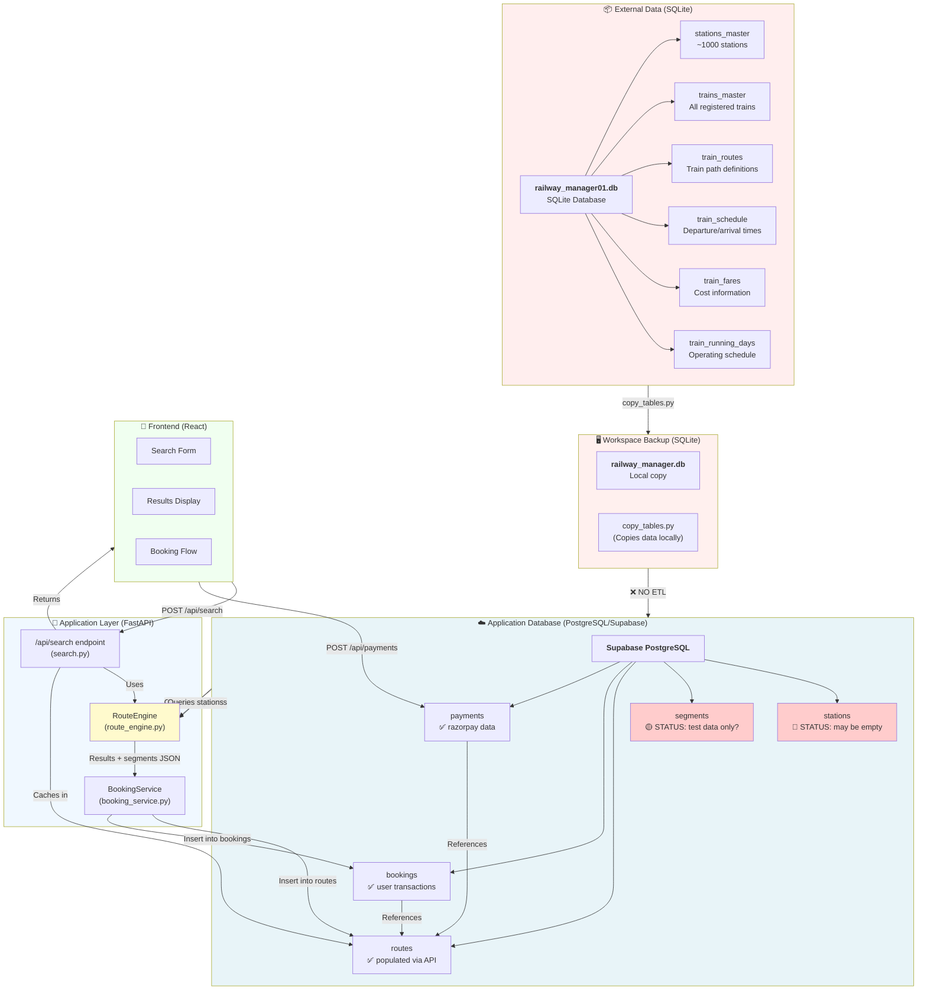
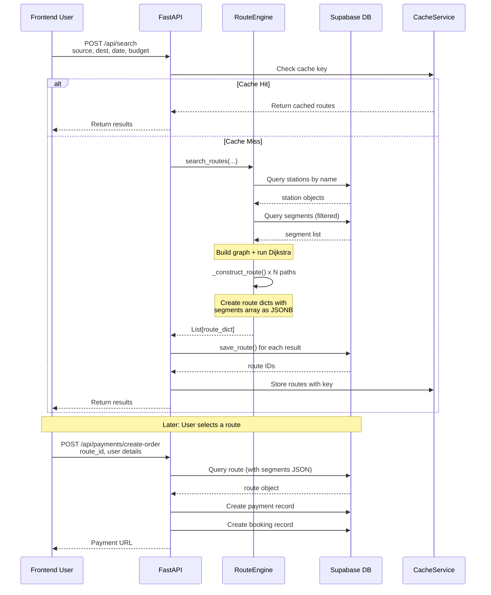
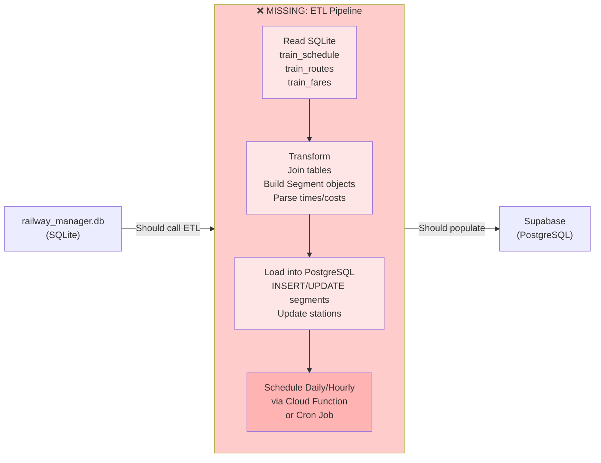
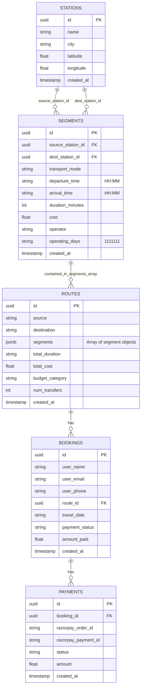
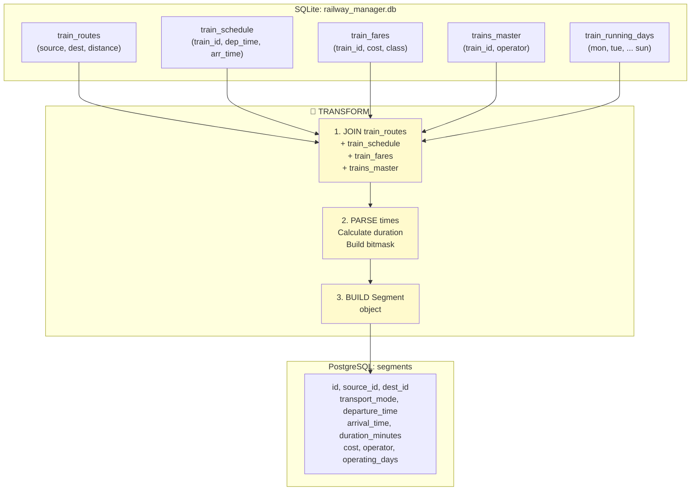
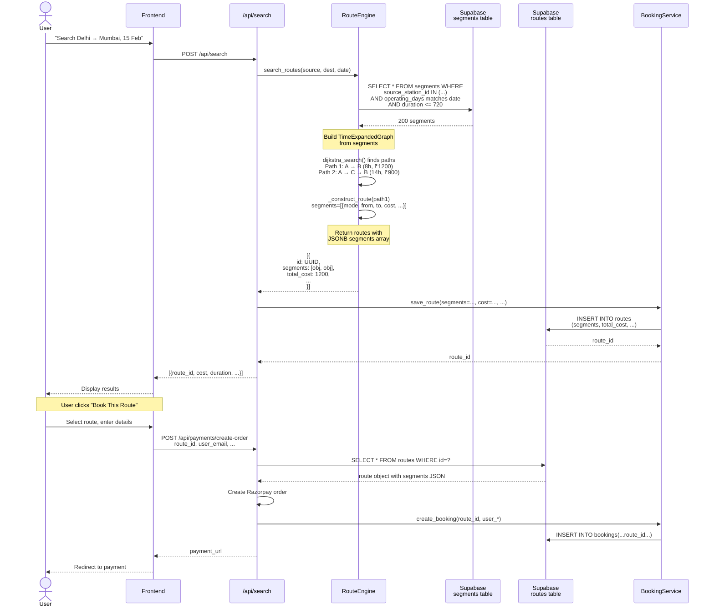

# Database Architecture Diagram

## System Overview (Mermaid Diagram)



---

## Current Data Flow (What Happens Now) 



---

## Missing ETL Pipeline (What Should Exist)



---

## Data Model: Segments Table (PostgreSQL)



---

## Segments Formation: SQLite → PostgreSQL Transformation



---

## High-Level System Architecture

```
┌────────────────────────────────────────────────────────────────┐
│                      USER (Frontend)                           │
│         React App (TypeScript + Vite)                          │
└────────────────┬─────────────────────────────────────────────┘
                 │
                 │ HTTP Requests
                 │
┌────────────────▼─────────────────────────────────────────────┐
│              FASTAPI APPLICATION LAYER                        │
│  ┌──────────────────────────────────────────────────────┐    │
│  │ /api/search     ← Search routes                      │    │
│  │ /api/route/{id} ← Get route details                 │    │
│  │ /api/payments   ← Create orders & verify payments    │    │
│  │ /api/bookings   ← Manage user bookings               │    │
│  └──────────────────────────────────────────────────────┘    │
│                                                               │
│  Services:                                                   │
│  ┌──────────────┐  ┌──────────────┐  ┌──────────────┐       │
│  │ RouteEngine  │  │BookingService│  │PaymentService│       │
│  │ (search)     │  │(persistence) │  │(razorpay)    │       │
│  └──────────────┘  └──────────────┘  └──────────────┘       │
└────────────────┬─────────────────────────────────────────────┘
                 │
                 │ SQL Queries (ORM: SQLAlchemy)
                 │
┌────────────────▼─────────────────────────────────────────────┐
│         SUPABASE POSTGRESQL (Production DB)                  │
│                                                               │
│  ┌─────────────┐ ┌──────────┐ ┌────────┐ ┌──────────┐       │
│  │  stations   │ │ segments │ │ routes │ │ bookings │       │
│  └─────────────┘ └──────────┘ └────────┘ └──────────┘       │
│                                                               │
│  ❌ STATUS: segments may be empty!                           │
│  ❌ STATUS: Need ETL to populate from SQLite!               │
└────────────────────────────────────────────────────────────────┘
                 ▲
                 │ Should populate via ETL
                 │ (CURRENTLY MISSING)
                 │
┌────────────────┴─────────────────────────────────────────────┐
│    RAILWAY_MANAGER.DB (SQLite - Master Data)                 │
│                                                               │
│  ┌────────────────┐ ┌──────────────┐ ┌──────────┐           │
│  │stations_master │ │ trains_master│ │train_*   │           │
│  │(~1000 records) │ │ train_routes │ │ tables   │           │
│  │                │ │train_schedule│ │          │           │
│  │                │ │ train_fares  │ │          │           │
│  └────────────────┘ └──────────────┘ └──────────┘           │
│                                                               │
│  ✅ Contains all railway data                               │
│  ✅ Cannot be modified by users                             │
│  ❌ Not synced to Supabase!                                 │
└────────────────────────────────────────────────────────────────┘
```

---

## Example: How a Route is Created & Retrieved



---

## The Critical Problem ⚠️

The **Segments Table is Likely Empty or Incomplete** because:

❌ No ETL process reads from `railway_manager.db`
❌ Tests create mock segments, but production DB doesn't have them
❌ Routes can't be found → API returns empty results

**Current Code Flow:**
```
1. RouteEngine queries segments table
2. Segments table is empty
3. Graph has no edges
4. Dijkstra finds no paths
5. Routes = []
6. User sees "No routes found"
```

**What Should Happen:**
```
1. Daily ETL: Read train_schedule from SQLite
2. Transform to Segment objects
3. INSERT into Supabase segments
4. RouteEngine queries populated segments
5. Finds exact trains matching search
6. Returns real routes with actual costs
```

---

## Solution: Create the ETL Bridge

**File to create:** `backend/etl/populate_segments_from_sqlite.py`

```python
"""
ETL: SQLite railway_manager.db → Supabase segments table

Flow:
  1. Read train_schedule + train_routes + train_fares from SQLite
  2. For each combination:
     - Parse departure/arrival times
     - Calculate duration
     - Get cost
     - Determine operating days bitmask
  3. Create Segment object
  4. Upsert into Supabase (INSERT OR UPDATE)
  5. Log results

Usage:
  python -m backend.etl.populate_segments_from_sqlite
"""
```

This one script fixes the entire architecture!

