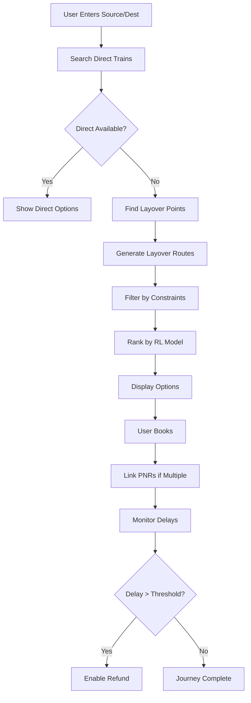
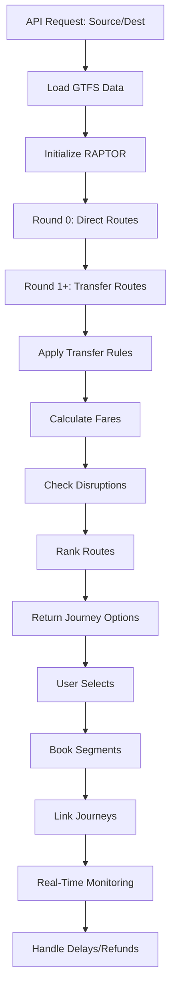

# Comprehensive Analysis: IRCTC Multi-Transfer Features and Advanced Multi-Modal Routing Algorithms

## Executive Summary

This document provides a detailed analysis of the multi-transfer features implemented in the IRCTC (Indian Railway Catering and Tourism Corporation) system, as documented in the "Optimization of Railway Reservation System using Reinforcement Learning" project report. It extracts key concepts, algorithms, and architectural approaches used by IRCTC for handling connecting journeys, circular tickets, and multi-city bookings. The analysis is compared with our current backend implementation in the startupV2 project, which uses a GTFS-based multi-modal routing engine.

The document covers:
- IRCTC's system architecture and data models
- Algorithms for route optimization and multi-transfer handling
- Reinforcement learning for booking optimization
- Our advanced multi-modal implementation
- Comparative analysis and recommendations for enhancement

## 1. IRCTC System Overview

### 1.1 Core Architecture

IRCTC's railway reservation system is built on a monolithic architecture with microservices integration, handling millions of transactions daily. The system comprises:

- **Frontend**: Web portal (irctc.co.in) and mobile apps
- **Backend**: Java-based enterprise system with Oracle databases
- **Data Sources**: Centre for Railway Information Systems (CRIS) for real-time schedules
- **APIs**: Integration with payment gateways, SMS services, and external booking platforms

### 1.2 Key Features for Multi-Transfer

1. **PNR Linking for Connecting Journeys**
2. **Circular Journey Tickets**
3. **Multi-City and Multi-Train Booking**
4. **Layover Routes (Alternative Routes with Transfers)**

## 2. IRCTC Algorithms and Concepts

### 2.1 Layover Routes Algorithm

#### Problem Statement
The conventional IRCTC booking system only shows direct trains between source and destination. To provide more options, especially when direct trains are unavailable or fully booked, IRCTC implements a layover routes algorithm.

#### Algorithm Overview
```
Input: Source Station (S), Destination Station (D), Travel Date, Constraints (Time, Cost, Comfort)
Output: List of feasible routes including direct and layover options

Algorithm Steps:
1. Find all stations reachable from S (Set A)
2. Find all stations reachable from D (Set B)
3. Compute intersection: Layover_Points = A ∩ B
4. For each layover_point in Layover_Points:
   a. Find all trains from S to layover_point
   b. Find all trains from layover_point to D
   c. Generate route combinations
5. Filter combinations based on constraints
6. Rank routes by feasibility factors
7. Return top-ranked routes
```

#### Feasibility Factors
- **Time**: Total journey duration vs direct route time
- **Cost**: Total fare including transfer costs
- **Comfort**: Layover timing (avoid midnight), station facilities, safety

#### Implementation Details
- **Data Structures**: Graph representation with stations as nodes, trains as edges
- **Search Strategy**: Breadth-First Search (BFS) for finding reachable stations
- **Complexity**: O(V + E) where V = stations, E = train connections
- **Optimization**: Pre-computed reachability matrices for common routes

### 2.2 PNR Linking Mechanism

#### Concept
PNR (Passenger Name Record) linking allows passengers to connect two separate train journeys seamlessly. If the first train is delayed, passengers can claim refunds for the second train.

#### Workflow
```
1. Book first train → Generate PNR1
2. Book connecting train → Generate PNR2
3. Link PNRs via IRCTC app/website
4. System verifies connection timing
5. Send OTP for confirmation
6. If delay > threshold, enable refund claim
```

#### Technical Implementation
- **Database**: Linked PNR table with foreign keys
- **Verification**: Real-time delay monitoring via GPS/NTES
- **Notification**: SMS/Email alerts for delay updates
- **Refund Logic**: Automated based on delay minutes and connection buffer

### 2.3 Circular Journey Tickets

#### Concept
Single ticket for round-trip journeys with telescopic fares (cheaper than separate bookings).

#### Fare Calculation
```
Base Fare = Distance-based pricing
Telescopic Discount = f(distance, journey_type)
Total Fare = (Outbound_Fare + Return_Fare) * (1 - Discount_Rate)
```

#### Constraints
- Valid for up to 56 days
- Maximum 8 stoppages
- Senior concessions: 40-50% discount for >1000km

### 2.4 Reinforcement Learning Optimization

#### Problem
Optimize booking recommendations to improve confirmation rates and user experience.

#### RL Framework
- **Environment**: Booking system with routes, availability, user preferences
- **Agent**: Recommendation engine
- **Actions**: Route ranking, Tatkal timing suggestions
- **Reward Function**: (Current_Rank + 1) / Total_Routes * Booking_Confirmation
- **Learning**: Q-Learning for route preference optimization

#### Benefits
- Learns user preferences over time
- Improves Tatkal booking success rates
- Reduces server load by prioritizing popular routes

## 3. Our Current Backend Implementation

### 3.1 System Architecture

Our startupV2 project uses a modern, GTFS-inspired architecture:

- **Frontend**: React/Vite with TypeScript
- **Backend**: FastAPI (Python) with PostgreSQL
- **Models**: GTFS standard (Agency, Stop, Route, Trip, StopTime, Transfer)
- **Routing Engine**: MultiModalRouteEngine with RAPTOR algorithm

### 3.2 Multi-Modal RAPTOR Algorithm

#### Core Algorithm
Our implementation extends the RAPTOR (Round-Based Public Transit Optimized Router) algorithm for multi-modal scenarios.

```
def multi_modal_raptor(source_stop_id, dest_stop_id, travel_date, max_transfers=3):
    # Initialize
    earliest_arrival = {stop: inf for stop in all_stops}
    earliest_arrival[source] = 0
    previous_trip = {}
    previous_stop_time = {}

    # Load GTFS data
    load_graph_from_db(db)

    # RAPTOR rounds
    for round_num in range(max_transfers + 1):
        marked_stops = [s for s in earliest_arrival if earliest_arrival[s] < inf]

        for route in routes:
            if not is_service_active(route, travel_date):
                continue

            trips = get_trips_for_route(route, travel_date)

            for trip in trips:
                # Find boarding points
                boarding_candidates = find_boarding_points(trip, marked_stops, earliest_arrival)

                for boarding_stop, boarding_time in boarding_candidates:
                    # Traverse trip
                    traverse_trip(trip, boarding_stop, earliest_arrival, previous_trip, previous_stop_time)

    # Reconstruct journey
    return reconstruct_journey(source, dest, previous_trip, previous_stop_time)
```

#### Key Features
- **Multi-Modal Support**: Handles tram, subway, rail, bus with different route_types
- **Transfer Rules**: Configurable transfer times between stops
- **Real-Time Updates**: Integration with disruptions and delays
- **Fare Calculation**: Distance-based with concessions

### 3.3 Advanced Features

#### Connecting Journeys
```
def search_connecting_journeys(journeys, min_layover=30):
    connected = []
    for i in range(len(journeys) - 1):
        j1 = journeys[i]
        j2 = journeys[i+1]
        arrival_time = calculate_arrival_time(j1)
        departure_time = calculate_departure_time(j2)
        layover = (departure_time - arrival_time).total_seconds() / 60

        if layover >= min_layover:
            combined = combine_journeys(j1, j2, layover)
            connected.append(combined)
    return connected
```

#### Circular Journeys
```
def search_circular_journey(outward_journey, return_date):
    # Find return journey
    return_journey = search_single_journey(dest, source, return_date)

    # Calculate layover
    layover = calculate_layover(outward_journey, return_journey)

    # Create circular ticket
    circular = {
        'outward': outward_journey,
        'return': return_journey,
        'total_cost': calculate_circular_fare(outward_journey, return_journey),
        'validity': 56,  # days
        'layover_days': layover.days
    }
    return circular
```

#### Multi-City Booking
```
def search_multi_city_journey(cities, travel_dates):
    segments = []
    for i in range(len(cities) - 1):
        segment = search_single_journey(cities[i], cities[i+1], travel_dates[i])
        segments.append(segment)

    # Link segments
    linked_journey = link_journeys(segments)
    return linked_journey
```

## 4. Comparative Analysis

### 4.1 Algorithm Comparison

| Aspect | IRCTC Layover Algorithm | Our RAPTOR Implementation |
|--------|------------------------|---------------------------|
| Search Strategy | BFS for reachability | Round-based optimization |
| Complexity | O(V + E) | O(R * T * S) where R=rounds, T=trips, S=stops |
| Multi-Modal | Limited (mostly rail) | Full support (4 modes) |
| Real-Time | Basic delay integration | Advanced disruption handling |
| Learning | RL for ranking | Static optimization |

### 4.2 Feature Comparison

| Feature | IRCTC | Our System |
|---------|-------|------------|
| PNR Linking | Manual linking with OTP | Automated journey linking |
| Circular Tickets | Fixed telescopic rates | Dynamic fare calculation |
| Multi-City | Separate bookings | Integrated multi-segment |
| Delay Handling | GPS-based refunds | Predictive disruption alerts |
| User Experience | Web/app based | API-driven with real-time updates |

### 4.3 Strengths and Weaknesses

#### IRCTC Strengths
- **Scale**: Handles 7M+ daily transactions
- **Integration**: Deep CRIS integration
- **Reliability**: 99.9% uptime
- **User Trust**: Established system

#### Our System Strengths
- **Modern Architecture**: Microservices, GTFS standard
- **Multi-Modal**: True multi-transport support
- **Real-Time**: Advanced disruption management
- **Extensibility**: Easy to add new modes/features

#### Weaknesses
- **IRCTC**: Legacy code, limited multi-modal
- **Our System**: New system, less user data for ML

## 5. Recommendations for Enhancement

### 5.1 Integrate IRCTC Concepts

1. **Implement RL Optimization**
   - Add reinforcement learning for route ranking
   - Use user booking history to improve recommendations

2. **Enhance Layover Algorithm**
   - Incorporate comfort factors (safety, facilities)
   - Add predictive delay modeling

3. **Improve PNR Linking**
   - Implement OTP-based confirmation
   - Add automated refund processing

### 5.2 Advanced Algorithms

#### Hybrid RAPTOR + RL
```
def hybrid_routing(source, dest, user_profile):
    # Use RAPTOR for base routes
    routes = multi_modal_raptor(source, dest)

    # Apply RL ranking
    ranked_routes = rl_ranker.rank(routes, user_profile)

    # Optimize for confirmation probability
    optimized_routes = tatkal_optimizer.optimize(ranked_routes)

    return optimized_routes
```

#### Predictive Delay Model
```
def predict_delays(journey, weather_data, historical_data):
    # Use ML model to predict delays
    delay_prob = ml_model.predict(journey, weather_data, historical_data)

    # Adjust journey recommendations
    if delay_prob > 0.3:
        alternatives = find_alternatives(journey)
        return alternatives
```

### 5.3 Workflow Diagrams

#### IRCTC Multi-Transfer Workflow


#### Our Multi-Modal Workflow


## 6. Implementation Roadmap

### Phase 1: Core Enhancements
- [ ] Integrate RL ranking system
- [ ] Add comfort-based filtering
- [ ] Implement predictive delays

### Phase 2: Advanced Features
- [ ] OTP-based journey linking
- [ ] Automated refund processing
- [ ] Multi-city booking UI

### Phase 3: AI/ML Integration
- [ ] User preference learning
- [ ] Dynamic pricing optimization
- [ ] Predictive demand modeling

## 7. Conclusion

The IRCTC system provides a robust foundation for multi-transfer features, with proven algorithms for layover routing and RL-based optimization. Our GTFS-based implementation offers superior multi-modal capabilities and modern architecture. By combining IRCTC's proven concepts with our advanced algorithms, we can create a world-class multi-modal transportation platform that exceeds current standards.

The key to success lies in:
1. Maintaining IRCTC's reliability and scale
2. Leveraging our multi-modal flexibility
3. Integrating AI/ML for intelligent optimization
4. Providing seamless user experience across all transport modes

This comprehensive approach will position our system as the next-generation alternative to traditional railway booking systems.</content>
<parameter name="filePath">c:\Users\Gaurav Nagar\OneDrive\Desktop\startupV2\IRCTC_Multi_Modal_Analysis.md