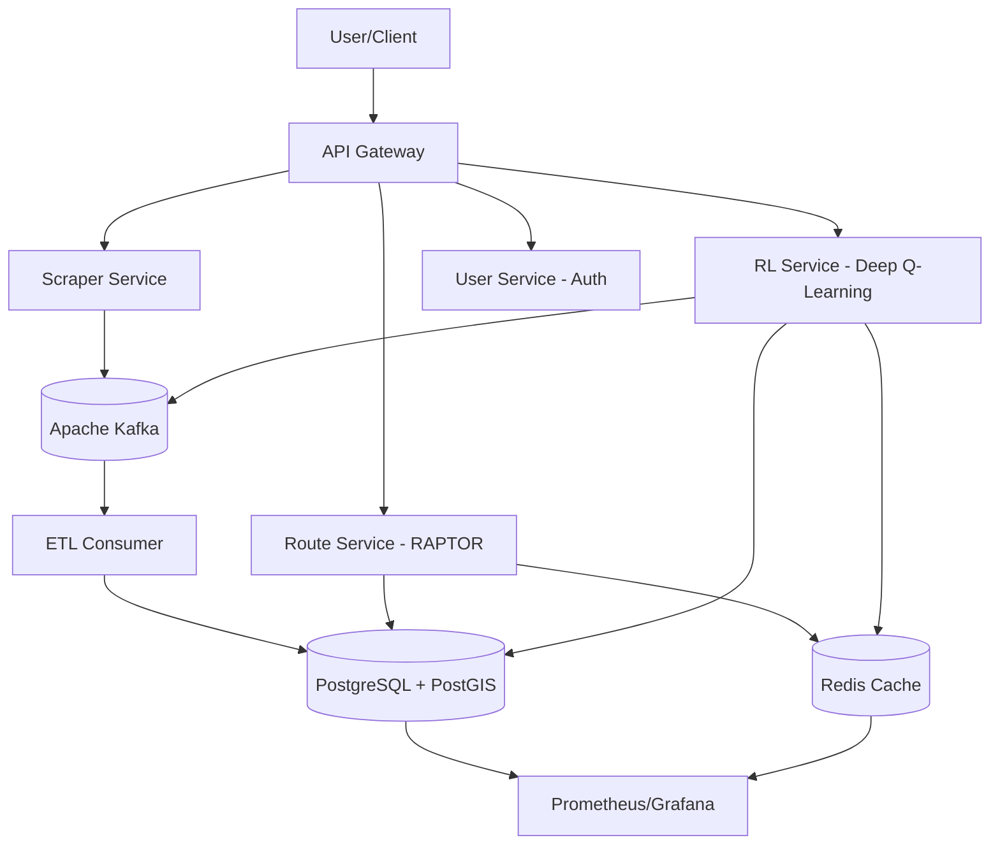

# Railway Intelligence Engine

An AI-powered railway intelligence platform that provides advanced route optimization, real-time recommendations, and intelligent booking assistance using reinforcement learning and modern microservices architecture.

## 🚂 Features

- **Advanced Route Optimization**: RAPTOR algorithm for multi-modal journey planning
- **AI-Powered Recommendations**: Deep Q-Learning for personalized route suggestions
- **Real-time Data Processing**: Kafka-based ETL pipeline for live train data
- **Web Scraping**: Automated data acquisition from railway sources
- **Microservices Architecture**: Scalable, containerized services
- **User Authentication**: JWT-based auth with user management
- **Monitoring & Observability**: Prometheus/Grafana/Loki stack
- **Kubernetes Deployment**: Production-ready container orchestration

## 🏗️ Architecture



## 🛠️ Tech Stack

- **Backend**: Python, FastAPI, SQLAlchemy
- **Database**: PostgreSQL with PostGIS
- **Cache**: Redis
- **Message Queue**: Apache Kafka
- **ML/AI**: TensorFlow, Scikit-learn
- **Containerization**: Docker, Kubernetes
- **Monitoring**: Prometheus, Grafana, Loki
- **Infrastructure**: Docker Compose, K8s manifests

## 🚀 Quick Start

### Prerequisites
- Docker & Docker Compose
- Python 3.11+
- kubectl (for K8s deployment)

### Local Development

1. **Clone and setup**:
   ```bash
   git clone <repository>
   cd startupV2
   ```

2. **Start infrastructure**:
   ```bash
   docker-compose up -d db redis zookeeper kafka
   ```

3. **Build and deploy**:
   ```bash
   # Use the deployment script
   chmod +x scripts/deployment/deploy.sh
   ./scripts/deployment/deploy.sh
   ```

4. **Access services**:
   - Scraper API: http://localhost:8001/docs
   - Route API: http://localhost:8002/docs
   - User API: http://localhost:8004/docs
   - RL API: http://localhost:8003/docs (when built)

### Kubernetes Deployment

1. **Build images and push to registry**
2. **Apply manifests**:
   ```bash
   kubectl apply -f k8s/
   ```
3. **Check status**:
   ```bash
   kubectl get pods
   kubectl get services
   ```

## 📁 Project Structure

```
startupV2/
├── backend/
│   ├── scraper/          # Web scraping service
│   ├── etl/             # Data processing service
│   ├── route_service/   # RAPTOR route optimization
│   ├── rl_service/      # Reinforcement learning
│   └── user_service/    # Authentication & users
├── monitoring/          # Prometheus/Grafana configs
├── k8s/                # Kubernetes manifests
├── scripts/
│   └── deployment/     # Deployment scripts
├── src/                # Frontend React app
├── docker-compose.yml  # Local development
└── Advanced_Railway_Intelligence_Engine_Design.md
```

## 🔧 Development

### Adding a New Service

1. Create service directory under `backend/`
2. Add `requirements.txt`, `app.py`, `Dockerfile`
3. Update `docker-compose.yml`
4. Add Kubernetes manifests in `k8s/`
5. Update CI/CD pipeline

### Running Tests

```bash
# Run all tests
pytest backend/tests/

# Run specific service tests
pytest backend/route_service/tests/
```

### Code Quality

```bash
# Format code
black backend/
isort backend/

# Lint
flake8 backend/
mypy backend/
```

## 📊 Monitoring

Access monitoring stack:
- **Grafana**: http://localhost:3000
- **Prometheus**: http://localhost:9090
- **Loki**: http://localhost:3100

## 🔒 Security

- JWT authentication for API access
- Input validation and sanitization
- Rate limiting on API endpoints
- Secrets management with Kubernetes secrets
- TLS encryption for production

## 🚢 Deployment

### CI/CD Pipeline

- **GitHub Actions**: Automated testing and building
- **Docker Registry**: ECR/GCR for image storage
- **Kubernetes**: Production deployment
- **Helm**: Package management (future)

### Production Checklist

- [ ] Environment variables configured
- [ ] Secrets injected
- [ ] Database migrations run
- [ ] Monitoring alerts configured
- [ ] SSL certificates installed
- [ ] Load balancer configured
- [ ] Backup strategy implemented

## 🤝 Contributing

1. Fork the repository
2. Create a feature branch
3. Make changes with tests
4. Submit a pull request

## 📝 License

This project is licensed under the MIT License - see the LICENSE file for details.

## 📚 Documentation

- [Advanced Design Document](Advanced_Railway_Intelligence_Engine_Design.md)
- [Database Architecture](DATABASE_ARCHITECTURE_DEEP_DIVE.md)
- [ETL Implementation](ETL_IMPLEMENTATION_GUIDE.md)
- [API Documentation](http://localhost:8002/docs) (when running)

## 🆘 Support

For support and questions:
- Create an issue in the repository
- Check the documentation
- Review the design documents

---

*Built with ❤️ for intelligent railway transportation*