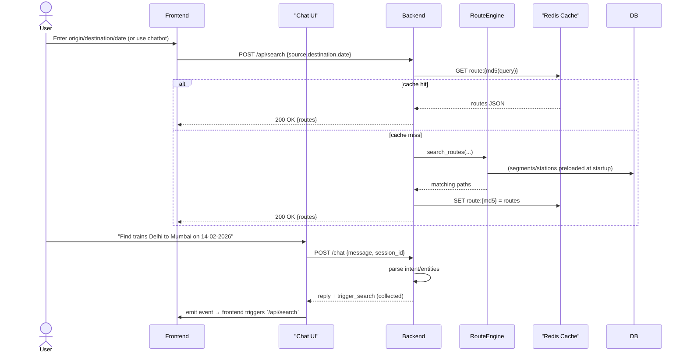

# StartupRouteMaster

A short README with quick references, a rendered Mermaid sequence (search/chat path), a docker-compose example for local development, and CI smoke tests for the API.

---

## Architecture (quick view)
The canonical workflow and algorithm details are in `DOW.md` — see the "Sequence diagram (overview)" section for a Mermaid diagram. Below is the same sequence diagram rendered for quick reference.



---

## Docker Compose (example)
Use the existing `docker-compose.yml` for `db` and `redis`. Add the `docker-compose.dev.yml` below (also included in the repo) to run the backend API in a container bound to your local source tree:

```yaml
# docker-compose.dev.yml (example)
version: '3.8'

services:
  api:
    image: python:3.11-slim
    container_name: startupv2_api
    depends_on:
      db:
        condition: service_healthy
      redis:
        condition: service_healthy
    volumes:
      - ./backend:/app
    working_dir: /app
    environment:
      DATABASE_URL: postgresql://postgres:postgres@db:5432/postgres
      REDIS_URL: redis://redis:6379/0
      LOG_LEVEL: info
    command: /bin/sh -c "pip install -r requirements.txt && uvicorn app:app --host 0.0.0.0 --port 8000"
    ports:
      - "8000:8000"
    healthcheck:
      test: ["CMD-SHELL", "curl -f http://localhost:8000/health || exit 1"]
      interval: 5s
      retries: 5

# Start: docker compose -f docker-compose.yml -f docker-compose.dev.yml up --build
```

---

## CI: API smoke tests
A GitHub Actions workflow validates `/health`, `/chat`, and `/api/search` using the same curl examples in `DOW.md`. The workflow spins up Postgres + Redis, starts the backend, and runs smoke curl checks (see `.github/workflows/api-smoke-tests.yml`).

---

## Contributing — migrations (quick guide)
- When you change SQLAlchemy models, always create and commit an Alembic migration.
  - Create autogen migration:
    ```bash
    .venv\Scripts\python -m alembic -c backend/alembic.ini revision --autogenerate -m "describe changes"
    ```
  - Apply locally to verify: `alembic -c backend/alembic.ini upgrade head`
  - Commit the new file under `backend/alembic/versions/` together with your model changes.
- Enable the local safety check (recommended):
  ```bash
  pip install pre-commit
  pre-commit install
  ```
  This repository includes a small pre-commit hook that prevents committing model changes without a corresponding migration.

---

### Running top-level scripts during development

If you run repo-level scripts (examples: `scripts/raptor_benchmark.py`, `scripts/etl_*`) make sure `backend/` is importable. Two easy options:

- Recommended (dev): use the bootstrap helper to prepend repository root + `backend/` to sys.path:

  ```bash
  python scripts/bootstrap-python-path.py scripts/raptor_benchmark.py --stations 200 --queries 100
  ```

- Or run from repo root with PYTHONPATH/backend on sys.path:

  ```bash
  PYTHONPATH=./backend python scripts/raptor_benchmark.py --stations 200 --queries 100
  ```

Both make `from backend.config import Config` (and legacy `from config import Config`) resolve consistently.

See `DOW.md` for the full design, algorithm, and developer guide.

---

## Developer extras

For optional developer tooling and the Streamlit annotation UI, install the dev extras:

```bash
pip install -r requirements-dev.txt
```

This will install `streamlit`, `pandas`, and common developer utilities used during local development and testing.
