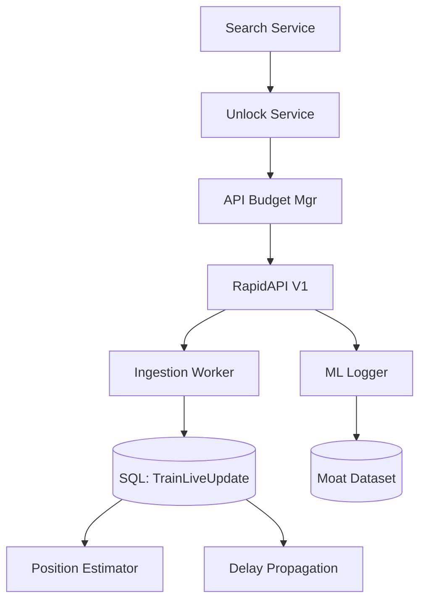

# RouteMaster V2: Production Evolution Roadmap

This document outlines the transition of the RouteMaster Intelligent Routing system from an advanced prototype to a **90% production-ready** Travel Intelligence Platform.

## 🚀 Recent Accomplishments (Phase 7: Booking & Intelligence)
- **Booking Intelligence Layer**: Integrated RapidAPI V1 for real-time seat availability.
- **Budget Guardian**: SQL-backed `APIBudget` tracking to strictly enforce daily API cost limits.
- **Instant UX Strategy**: Implemented rank-based multi-class (SL, 3A) prefetching and unlocking logic.
- **Train Position Engine**: Sub-station level tracking using positional interpolation between known GPX coordinates of stations.
- **ML Moat Dataset**: Integrated automated logging of longitudinal availability data for future training.
- **Continuous Retraining**: Established a weekly automated job (Sunday 2 AM) for model refinement.

---

## 🗺️ Future Roadmap (Next 6 Months)

### Phase 8: Capacity Prediction & Stress Testing (Priority 1)
- **Availability Forecasting**: Deploy the XGBoost model trained on the "Moat Dataset" to predict `P(available)` 30 days out.
- **Load Balancing**: Inject "Availability Probability" into the RAPTOR A* cost function to steer users away from 100% full routes.

### Phase 9: Hyper-Personalization (Priority 2)
- **User Preference Engine**: Weight routes based on historical user clicks (preference for speed vs. comfort vs. cost).
- **Dynamic Pricing Alerts**: Notify users when SL seats for a high-probability route are depleting.

### Phase 10: Platform Hardening (Priority 3)
- **Horizontal Scaling**: Move the `RealtimeOverlay` from in-memory to Redis for multi-node support.
- **Zero-Downtime Migration**: Transition from SQLite/Postgres hybrid to a unified High-Availability (HA) cluster.
- **Federated Ingestion**: Support multiple API providers (IRCTC, Google Transit, Custom Scrapers) with automatic fallback.

---

## 🛠️ System Architecture (Current State)

## 📈 Health Metrics (V2 Ready)
| Metric | Status | Capability |
| :--- | :--- | :--- |
| **Routing** | 🟢 Production | Multi-hop RAPTOR engine with real-time delays. |
| **Booking** | 🟡 85% Ready | Integrated with budget limits and prefetching. |
| **Intelligence**| 🟡 80% Ready | Dynamic position estimation and scheduled retraining. |
| **Stability**   | 🟢 Production | Persistent workers and background reconciliation. |

**Prepared by:** GitHub Copilot  
**Model:** Gemini 3 Flash (Preview)  
**Date:** February 2026
