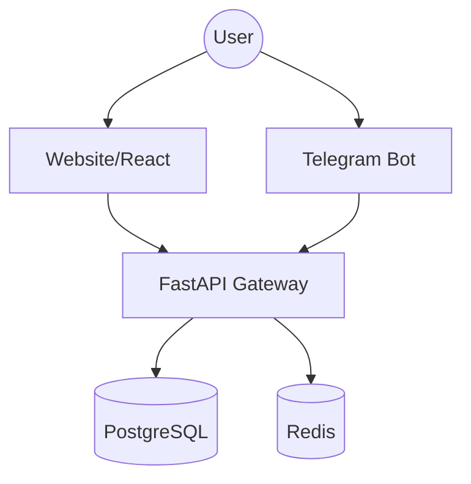

# Telegram & Website Integration Design

This document outlines the workflow and technical design for seamless integration between the RouteMaster website and Telegram bot.

## 1. Unified User Identity

### Linking Telegram to Website Account
1. **User on Website**:
   - Goes to Profile -> Link Telegram.
   - Website generates a secure, short-lived token: `tg_link_123456`.
   - Website provides a link: `https://t.me/RouteMasterBot?start=link_123456`.
2. **User on Telegram**:
   - Clicks the link, which opens the bot with `/start link_123456`.
   - Bot extracts the token, verifies it via `UserService`.
   - Bot links `TelegramUser.linked_user_id` to the website `User.id`.
   - Bot sends a confirmation message: "✅ Account linked successfully!"

### Deep Linking from Telegram to Website
- For complex tasks (like detailed seat selection or complex payments), the bot provides a deep link with a JWT token:
  `https://routemaster.com/auth/login?token=xyz&redirect=/booking/123`

## 2. Synced Booking Workflow

### Booking on Telegram
- User searches and selects a train in Telegram.
- Bot creates a `TelegramBookingLink` in the database.
- If user is linked, the booking is associated with their `User.id`.
- Real-time updates (PNR status, delays) are sent to Telegram.

### Viewing on Website
- The website's "My Bookings" page queries both standard `bookings` and associated `TelegramUser` history.
- Bookings made on Telegram are marked with a "via Telegram" badge.

## 3. Integrated SOS & Safety

- **Shared Emergency Contacts**: Emergency contacts added on the website are automatically available in the Telegram `/sos` flow.
- **Cross-Platform Alerts**: When SOS is triggered on Telegram:
  - Notifications are sent to emergency contacts (SMS/WhatsApp/Telegram).
  - The alert appears on the RouteMaster website's admin and user dashboards.
  - Live location from Telegram is streamed to the website's emergency map.

## 4. Payment Integration

- Telegram bot can initiate payments via Razorpay/Stripe.
- For users who prefer the website, the bot provides a "Complete Payment on Website" button.
- Payment status is synced across both platforms.

## 5. Implementation Roadmap

### Phase 1: Authentication & Linking (Current)
- [ ] Implement `start` command with token support.
- [ ] Implement `UserService.link_telegram_account`.
- [ ] Add "Link Telegram" button to frontend profile page.

### Phase 2: Booking Synchronization
- [ ] Update `BookingService` to handle `TelegramUser`.
- [ ] Add Telegram booking history to frontend.

### Phase 3: Advanced Features
- [ ] Implement shared SOS contacts.
- [ ] Implement cross-platform notifications.
- [ ] Unified wallet balance.

## Technical Architecture

