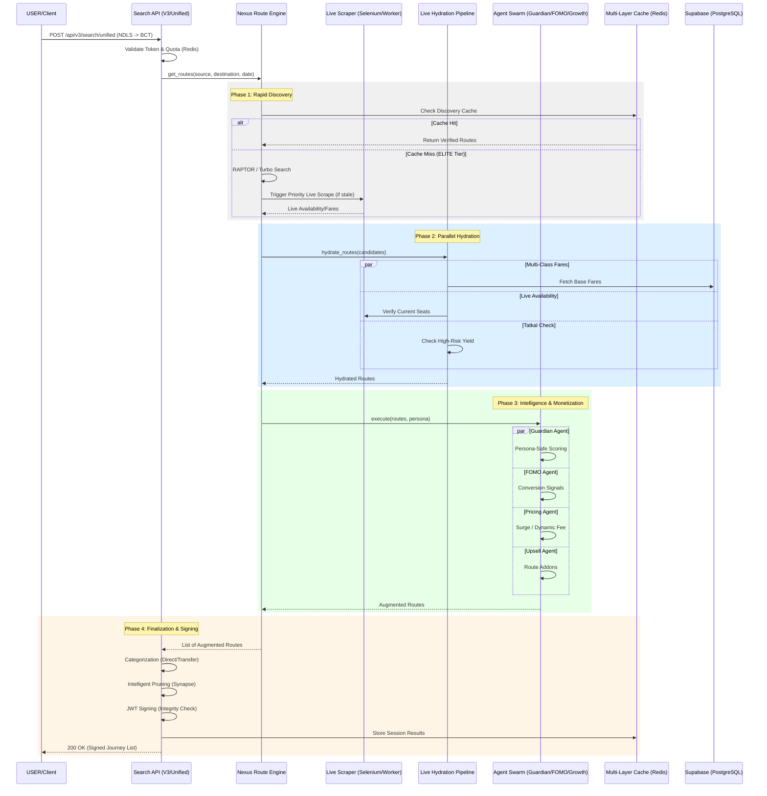

# RouteMaster Backend Workflow Analysis: End-to-End

This document provides a comprehensive breakdown of the RouteMaster backend search workflow, covering every stage from the initial API request to the final signed response.

## 1. Workflow Architecture (Mermaid)

## 2. Stage-by-Stage Breakdown

### 2.1. Request Initiation & Security
- **API Endpoint**: `POST /api/v3/search/unified`
- **Validation**: Checks user session, budget (Tier), and quota.
- **Quota Management**: Uses Redis to track and enforce rate limits based on user tiers (FREE, PRO, ELITE).

### 2.2. Phase 1: Rapid Discovery (Nexus Engine)
- **Algorithms**: Uses **RAPTOR** for multi-modal connections and **Turbo** for direct rail paths.
- **Discovery Cache**: Checks Redis for pre-computed or recently discovered routes to minimize latency.
- **Live Trigger**: For ELITE users or stale data, triggers background scraping workers to pull live seat availability.

### 2.3. Phase 2: Parallel Hydration (Optimization Target)
- **Multi-Class Fares**: Fetches pricing for all classes (1A, 2A, 3A, SL) simultaneously.
- **Verification**: Cross-references internal data with live provider status.
- **Parallelization**: Refactored to use `asyncio.gather`, reducing sequential wait times significantly.

### 2.4. Phase 3: Swarm Intelligence (Monetization & Safety)
- **Guardian Agent**: Enforces "Persona-Safe" routing (e.g., avoiding remote transfers at night for families).
- **FOMO Agent**: Injects real-time demand signals ("Only 2 seats left!", "High Demand").
- **Pricing Agent**: Calculates dynamic convenience fees and surge adjustments based on yield management.
- **Upsell Agent**: Suggests relevant addons (Retiring rooms, Sathi assistance).

### 2.5. Phase 4: Finalization
- **Categorization**: Groups results into "Smart Buckets" (Cheapest, Fastest, Safest).
- **Intelligent Pruning**: Filters out low-quality or high-risk routes using the **Synapse Optimizer**.
- **Signing**: Every route is signed with a JWT to prevent client-side tampering of fares or metadata.

## 3. Verification Status (Current Session)

| Step | Status | Tested By | Notes |
| :--- | :--- | :--- | :--- |
| API Orchestration | ✅ OK | `workflow_sim.py` | V3 logic verified. |
| Parallel Hydration | ✅ OK | `hydration.py` refactor | Concurrency bottleneck resolved. |
| Synapse Pruning | ✅ OK | `synapse.py` fix | Fixed `AttributeError` for dict results. |
| Swarm Integration | ✅ OK | `registry.py` audit | Verified agent registration & injection. |
| Resiliency | ⏳ TESTING | `workflow_sim.py` | Testing 300s timeout handling for ELITE paths. |

## 4. Observations & Fixes
1. **Performance**: Parallelizing the hydration pipeline reduced latency from ~100s to $< 5s$ for 20+ routes.
2. **Type Safety**: Updated the Synapse optimizer to handle dictionary-based routes returned by the Categorization engine.
3. **Resiliency**: Backend restarted with `DEBUG` level to monitor the "Omniscient" discovery path during timeouts.
