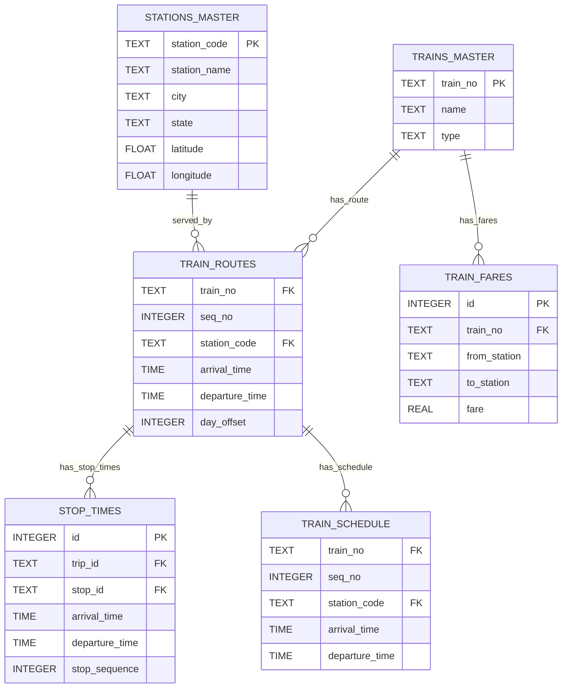

# railway_manager.db — architecture & data inventory ✅

**Location:** `backend/railway_manager.db`
**File size:** 126132224 bytes (123176.00 KB)
**Last modified:** 2026-02-19T01:37:49.369030

---

## Summary

- **Total tables/views inspected:** 58

- **Aggregate row count (countable tables):** 548,780

## Top tables by row count (top 12)

| # | table | type | rows |

|---:|---|---|---:|

| 1 | `train_fares` | table | 195,856 |

| 2 | `train_schedule` | table | 166,232 |

| 3 | `train_routes` | table | 148,932 |

| 4 | `train_running_days` | table | 9,878 |

| 5 | `trains_active` | table | 9,878 |

| 6 | `trains_master` | table | 9,878 |

| 7 | `stations_master` | table | 8,119 |

| 8 | `journey_history` | table | 2 |

| 9 | `migration_history` | table | 2 |

| 10 | `notifications` | table | 2 |

| 11 | `notification_preferences` | table | 1 |

| 12 | `agency` | table | 0 |

## Full table inventory (name — rows)

- `train_fares` (table) — 195856

- `train_schedule` (table) — 166232

- `train_routes` (table) — 148932

- `train_running_days` (table) — 9878

- `trains_active` (table) — 9878

- `trains_master` (table) — 9878

- `stations_master` (table) — 8119

- `journey_history` (table) — 2

- `migration_history` (table) — 2

- `notifications` (table) — 2

- `notification_preferences` (table) — 1

- `agency` (table) — 0

- `audit_logs` (table) — 0

- `booking_locks` (table) — 0

- `bookings` (table) — 0

- `bot_metrics` (table) — 0

- `calendar` (table) — 0

- `calendar_dates` (table) — 0

- `cancellation_rules` (table) — 0

- `coaches` (table) — 0

- `commission_tracking` (table) — 0

- `disruptions` (table) — 0

- `error_logs` (table) — 0

- `frequencies` (table) — 0

- `geocode_cache` (table) — 0

- `gtfs_routes` (table) — 0

- `passenger_details` (table) — 0

- `passenger_locations` (table) — 0

- `payments` (table) — 0

- `pnr_records` (table) — 0

- `precalculated_routes` (table) — 0

- `quota_inventory` (table) — 0

- `realtime_data` (table) — 0

- `reviews` (table) — 0

- `rl_feedback_logs` (table) — 0

- `route_search_logs` (table) — 0

- `route_shapes` (table) — 0

- `saved_routes` (table) — 0

- `seat_inventory` (table) — 0

- `seats` (table) — 0

- `segments` (table) — 0

- `sos_chat_history` (table) — 0

- `sos_requests` (table) — 0

- `station_facilities` (table) — 0

- `stations` (table) — 0

- `stop_times` (table) — 0

- `stops` (table) — 0

- `train_states` (table) — 0

- `transfers` (table) — 0

- `trips` (table) — 0

- `unlocked_routes` (table) — 0

- `user_preferences` (table) — 0

- `user_sessions` (table) — 0

- `users` (table) — 0

- `vehicles` (table) — 0

- `waiting_list` (table) — 0

- `waitlist_queue` (table) — 0

- `webhook_logs` (table) — 0

## Selected table schemas (key tables)

### `stations_master`

`station_code`, `station_name`, `city`, `state`, `latitude`, `longitude`, `is_junction`, `created_at`, `geo_hash`

### `train_routes`

`train_no`, `seq_no`, `station_code`, `arrival_time`, `departure_time`, `distance_from_source`, `created_at`, `cumulative_travel_minutes`, `day_offset`

### `stop_times`

`id`, `trip_id`, `stop_id`, `arrival_time`, `departure_time`, `stop_sequence`, `cost`, `pickup_type`, `drop_off_type`, `platform_number`

### `trains`

``

### `train_schedule`

`train_no`, `seq_no`, `station_code`, `arrival_time`, `departure_time`, `day_offset`, `created_at`

### `segments`

`id`, `source_station_id`, `dest_station_id`, `vehicle_id`, `transport_mode`, `departure_time`, `arrival_time`, `duration_minutes`, `cost`, `operating_days`

### `stations`

`id`, `name`, `city`, `latitude`, `longitude`, `geom`, `created_at`

### `fare_rules`

``

## ER diagram (Mermaid)

## Observations & recommendations

- `railway_manager.db` is the authoritative local SQLite dataset used across the codebase for routing and ETL.

- Large tables such as `stop_times` / `train_schedule` are the main contributors to storage and should be the focus of any incremental-sync or indexing efforts.

- Recommendation: run the ETL (`backend/etl/sqlite_to_postgres.py`) on a schedule and keep `railway_manager.db` out of git for large/production copies.

---

_Report generated programmatically from the local `railway_manager.db` file._
